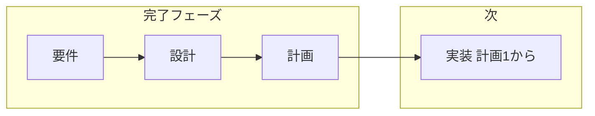
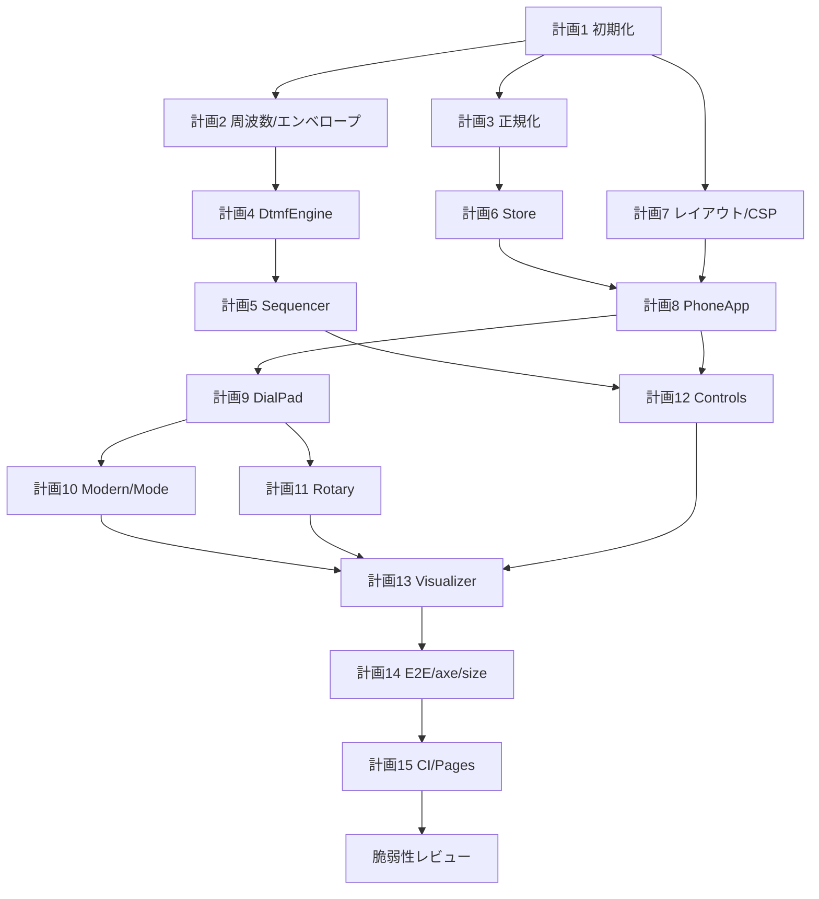

# DTMF Web App 実装プラン

## 現状認識

| 項目 | 状態 |
|------|------|
| フェーズ | **実装**（計画フェーズ承認済み、[spec/status.md](spec/status.md)） |
| コードベース | `src/`・`package.json` **未作成**（テンプレートの [scripts/](scripts/) のみ） |
| 参照ドキュメント | [spec/requirements.md](spec/requirements.md)、[spec/design.md](spec/design.md)、[spec/plan.md](spec/plan.md) |
| 着手起点 | **計画1**（プロジェクト初期化） |

---

## 実装の基本ルール（全計画共通）

1. **TDD**: 各計画でテストを先に書き → RED 確認 → 最小実装 → GREEN → 必要ならリファクタ
2. **品質ゲート**: 計画完了ごとに `bash scripts/quality-gate.sh` が PASS（`--no-verify` 禁止）
3. **配置原則**（[spec/design.md](spec/design.md)）:
   - `src/lib/**` … DOM/AudioContext 非依存の純粋ロジック
   - `src/islands/**` … Solid アイランド（`client:idle`）
   - `src/components/**`・`src/pages/**` … Astro 静的層
4. **ドキュメント更新**: タスク完了直後に [spec/plan.md](spec/plan.md) の該当 `[ ]` を `[x]` に更新し、コミットに含める
5. **パッケージ選定**: 各計画着手時に **2026-05-18 時点で公開済みの最新安定版** をレジストリで確認（プロジェクトルール）
6. **コミット**: 計画ごとに 1 コミット以上、メッセージは日本語（`機能` / `テスト` / `設定` 等）

---

## 実行順序と並列化

[spec/plan.md](spec/plan.md) の依存関係に従い、**計画1完了後**は以下が並列可能:

- **ロジック系**: 計画2（周波数表）‖ 計画3（正規化）→ 計画4 → 計画5
- **静的UI**: 計画7（レイアウト/CSP）— 計画1と並行可能だが、計画8前に完了必須
- **状態**: 計画6（計画3完了後）

**推奨セッション割り当て**: 1 セッション = 1 計画（[spec/plan.md](spec/plan.md) の粒度ガイドライン）

---

## 計画1: プロジェクト初期化

**目的**: Astro 5 + Solid + Tailwind v4 + Bun + Biome でビルド・テスト・リントが通る骨格を作る。

**主要成果物**:

| 種別 | パス |
|------|------|
| 設定 | `package.json`, `bunfig.toml`, `tsconfig.json`, `astro.config.mjs`（`base: '/dtmf/'`, `site`）, `tailwind.config.ts`, `biome.json`, `playwright.config.ts` |
| 骨格 | `src/pages/`, `src/layouts/`, `src/components/`, `src/islands/`, `src/lib/dtmf|input|state|platform/`, `src/styles/`, `tests/unit|component|e2e|helpers/` |
| スクリプト | [scripts/lint.sh](scripts/lint.sh) → `bun biome ci .`、[scripts/build.sh](scripts/build.sh) → `bun astro build`、[scripts/test.sh](scripts/test.sh) → `bun test` |
| その他 | `public/.nojekyll`, [`.github/dependabot.yml`](.github/dependabot.yml) の `npm` 有効化, [README.md](README.md) 更新, `bash scripts/setup-hooks.sh` |

**TDD**: `tests/unit/smoke.test.ts` で Bun Test 起動確認のみ。

**完了判定**: `bun astro build` 成功、`bash scripts/quality-gate.sh` PASS、[spec/status.md](spec/status.md) 初期化チェックリスト更新。

**リスク R-005**: 計画1の最初に Astro+Solid+Tailwind v4 の最小起動を確認してから本格ディレクトリ作成。

---

## 計画2〜5: ロジック層（ブラウザ非依存）

### 計画2 — DTMF 周波数表・エンベロープ

- **RED**: [tests/unit/frequencyMap.test.ts](tests/unit/frequencyMap.test.ts), [tests/unit/envelope.test.ts](tests/unit/envelope.test.ts)
- **GREEN**: [src/lib/dtmf/frequencyMap.ts](src/lib/dtmf/frequencyMap.ts), [src/lib/dtmf/envelope.ts](src/lib/dtmf/envelope.ts)
- **境界**: `durationMs < attack+release`, `gain=0`, 負値拒否

### 計画3 — 入力正規化

- **RED**: [tests/unit/normalizer.test.ts](tests/unit/normalizer.test.ts)（許可文字、国際 `+`、全角数字、64桁切り詰め、空文字）
- **GREEN**: [src/lib/input/normalizer.ts](src/lib/input/normalizer.ts) — `NormalizeResult` + `normalizePhoneNumber`

### 計画4 — DtmfEngine + AudioContext 抽象

- **RED**: [tests/helpers/FakeAudioContext.ts](tests/helpers/FakeAudioContext.ts), [tests/unit/engine.test.ts](tests/unit/engine.test.ts)
- **GREEN**: [src/lib/platform/audioContextFactory.ts](src/lib/platform/audioContextFactory.ts), [src/lib/dtmf/engine.ts](src/lib/dtmf/engine.ts)
- **設計要点**: `createDtmfEngine(deps)` でコンストラクタ注入、iOS `webkitAudioContext`、`ensureContext()` は初回ポインタ操作（R-001）

### 計画5 — AutoDialSequencer

- **RED**: [tests/unit/sequencer.test.ts](tests/unit/sequencer.test.ts) — `currentTime` ベース予約、`AbortController`、`pause`/`resume`、最大16件先読み
- **GREEN**: [src/lib/dtmf/sequencer.ts](src/lib/dtmf/sequencer.ts)

---

## 計画6: 状態層

- **RED**: [tests/unit/store.test.ts](tests/unit/store.test.ts), [tests/unit/persistence.test.ts](tests/unit/persistence.test.ts)
- **GREEN**: [src/lib/state/store.ts](src/lib/state/store.ts), [src/lib/state/persistence.ts](src/lib/state/persistence.ts)
- **必須検証**: 入力（`raw`/`digits`）は **localStorage に書かない**（NFR-002）、`dtmf:schemaVersion=1`

---

## 計画7: 静的シェル（Astro）

- [src/layouts/Base.astro](src/layouts/Base.astro), [src/components/Head.astro](src/components/Head.astro)（CSP メタ）, [Footer.astro](src/components/Footer.astro), [Hero.astro](src/components/Hero.astro)
- [src/styles/global.css](src/styles/global.css) — Tailwind v4 + `prefers-reduced-motion`
- [src/pages/index.astro](src/pages/index.astro) — 島なしの静的ページ
- **確認**: `dist/index.html` に CSP、`import.meta.env.BASE_URL` 利用方針（R-008）

---

## 計画8〜13: Solid アイランド UI

| 計画 | 主要ファイル | テスト |
|------|-------------|--------|
| 8 PhoneApp/入力/Toast | `PhoneApp.tsx`, `NumberInput.tsx`, `Toast.tsx` | `NumberInput.test.tsx`, `Toast.test.tsx` |
| 9 DialPad/キーボード | `DialPad.tsx` + PhoneApp キーハンドラ | `DialPad.test.tsx`, `keyboard.test.tsx` |
| 10 Modern/Mode | `ModernPad.tsx`, `ModeSwitcher.tsx` | View Transitions フォールバック（R-002） |
| 11 Rotary | `rotaryAngle.ts`, `RotaryDial.tsx` | 純関数→UI、キュー最大20（R-004） |
| 12 Controls/Settings/Detail | `PlaybackControls.tsx`, `SettingsPanel.tsx`, `DetailPanel.tsx` | Sequencer モック注入 |
| 13 Visualizer/ハイライト | `Visualizer.tsx` + 各 Pad の `data-active` | rAF モック、`highlightSync.test.tsx` |

**計画8の接続点**: `PhoneApp` が Store + persistence ロード + `isSupported()` バナー、`index.astro` に `<PhoneApp client:idle />`。

---

## 計画14: E2E・a11y・バンドル予算

- Playwright: `auto-dial`, `dial-pad`, `mode-switch`, `rotary`, `a11y`（`@axe-core/playwright` 違反0）
- `size-limit`: `dist/_astro/**.js` gzip ≤ 100KB（NFR-009, R-003）
- [scripts/test.sh](scripts/test.sh) に E2E / size-limit を統合（CI 向け分岐可）
- WebKit プロファイルで AudioContext 挙動確認（R-001）

---

## 計画15: CI / GitHub Pages

- `.github/workflows/ci.yml` — Bun install → quality-gate → Playwright → size-limit
- `.github/workflows/pages.yml` — `bun astro build` → Pages deploy（`https://cho5butter.github.io` + `/dtmf/`）
- 配信後スモーク + Lighthouse（NFR-001: TTI ≤ 2.5s, LCP ≤ 2.0s, A11y ≥ 95）

---

## 最終計画: 脆弱性レビュー（マージ前必須）

[spec/plan.md](spec/plan.md) 末尾の固定計画に従い実施:

- OWASP 観点（`set:html` / `innerHTML` 不使用、正規化後のみ再生、入力のコンソール漏洩なし）
- CSP 実効確認（DevTools）
- `bun audit` + Dependabot Security タブ
- High/Critical は解消または保留理由を PR に記録

---

## 第1セッションの具体手順（計画1）

実装承認後、次の順で進める:

1. [spec/requirements.md](spec/requirements.md) と [spec/design.md](spec/design.md) を再読
2. `bun create astro` 相当で最小プロジェクト生成 → Solid / Tailwind v4 統合を検証
3. パッケージバージョンを 2026-05-18 基準で固定
4. ディレクトリ骨格・設定ファイル・scripts 書き換え・dependabot 有効化
5. `tests/unit/smoke.test.ts` → RED/GREEN
6. `bash scripts/quality-gate.sh` PASS
7. [spec/plan.md](spec/plan.md) 計画1チェックボックス + [spec/status.md](spec/status.md) 初期化チェックリストを `[x]` 更新
8. コミット（種別: `設定` または `機能`）

---

## ブロッカー・確認事項

| ID | 内容 | 対応タイミング |
|----|------|----------------|
| R-001 | iOS Safari AudioContext | 計画4 `ensureContext`、計画14 WebKit E2E |
| R-007 | happy-dom 非 AudioContext | 計画4 FakeAudioContext |
| R-003 | JS ≤ 100KB gzip | 計画1 size-limit 導入、計画14 CI 失敗化 |
| PR #3 | 計画承認 PR のマージ要否 | ユーザー判断（実装は main/作業ブランチで進行可） |

**spec 変更**: [spec/plan.md](spec/plan.md) のチェックボックス更新のみ実装フェーズで許可。要件・設計の内容変更はユーザー承認必須。
