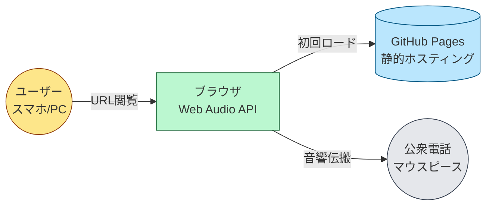
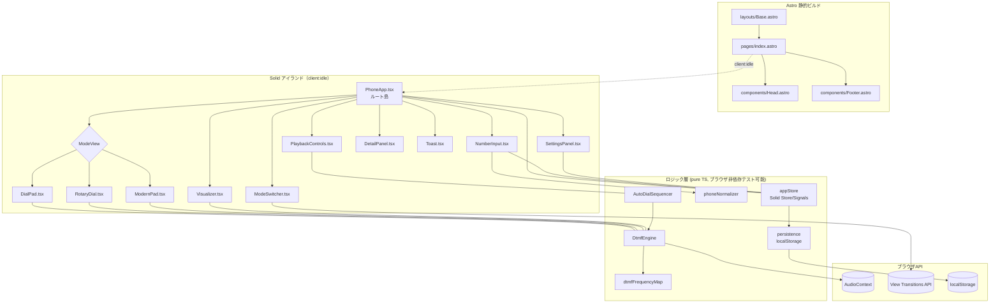
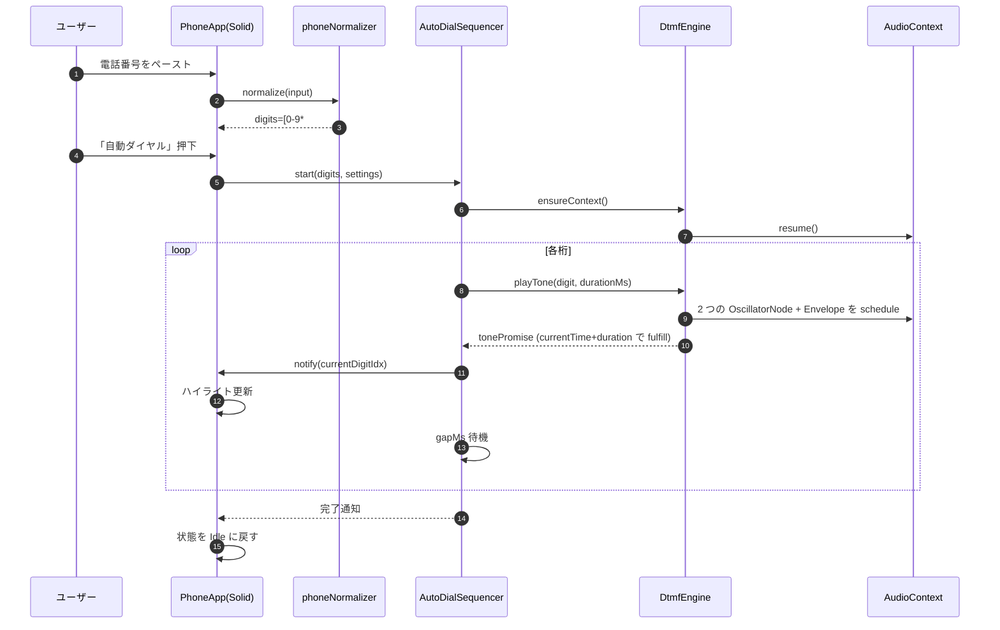
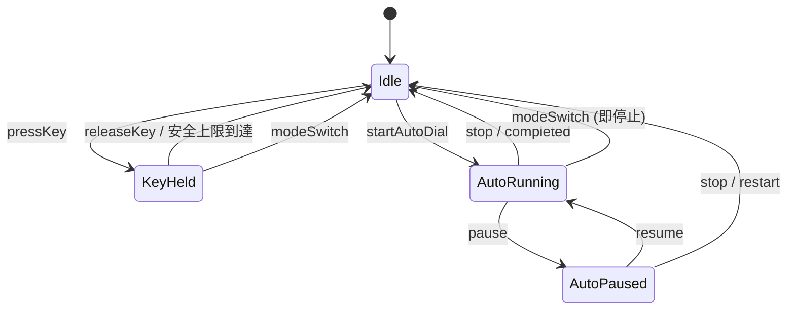
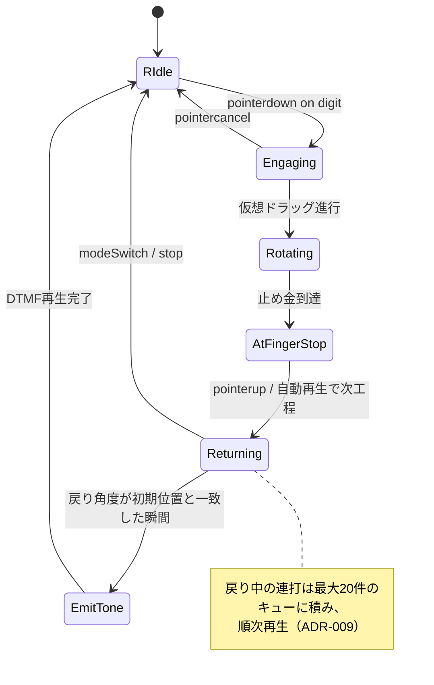
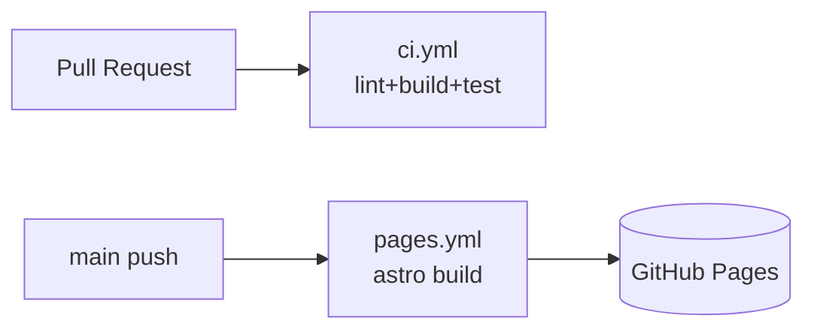

# 設計

> 本書は `spec/requirements.md` の要件 (US-001〜010 / F-001〜010 / NFR-001〜009) を満たすための設計を定義する。
> 実装着手前に必ずこの設計を参照し、不整合があれば本書を更新したうえで実装する。

## 設計の指針

1. **静的配信ファースト**: GitHub Pages 配信のためサーバ処理を一切持たない。すべて静的ファイル + ブラウザ実行。
2. **アイランドアーキテクチャ**: Astro が出力する HTML 内で、操作が必要な部分のみ Solid コンポーネントを島として水和する。初回JS転送量 ≤ 100KB gzip (NFR-009) を達成する。
3. **音声処理は単一エンジンに集約**: AudioContext / Oscillator の生成と破棄、シーケンサ、停止は `DtmfEngine` に集約し、UI 層から直接 Web Audio API を叩かない。
4. **状態は単一ストアに集約**: Solid の Signal / Store でアプリ全体の状態を 1 箇所に保持。永続化対象は localStorage に保存。
5. **TDD前提**: ロジック層（エンジン・正規化・シーケンサ）は UI から完全に分離し、ブラウザ非依存で単体テスト可能な形で実装する。AudioContext は薄いラッパで抽象化する。

---

## アーキテクチャ概要

### システムコンテキスト



### コンポーネント構成



### ランタイムフロー（自動ダイヤルの例）



---

## ディレクトリ構成

```
.
├── spec/                        # 要件・設計・計画
├── public/
│   ├── favicon.svg
│   └── og.png                   # OGP画像（あれば）
├── src/
│   ├── pages/
│   │   └── index.astro          # 唯一の SPA エントリ
│   ├── layouts/
│   │   └── Base.astro           # <head> / メタ / View Transitions ルート
│   ├── components/              # Astro コンポーネント (SSG, 非インタラクティブ)
│   │   ├── Head.astro
│   │   ├── Footer.astro
│   │   └── Hero.astro
│   ├── islands/                 # Solid アイランド (client:* で水和)
│   │   ├── PhoneApp.tsx         # ルート島・全体配線
│   │   ├── NumberInput.tsx
│   │   ├── ModeSwitcher.tsx
│   │   ├── DialPad.tsx
│   │   ├── RotaryDial.tsx
│   │   ├── ModernPad.tsx
│   │   ├── PlaybackControls.tsx
│   │   ├── SettingsPanel.tsx
│   │   ├── DetailPanel.tsx
│   │   ├── Visualizer.tsx
│   │   └── Toast.tsx
│   ├── lib/                     # ブラウザ非依存（または極薄ラッパ）のロジック
│   │   ├── dtmf/
│   │   │   ├── frequencyMap.ts  # ITU-T Q.23 周波数表
│   │   │   ├── engine.ts        # DtmfEngine クラス
│   │   │   ├── sequencer.ts     # AutoDialSequencer
│   │   │   └── envelope.ts      # アタック/リリース計算
│   │   ├── input/
│   │   │   └── normalizer.ts    # 電話番号文字列の正規化
│   │   ├── state/
│   │   │   ├── store.ts         # Solid Store / Signals
│   │   │   └── persistence.ts   # localStorage 読み書き
│   │   └── platform/
│   │       └── audioContextFactory.ts  # AudioContext 生成・iOSサスペンド対応
│   ├── styles/
│   │   └── global.css           # Tailwind v4 + カスタムレイヤ
│   └── env.d.ts
├── tests/
│   ├── unit/
│   │   ├── normalizer.test.ts
│   │   ├── engine.test.ts       # FakeAudioContext を用いた振る舞いテスト
│   │   ├── sequencer.test.ts
│   │   └── store.test.ts
│   ├── component/
│   │   ├── DialPad.test.tsx     # @solidjs/testing-library + happy-dom
│   │   ├── NumberInput.test.tsx
│   │   └── RotaryDial.test.tsx
│   └── e2e/
│       └── auto-dial.spec.ts    # Playwright
├── scripts/                     # 既存（lint / build / test / quality-gate）
├── astro.config.mjs
├── biome.json
├── tailwind.config.ts           # v4 でも残す（プラグイン記述用）
├── tsconfig.json
├── package.json
├── bunfig.toml
└── playwright.config.ts
```

**配置原則:**
- `src/lib/**` は DOM/AudioContext を直接参照しない、もしくは引数経由でのみ受け取る純粋ロジック。これにより Bun Test で快速にテスト可能。
- `src/islands/**` は Solid コンポーネント。Astro 側からは `client:idle` で水和（ファーストペイント優先）。
- `src/components/**` は Astro 静的コンポーネントのみ（インタラクティブ性を持たない）。

---

## モジュール詳細設計

### `lib/dtmf/frequencyMap.ts`

DTMF キー → 周波数 (Hz) の不変テーブル。`as const` で型推論。

```ts
export const DTMF_FREQUENCY_MAP = {
  "1": { low: 697, high: 1209 },
  "2": { low: 697, high: 1336 },
  "3": { low: 697, high: 1477 },
  "4": { low: 770, high: 1209 },
  "5": { low: 770, high: 1336 },
  "6": { low: 770, high: 1477 },
  "7": { low: 852, high: 1209 },
  "8": { low: 852, high: 1336 },
  "9": { low: 852, high: 1477 },
  "*": { low: 941, high: 1209 },
  "0": { low: 941, high: 1336 },
  "#": { low: 941, high: 1477 },
} as const;

export type DtmfKey = keyof typeof DTMF_FREQUENCY_MAP;
```

### `lib/platform/audioContextFactory.ts`

- ブラウザの `AudioContext` または `webkitAudioContext` を選び、シングルトンで生成。
- ユーザー操作（最初の `pointerdown` 等）まで生成を遅延 → iOS Safari のサスペンド回避。
- `resume()` が必要な場合は `engine.ensureContext()` から呼ぶ。

### `lib/dtmf/envelope.ts`

クリックノイズ防止のため、各トーンの先頭・末尾に短いランプ（アタック 8ms / リリース 8ms、`linearRampToValueAtTime`）を適用するヘルパー。

### `lib/dtmf/engine.ts` — DtmfEngine

```ts
export interface DtmfEngine {
  ensureContext(): Promise<void>;
  /** 指で押している間の単音。stopKey() か stopAll() で停止 */
  pressKey(key: DtmfKey, opts?: { maxMs?: number }): void;
  releaseKey(): void;
  /** 自動ダイヤル用：指定 ms で 1 桁鳴らし、終わりまで待つ Promise を返す */
  playTone(key: DtmfKey, durationMs: number, when?: number): Promise<void>;
  /** 即時すべての発音を停止 */
  stopAll(): void;
  /** 0.0 - 1.0 */
  setVolume(v: number): void;
  /** 可視化のためのアナライザーノードを返す */
  getAnalyser(): AnalyserNode | null;
  /** 利用可否 */
  isSupported(): boolean;
}
```

**内部構造:**
- `AudioContext` ← lazy
- 共通 `GainNode`（マスターボリューム）→ `AnalyserNode`（可視化用）→ `destination`
- トーンごとに 2 個の `OscillatorNode` と 1 個の `GainNode`（エンベロープ）を都度生成 → 終了で `stop()` & `disconnect()`
- `pressKey` 時は `setTimeout(maxMs)` で安全停止（既定 5000ms / 上限 10000ms）。`releaseKey` で即停止。
- 新しいキー押下時、前のトーンを即停止（クロスフェード 5ms）。

**周波数精度（NFR-004）:**
- `oscillator.frequency.value` に表値をそのまま設定。`AudioContext.sampleRate`（通常 44.1kHz/48kHz）で生成される正弦波の偏差は浮動小数誤差程度（≪ ±1.5%）。
- ユニットテストで「`OscillatorNode.frequency.value === 期待値 ±0.01Hz`」を assert。

### `lib/dtmf/sequencer.ts` — AutoDialSequencer

自動ダイヤルを「`AudioContext.currentTime` ベースで先読みスケジュール」する方式で実装する（`setTimeout` 単独だと数十msのジッタがある）。

```ts
export interface AutoDialOptions {
  toneDurationMs: number;   // F-005 既定 150ms
  gapMs: number;            // F-005 既定 100ms
  signal: AbortSignal;      // 停止/一時停止用
  onTick: (digitIdx: number) => void;
}

export interface AutoDialSequencer {
  start(digits: string, opts: AutoDialOptions): Promise<void>;
  pause(): void;
  resume(): void;
  position(): number;
}
```

**実装方針:**
- `audioCtx.currentTime` を起点に各桁の発音開始時刻 `t_i = t_0 + i*(tone+gap)` を計算し `playTone(digit, duration, when=t_i)` で予約。
- 同時に `onTick` を `setTimeout(t_i - now)` で呼んで UI ハイライト更新。
- `signal.aborted` 検知で全予約をキャンセル（前述 `stopAll`）。
- `pause()` は現桁終了まで待ち、次桁予約をキャンセル。`resume()` は現在位置から再スタート（新しい `t_0` を取り直す）。
- 一度に予約する量は最大 16 桁分（メモリと AbortController のための上限）。残桁は順次予約。

### `lib/input/normalizer.ts`

```ts
export interface NormalizeResult {
  display: string;           // 表示用（先頭の + を保持、他の許可記号は維持）
  digits: string;            // 再生用：[0-9*#]+ のみ
  hadInternationalPrefix: boolean;
  removed: string;           // 取り除いた文字（学習用に保持）
}
export function normalizePhoneNumber(input: string): NormalizeResult;
```

**正規化ルール（ADR-006 で詳述）:**
- 許可: `0-9`, `*`, `#`
- 削除: 空白 / `-` / `(` `)` / `.` / `/`
- 先頭の `+` は **発音対象から除外**（公衆電話の DTMF では国際プレフィックスを送出しない／別途オペレータ番号が必要なため）。`display` には残し、`hadInternationalPrefix=true` を立てて、UI 上に「先頭の `+` は鳴らされません」と注記する。
- アルファベット（vanity number, 例: 1-800-FLOWERS）は本スコープでは数字変換せず削除する（要件のスコープ外）。
- 最大 **64 桁**（F-002 のユーザー操作で誤って大量入力された場合の安全上限）。超過は切り詰めて警告を表示。

### `lib/state/store.ts` — appStore

Solid の `createStore` でグローバルアプリ状態を保持。Context 経由で子島に注入。

```ts
type UiMode = "retro" | "modern" | "rotary";
type Playback = "idle" | "key_held" | "auto_running" | "auto_paused";

interface AppState {
  raw: string;                  // ユーザー入力そのまま
  display: string;              // 整形表示
  digits: string;               // 再生対象
  hadInternationalPrefix: boolean;
  currentDigitIdx: number;      // -1 なら未再生
  playback: Playback;
  mode: UiMode;
  settings: {
    toneDurationMs: number;     // 150
    gapMs: number;              // 100
    volume: number;             // 0.5
  };
  audio: {
    supported: boolean;
    contextSuspended: boolean;
  };
  toast: { kind: "info" | "warn" | "error"; message: string } | null;
}
```

### `lib/state/persistence.ts`

- キー名前空間: `dtmf:settings`, `dtmf:mode`。
- `JSON.parse` 失敗・スキーマ不一致は無視してデフォルト値で起動（壊れた localStorage で全死を避ける）。
- 入力番号は **永続化しない**（プライバシー: NFR-002）。
- バージョンキー `dtmf:schemaVersion=1` を持たせ、将来のマイグレーションに備える。

---

## 状態遷移

### 再生状態マシン（PhoneApp 全体）



### 回転ダイヤル状態マシン（RotaryDial 内部）



---

## UI モード設計（F-004）

3モードを共通の状態に紐づく **ビュー差分** として実装する。

| モード | 説明 | レイアウト | 配色 (Tailwind v4) |
|--------|------|------------|--------------------|
| `retro` | 緑/グレーのレトロ公衆電話風 | 縦長カード＋テンキー | `bg-emerald-900` / `text-emerald-50` / 鋳鉄調影 |
| `modern` | フラットなミニマル UI | グリッド配置 | `bg-neutral-950` / アクセント `cyan-400` |
| `rotary` | 黒電話風円形ダイヤル | 中央に円形ダイヤル + 補助 `*` `#` ボタン | `bg-zinc-100` / `text-zinc-900` |

- モード切替は `document.startViewTransition()` でクロスフェード（200〜400ms）。非対応ブラウザでは即時切替。
- 共通要素（番号入力欄・再生制御・設定）はモードに関わらず表示。
- `prefers-reduced-motion: reduce` の場合、View Transitions も発火させない（CSS `view-transition-class: none` 相当）。

---

## 視覚的フィードバック（F-007）

| 要素 | 実装 |
|------|------|
| キー押下感 | `transform: scale(0.96)` + `box-shadow` + `outline` の発光リング。CSS のみ |
| 自動ダイヤル進行ハイライト | `currentDigitIdx` で対象 `<span>` / `<button>` に `data-active` を付与し CSS で強調 |
| 波形ビジュアライザ | `AnalyserNode.getByteTimeDomainData` を `requestAnimationFrame` で読み出し `<canvas>` に折線描画。再生していない時は描画ループを停止 |
| 回転アニメ | `transform: rotate()` + `transition: transform cubic-bezier()` を JS で切替 |
| モード切替 | View Transitions API |
| reduced-motion | `@media (prefers-reduced-motion: reduce)` で `transition` を 0ms に、回転は中間補完なしで瞬時 |

---

## アクセシビリティ設計（F-010 / NFR-007）

- すべてのボタンに `aria-label`（例: `<button aria-label="ダイヤルキー 7">`）。
- キーボードイベントを Document レベルで購読し、`0-9`, `*`, `#` を対応キーへルーティング。フォーカスマネジメントは `tabindex` で順序を制御。
- `Space` / `Enter` で押下、`Esc` で停止。
- フォーカスリングは常時可視（`:focus-visible` で 2px ハイコントラスト）。
- カラーパレットは WCAG 2.2 AA を満たす組合せに限定（CI で `@axe-core/playwright` で検査）。
- スクリーンリーダー向けに、再生開始/停止/桁進行を `aria-live="polite"` の隠し領域に出力。

---

## 技術選定

| カテゴリ | 採用 | バージョン基準 | 選定理由 / 既定との差分 |
|----------|------|---------------|----------------------|
| フレームワーク（静的） | Astro | 5系 (2026-05-18時点の最新安定版) | アイランド配信。要件で指定 |
| UI（島） | Solid + @astrojs/solid-js | Solid 1系 | 軽量・きめ細かい反応性。要件で指定 |
| スタイル | Tailwind CSS v4 | 4系 | 要件指定。CSS-first config |
| 言語 | TypeScript | 5系 | CLAUDE.md デフォルト |
| ランタイム / PM | Bun | 1系 | CLAUDE.md デフォルト |
| 単体テスト | Bun Test + happy-dom + @solidjs/testing-library | 各最新安定版 | CLAUDE.md デフォルト |
| 静的解析 | Biome | 2系 | CLAUDE.md デフォルト |
| E2E | Playwright | 1系 | Web Audio含むユーザー操作検証に必要 |
| アクセシビリティ検査 | `@axe-core/playwright` | 最新 | NFR-007 達成のため |
| デプロイ | GitHub Actions → GitHub Pages | — | 要件指定 |

> 既定（Next.js）から **Astro+Solid に変更した理由** は ADR-001 に記録。

---

## ビルド・デプロイ設計

### Astro 設定の要点

```ts
// astro.config.mjs (概念)
export default defineConfig({
  output: "static",
  site: "https://<user>.github.io",
  base: "/dtmf/",            // リポジトリ名配下
  integrations: [solid()],
  vite: { build: { target: "es2022" } },
});
```

- すべての内部リンク・アセット参照は `import.meta.env.BASE_URL` 経由。
- `public/.nojekyll` を置き Jekyll 処理を抑止。

### GitHub Actions



- `ci.yml`: `bun install` → `bash scripts/quality-gate.sh` → Playwright (headless) を実行。
- `pages.yml`: `main` への push 時、`bun run build` → `actions/deploy-pages@v4` で配信。

---

## セキュリティ設計

本SPAは外部通信なし・サーバなし・PIIなし・第三者スクリプトなしの極小攻撃面である。重点は **XSS** と **クリックジャッキング** と **悪用防止表記**。

### 入力検証

- `normalizePhoneNumber` で許可文字以外を機械的にフィルタ。
- すべての入力は **テキストとしてのみ** DOM に挿入する。`innerHTML` 系の API は禁止（Biome ルールで lint）。
- Astro/Solid のテンプレートは既定でエスケープされるが、`set:html` / `innerHTML` は **使用禁止**（コードレビュー観点）。
- 入力長上限 64 桁。

### 認証・認可

- 認証なし。クライアント単体動作。

### データ保護

- 番号は **メモリ上のみ**。永続化しない（NFR-002）。
- 設定値（音量/トーン長/ギャップ/モード）のみ localStorage に保存。これらは個人情報ではない。
- アナリティクス・ログ送信は **入れない**。

### CSP / フレーム保護

- GitHub Pages はカスタム HTTP ヘッダーを設定できないため、`<meta http-equiv="Content-Security-Policy">` で以下を設定:

  ```
  default-src 'self';
  script-src 'self';
  style-src 'self' 'unsafe-inline';   /* Tailwind ランタイム不要のため最小化を試みる */
  img-src 'self' data:;
  media-src 'self';
  connect-src 'none';
  frame-ancestors 'self';
  base-uri 'self';
  form-action 'none';
  ```

- `<meta http-equiv="X-Frame-Options" content="SAMEORIGIN">` 相当は CSP の `frame-ancestors` で代替。

### 悪用防止表記（要件 制約事項）

- フッターに以下を明記:
  > 本ツールは合法的なダイヤル支援・学習・娯楽用途を目的としています。フリーキング、不正な電話会社サービス操作、第三者への嫌がらせ電話の補助等への利用を禁止します。

### 依存パッケージ

- `npm audit` 相当を Bun の `bun audit` で CI に組み込む。
- High/Critical はマージ前に解消。

---

## エラーハンドリング方針

| エラー種別 | 検知タイミング | 対処 | ユーザーへの表示 |
|-----------|-------------|------|----------------|
| Web Audio API 非対応 | 起動直後 `engine.isSupported()` | 全機能を無効化 | ヒーロー領域に「お使いのブラウザは Web Audio API に対応していません」 |
| AudioContext サスペンド | 最初のキー操作試行時 | `resume()` を試み、失敗時はバナー表示 | 上部バナー「画面をタップして音を有効にしてください」（自動消失） |
| 入力が空 / 不正のみ | 「自動ダイヤル」押下時 | 再生しない | Toast (error) 「ダイヤル可能な文字がありません」 |
| 入力 64 桁超過 | normalize 時 | 末尾を切り詰める | Toast (warn) 「最大64桁まで。先頭から64桁のみ使用します」 |
| `localStorage` 不可 / 破損 | 起動時 | デフォルトで動作 | サイレント（DevTools 警告のみ） |
| Oscillator 生成失敗 | playTone 時 | シーケンス中断、stopAll | Toast (error) 「音声合成に失敗しました。再読込してください」 |
| View Transitions 非対応 | モード切替時 | 即時切替へフォールバック | サイレント |
| 自動ダイヤル中の重複起動 | ボタン二重押下 | 既存シーケンスを `abort` してから再開 | サイレント |

---

## ADR（Architecture Decision Records）

### ADR-001: 静的サイト基盤に Astro + Solid（アイランドアーキテクチャ）を採用

**ステータス**: 承認待ち
**日付**: 2026-05-21

**コンテキスト**:
GitHub Pages 配信、軽量バンドル、PWA化はスコープ外という制約のもとで、JSフレームワークを選定する必要があった。CLAUDE.md デフォルトは Next.js だが、Next.js の静的書き出しは SPA 全体を 1 バンドルで配信する傾向があり、要件 NFR-009（≤100KB gzip）の達成余地が狭い。

**選択肢:**
1. **Astro + Solid アイランド**（本書の選択）
2. Next.js (static export)
3. Vite + Solid（フレームワークなし）

**決定**: 選択肢 1。

**理由**:
- Astro はビルド時にコンテンツを静的化し、操作が必要な箇所だけ Solid 島として水和する。初回 JS ペイロードを最小化できる。
- Solid は React と似た書き味で、ランタイムが小さく（≈ 7KB gzip）、シグナルベースで本要件の反応性に適合する。
- 要件で「Astro + Solid（アイランドアーキテクチャ）」が明示指定されている。

**影響**:
- CLAUDE.md デフォルト（Next.js）からの逸脱を本書に明記。
- 既定の TS スタックである Bun Test / Biome は維持し、UI テストは `@solidjs/testing-library` を併用する。
- Astro + Solid の組合せは `@astrojs/solid-js` インテグレーションで確立されており保守リスクは低い。

---

### ADR-002: DTMF 音声合成は OscillatorNode 2 本 + GainNode で生成

**ステータス**: 承認待ち
**日付**: 2026-05-21

**コンテキスト**:
DTMF 音は 2 周波数の加算で定義される。事前録音 WAV を持つ案もあるが、12 キー × 数バリエーションのアセットでバンドルが肥大する。

**選択肢:**
1. **`OscillatorNode` 2 本 + `GainNode` を毎回生成**（本書の選択）
2. 事前生成した PCM バッファを `AudioBufferSourceNode` で再生
3. `AudioWorklet` で DSP

**決定**: 選択肢 1。

**理由**:
- 周波数指定値が直接 ITU-T Q.23 と一致し、誤差は浮動小数点と sampleRate 由来のみ（≪ ±1.5% NFR-004）。
- アセット不要でバンドル軽量。
- 各音ごとに `start/stop` + `disconnect` でクリーンアップ可能。
- AudioWorklet はメインスレッド外で動くが、本用途では過剰。

**影響**:
- ノード生成のオーバーヘッドは数ms。連打時は前ノードを `stop()` してから生成。
- エンベロープ（8ms 程度のアタック/リリース）でクリックノイズを抑える。

---

### ADR-003: 自動ダイヤルは `AudioContext.currentTime` ベースのスケジュール方式

**ステータス**: 承認待ち
**日付**: 2026-05-21

**コンテキスト**:
`setTimeout`/`setInterval` は GC・タブ非アクティブ等で 数十ms の遅延が発生し得る。NFR-004 はトーンの周波数誤差を規定するが、Q.24 のタイミング許容も実用上満たしたい。

**選択肢:**
1. **`AudioContext.currentTime` で先読み予約**（本書の選択）
2. `setTimeout` 連鎖
3. Web Worker から `postMessage`

**決定**: 選択肢 1。

**理由**:
- Web Audio API の予約は AudioContext のサンプリングクロックで動き、メインスレッド負荷の影響を受けにくい。
- UI ハイライト同期だけ `setTimeout` で十分（多少のジッタは視覚的に許容）。
- Web Worker は AudioContext を生成できない（一部新仕様除く）ためメリットが薄い。

**影響**:
- 予約済みノードのキャンセルは `AbortController` で gain ramp を 0 にし `stop()` する。
- 一度に予約する最大桁数は 16（メモリ・キャンセル容易性）。

---

### ADR-004: アプリ状態は Solid Signals + Context で管理

**ステータス**: 承認待ち
**日付**: 2026-05-21

**コンテキスト**:
状態管理ライブラリの選択肢が複数ある。

**選択肢:**
1. **Solid `createStore` + Context**（本書の選択）
2. nanostores
3. Zustand
4. ローカルステートのみ

**決定**: 選択肢 1。

**理由**:
- 追加依存ゼロ。Solid 標準で十分。
- きめ細かい反応性で再描画コスト最小。

**影響**:
- 永続化は薄い `persistence.ts` で個別フィールドを localStorage に同期。

---

### ADR-005: 入力番号の正規化方針（先頭 `+` は発音対象外）

**ステータス**: 承認待ち
**日付**: 2026-05-21

**コンテキスト**:
要件 F-002 で「`+` は国際発信プレフィックスとしての扱いを設計フェーズで定義」とされている。公衆電話の DTMF で `+` を表現する標準的方法はない（国際発信には別途オペレータ番号や交換機側手順が必要）。

**選択肢:**
1. **`+` は発音せず無視（display には残す）**（本書の選択）
2. 先頭の `+` を `00` 等の決め打ち国際プレフィックスに置換
3. `+` を含む場合はエラー扱い

**決定**: 選択肢 1。

**理由**:
- 国ごとの国際プレフィックスが異なり、誤った置換はユーザーを誤誘導しかねない。
- ユーザー判断で適切な国際プレフィックスを別途付与できるよう、画面注記で明示。

**影響**:
- UI で「先頭の `+` は鳴らされません。必要に応じて国際発信プレフィックスを直接ご入力ください」と注記。

---

### ADR-006: vanity number（英字含む電話番号）は本スコープでは数字変換しない

**ステータス**: 承認待ち
**日付**: 2026-05-21

**コンテキスト**:
"1-800-FLOWERS" のような英字を含む電話番号表記をどう扱うか。

**選択肢:**
1. **英字は単純に削除**（本書の選択）
2. E.161 のキー配列で `ABC→2`, `DEF→3` …に変換

**決定**: 選択肢 1。

**理由**:
- 要件のスコープ外。実装複雑度を抑える。
- 将来拡張余地としてコメントに残す。

---

### ADR-007: 回転ダイヤル戻り中の連打は最大 20 件のキュー方式

**ステータス**: 承認待ち
**日付**: 2026-05-21

**コンテキスト**:
要件 F-003 で「キュー」か「ブロック」か選択を求められている。

**選択肢:**
1. **キュー方式、上限 20**（本書の選択）
2. ブロック方式（戻り中の入力を無視）

**決定**: 選択肢 1（ただしユーザー検討事項として残す）。

**理由**:
- 黒電話の体験再現として、連続入力に対するレスポンスが期待される。
- 上限 20 桁は最大入力 64 桁の 1/3 程度で実用上十分。

**影響**:
- キュー満杯時はキーを `aria-disabled="true"` にして打鍵フィードバックを抑止。

---

### ADR-008: UI モード切替は View Transitions API + Solid `<Show>`

**ステータス**: 承認待ち
**日付**: 2026-05-21

**コンテキスト**:
要件 F-004 でモード切替を「滑らかに」「View Transitions API で 200〜400ms」と指定されている。

**選択肢:**
1. **`document.startViewTransition()` で API ネイティブ遷移**（本書の選択）
2. CSS のみのトランジション

**決定**: 選択肢 1。

**理由**:
- ネイティブ API でレイアウト差分を自動補完できる。
- 非対応ブラウザは即時切替にフォールバック。

---

### ADR-009: テスト基盤に Bun Test + happy-dom + @solidjs/testing-library + Playwright

**ステータス**: 承認待ち
**日付**: 2026-05-21

**コンテキスト**:
CLAUDE.md デフォルト Bun Test に加え、UI 部品と Web Audio API 関連の検証手段が必要。

**選択肢:**
1. **Bun Test (純粋ロジック) + happy-dom + @solidjs/testing-library (コンポーネント) + Playwright (E2E)**（本書の選択）
2. Vitest 一本

**決定**: 選択肢 1。

**理由**:
- ランタイム軽量、CLAUDE.md と整合。
- Web Audio API は happy-dom にないため、`engine.ts` のテストは `FakeAudioContext` を自前で用意する。
- 実ブラウザ挙動（AudioContext, View Transitions）は Playwright で別途検証。

---

### ADR-010: GitHub Pages 配信に伴う制約への対応

**ステータス**: 承認待ち
**日付**: 2026-05-21

**コンテキスト**:
GitHub Pages はカスタム HTTP ヘッダーを設定できないため、CSP・HSTS 等を HTTP ヘッダーで強制できない。

**決定**:
- `<meta http-equiv="Content-Security-Policy">` で CSP を最大限緩和的に表現。
- HSTS は GitHub の `*.github.io` 配信に依存（Strict-Transport-Security はプリロード済み）。

**影響**:
- 厳密に強制されないため、追加で Subresource Integrity (SRI) と `import.meta.env.BASE_URL` の徹底で第三者改竄リスクを抑える。

---

## ユーザー検討待ち項目

設計の承認前に確認したい点:

1. **音量曲線**: 0.0〜1.0 をリニアゲインで反映（要件 F-005）と記載があるが、人間の聴覚はログ的なので、UI 上の 0.5 が小さく感じる懸念がある。**リニアのまま** とするか、UI スライダだけ log カーブにマップするか。
2. **回転ダイヤルのキュー上限 20** の妥当性。
3. **入力最大桁数 64** の妥当性（一般の国内最長は ~13桁、緊急時想定で余裕を持たせている）。
4. **CSP**: `style-src 'unsafe-inline'` を残すか、Tailwind v4 のインラインスタイル排除を試みるか（実装の手間と引換）。
5. **悪用防止表記の文面**: 本書ドラフトのままで良いか、もう少し柔らかい表現にするか。

承認が得られたら **フェーズ3: 計画** へ移行し、`spec/plan.md` を作成する。
