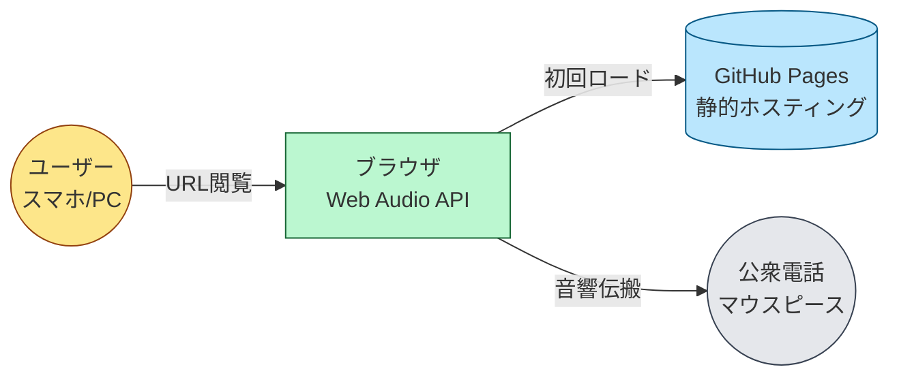
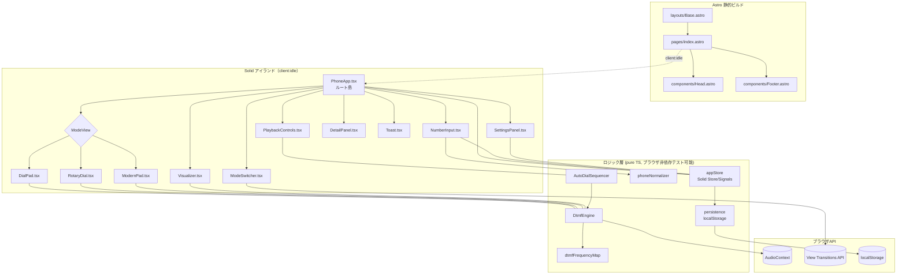
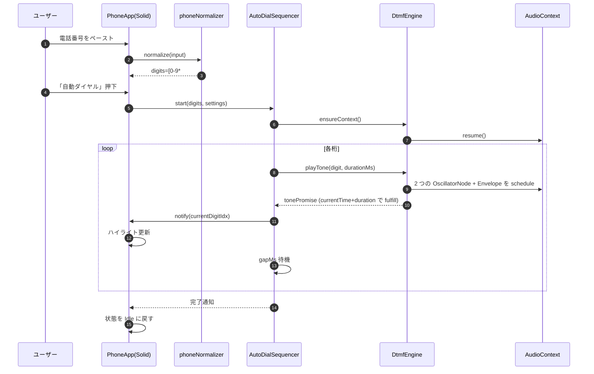
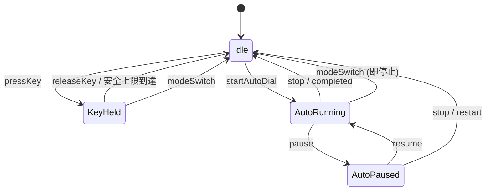
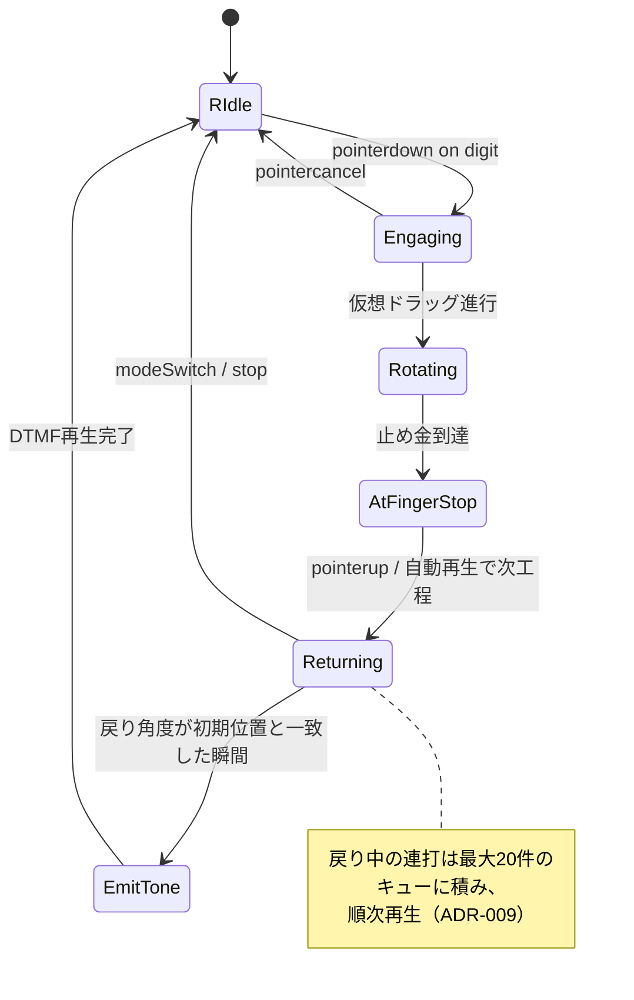
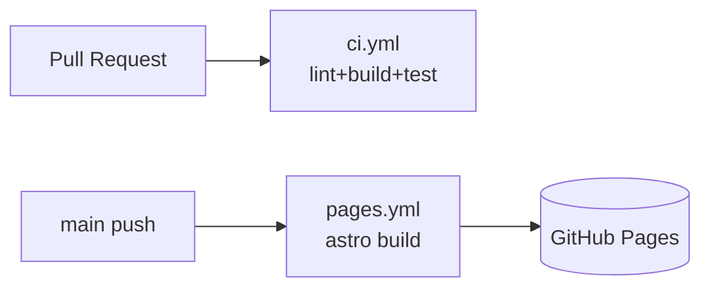
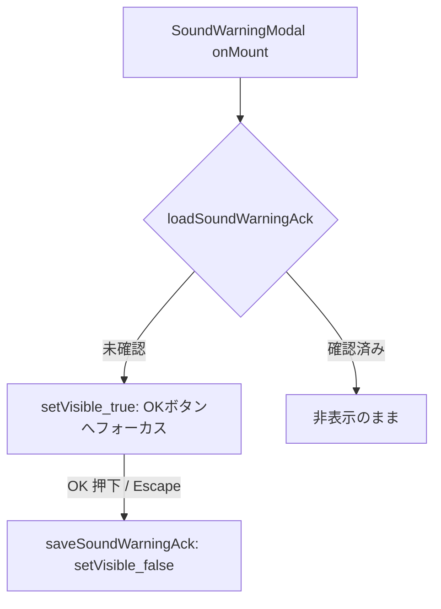

# 設計

> 本書は `spec/requirements.md` の要件 (US-001〜010 / F-001〜010 / NFR-001〜009) を満たすための設計を定義する。
> 実装着手前に必ずこの設計を参照し、不整合があれば本書を更新したうえで実装する。

## 設計の指針

1. **静的配信ファースト**: GitHub Pages 配信のためサーバ処理を一切持たない。すべて静的ファイル + ブラウザ実行。
2. **アイランドアーキテクチャ**: Astro が出力する HTML 内で、操作が必要な部分のみ Solid コンポーネントを島として水和する。初回JS転送量 ≤ 100KB gzip (NFR-009) を達成する。
3. **音声処理は単一エンジンに集約**: AudioContext / Oscillator の生成と破棄、シーケンサ、停止は `DtmfEngine` に集約し、UI 層から直接 Web Audio API を叩かない。
4. **状態は単一ストアに集約**: Solid の Signal / Store でアプリ全体の状態を 1 箇所に保持。永続化対象は localStorage に保存。
5. **TDD前提**: ロジック層（エンジン・正規化・シーケンサ）は UI から完全に分離し、ブラウザ非依存で単体テスト可能な形で実装する。AudioContext は薄いラッパで抽象化する。

---

## アーキテクチャ概要

### システムコンテキスト



### コンポーネント構成



### ランタイムフロー（自動ダイヤルの例）



---

## ディレクトリ構成

```
.
├── spec/                        # 要件・設計・計画
├── public/
│   ├── favicon.svg
│   └── og.png                   # OGP画像（あれば）
├── src/
│   ├── pages/
│   │   └── index.astro          # 唯一の SPA エントリ
│   ├── layouts/
│   │   └── Base.astro           # <head> / メタ / View Transitions ルート
│   ├── components/              # Astro コンポーネント (SSG, 非インタラクティブ)
│   │   ├── Head.astro
│   │   ├── Footer.astro
│   │   └── Hero.astro
│   ├── islands/                 # Solid アイランド (client:* で水和)
│   │   ├── PhoneApp.tsx         # ルート島・全体配線
│   │   ├── NumberInput.tsx
│   │   ├── ModeSwitcher.tsx
│   │   ├── DialPad.tsx
│   │   ├── RotaryDial.tsx
│   │   ├── ModernPad.tsx
│   │   ├── PlaybackControls.tsx
│   │   ├── SettingsPanel.tsx
│   │   ├── DetailPanel.tsx
│   │   ├── Visualizer.tsx
│   │   └── Toast.tsx
│   ├── lib/                     # ブラウザ非依存（または極薄ラッパ）のロジック
│   │   ├── dtmf/
│   │   │   ├── frequencyMap.ts  # ITU-T Q.23 周波数表
│   │   │   ├── engine.ts        # DtmfEngine クラス
│   │   │   ├── sequencer.ts     # AutoDialSequencer
│   │   │   └── envelope.ts      # アタック/リリース計算
│   │   ├── input/
│   │   │   └── normalizer.ts    # 電話番号文字列の正規化
│   │   ├── state/
│   │   │   ├── store.ts         # Solid Store / Signals
│   │   │   └── persistence.ts   # localStorage 読み書き
│   │   └── platform/
│   │       └── audioContextFactory.ts  # AudioContext 生成・iOSサスペンド対応
│   ├── styles/
│   │   └── global.css           # Tailwind v4 + カスタムレイヤ
│   └── env.d.ts
├── tests/
│   ├── unit/
│   │   ├── normalizer.test.ts
│   │   ├── engine.test.ts       # FakeAudioContext を用いた振る舞いテスト
│   │   ├── sequencer.test.ts
│   │   └── store.test.ts
│   ├── component/
│   │   ├── DialPad.test.tsx     # @solidjs/testing-library + happy-dom
│   │   ├── NumberInput.test.tsx
│   │   └── RotaryDial.test.tsx
│   └── e2e/
│       └── auto-dial.spec.ts    # Playwright
├── scripts/                     # 既存（lint / build / test / quality-gate）
├── astro.config.mjs
├── biome.json
├── tailwind.config.ts           # v4 でも残す（プラグイン記述用）
├── tsconfig.json
├── package.json
├── bunfig.toml
└── playwright.config.ts
```

**配置原則:**
- `src/lib/**` は DOM/AudioContext を直接参照しない、もしくは引数経由でのみ受け取る純粋ロジック。これにより Bun Test で快速にテスト可能。
- `src/islands/**` は Solid コンポーネント。Astro 側からは `client:idle` で水和（ファーストペイント優先）。
- `src/components/**` は Astro 静的コンポーネントのみ（インタラクティブ性を持たない）。

---

## モジュール詳細設計

### `lib/dtmf/frequencyMap.ts`

DTMF キー → 周波数 (Hz) の不変テーブル。`as const` で型推論。

```ts
export const DTMF_FREQUENCY_MAP = {
  "1": { low: 697, high: 1209 },
  "2": { low: 697, high: 1336 },
  "3": { low: 697, high: 1477 },
  "4": { low: 770, high: 1209 },
  "5": { low: 770, high: 1336 },
  "6": { low: 770, high: 1477 },
  "7": { low: 852, high: 1209 },
  "8": { low: 852, high: 1336 },
  "9": { low: 852, high: 1477 },
  "*": { low: 941, high: 1209 },
  "0": { low: 941, high: 1336 },
  "#": { low: 941, high: 1477 },
} as const;

export type DtmfKey = keyof typeof DTMF_FREQUENCY_MAP;
```

### `lib/platform/audioContextFactory.ts`

- ブラウザの `AudioContext` または `webkitAudioContext` を選び、シングルトンで生成。
- ユーザー操作（最初の `pointerdown` 等）まで生成を遅延 → iOS Safari のサスペンド回避。
- `resume()` が必要な場合は `engine.ensureContext()` から呼ぶ。

### `lib/dtmf/envelope.ts`

クリックノイズ防止のため、各トーンの先頭・末尾に短いランプ（アタック 8ms / リリース 8ms、`linearRampToValueAtTime`）を適用するヘルパー。

### `lib/dtmf/engine.ts` — DtmfEngine

```ts
export interface DtmfEngine {
  ensureContext(): Promise<void>;
  /** 指で押している間の単音。stopKey() か stopAll() で停止 */
  pressKey(key: DtmfKey, opts?: { maxMs?: number }): void;
  releaseKey(): void;
  /** 自動ダイヤル用：指定 ms で 1 桁鳴らし、終わりまで待つ Promise を返す */
  playTone(key: DtmfKey, durationMs: number, when?: number): Promise<void>;
  /** 即時すべての発音を停止 */
  stopAll(): void;
  /** 0.0 - 1.0 */
  setVolume(v: number): void;
  /** 可視化のためのアナライザーノードを返す */
  getAnalyser(): AnalyserNode | null;
  /** 利用可否 */
  isSupported(): boolean;
}
```

**内部構造:**
- `AudioContext` ← lazy
- 共通 `GainNode`（マスターボリューム）→ `AnalyserNode`（可視化用）→ `destination`
- トーンごとに 2 個の `OscillatorNode` と 1 個の `GainNode`（エンベロープ）を都度生成 → 終了で `stop()` & `disconnect()`
- `pressKey` 時は `setTimeout(maxMs)` で安全停止（既定 5000ms / 上限 10000ms）。`releaseKey` で即停止。
- 新しいキー押下時、前のトーンを即停止（クロスフェード 5ms）。

**周波数精度（NFR-004）:**
- `oscillator.frequency.value` に表値をそのまま設定。`AudioContext.sampleRate`（通常 44.1kHz/48kHz）で生成される正弦波の偏差は浮動小数誤差程度（≪ ±1.5%）。
- ユニットテストで「`OscillatorNode.frequency.value === 期待値 ±0.01Hz`」を assert。

### `lib/dtmf/sequencer.ts` — AutoDialSequencer

自動ダイヤルを「`AudioContext.currentTime` ベースで先読みスケジュール」する方式で実装する（`setTimeout` 単独だと数十msのジッタがある）。

```ts
export interface AutoDialOptions {
  toneDurationMs: number;   // F-005 既定 150ms
  gapMs: number;            // F-005 既定 100ms
  signal: AbortSignal;      // 停止/一時停止用
  onTick: (digitIdx: number) => void;
}

export interface AutoDialSequencer {
  start(digits: string, opts: AutoDialOptions): Promise<void>;
  pause(): void;
  resume(): void;
  position(): number;
}
```

**実装方針:**
- `audioCtx.currentTime` を起点に各桁の発音開始時刻 `t_i = t_0 + i*(tone+gap)` を計算し `playTone(digit, duration, when=t_i)` で予約。
- 同時に `onTick` を `setTimeout(t_i - now)` で呼んで UI ハイライト更新。
- `signal.aborted` 検知で全予約をキャンセル（前述 `stopAll`）。
- `pause()` は現桁終了まで待ち、次桁予約をキャンセル。`resume()` は現在位置から再スタート（新しい `t_0` を取り直す）。
- 一度に予約する量は最大 16 桁分（メモリと AbortController のための上限）。残桁は順次予約。

### `lib/input/normalizer.ts`

```ts
export interface NormalizeResult {
  display: string;           // 表示用（先頭の + を保持、他の許可記号は維持）
  digits: string;            // 再生用：[0-9*#]+ のみ
  hadInternationalPrefix: boolean;
  removed: string;           // 取り除いた文字（学習用に保持）
}
export function normalizePhoneNumber(input: string): NormalizeResult;
```

**正規化ルール（ADR-006 で詳述）:**
- 許可: `0-9`, `*`, `#`
- 削除: 空白 / `-` / `(` `)` / `.` / `/`
- 先頭の `+` は **発音対象から除外**（公衆電話の DTMF では国際プレフィックスを送出しない／別途オペレータ番号が必要なため）。`display` には残し、`hadInternationalPrefix=true` を立てて、UI 上に「先頭の `+` は鳴らされません」と注記する。
- アルファベット（vanity number, 例: 1-800-FLOWERS）は本スコープでは数字変換せず削除する（要件のスコープ外）。
- 最大 **64 桁**（F-002 のユーザー操作で誤って大量入力された場合の安全上限）。超過は切り詰めて警告を表示。

### `lib/state/store.ts` — appStore

Solid の `createStore` でグローバルアプリ状態を保持。Context 経由で子島に注入。

```ts
type UiMode = "retro" | "modern" | "rotary";
type Playback = "idle" | "key_held" | "auto_running" | "auto_paused";

interface AppState {
  raw: string;                  // ユーザー入力そのまま
  display: string;              // 整形表示
  digits: string;               // 再生対象
  hadInternationalPrefix: boolean;
  currentDigitIdx: number;      // -1 なら未再生
  playback: Playback;
  mode: UiMode;
  settings: {
    toneDurationMs: number;     // 150
    gapMs: number;              // 100
    volume: number;             // 0.5
  };
  audio: {
    supported: boolean;
    contextSuspended: boolean;
  };
  toast: { kind: "info" | "warn" | "error"; message: string } | null;
}
```

### `lib/state/persistence.ts`

- キー名前空間: `dtmf:settings`, `dtmf:mode`。
- `JSON.parse` 失敗・スキーマ不一致は無視してデフォルト値で起動（壊れた localStorage で全死を避ける）。
- 入力番号は **永続化しない**（プライバシー: NFR-002）。
- バージョンキー `dtmf:schemaVersion=1` を持たせ、将来のマイグレーションに備える。

---

## 状態遷移

### 再生状態マシン（PhoneApp 全体）



### 回転ダイヤル状態マシン（RotaryDial 内部）



---

## UI モード設計（F-004）

3モードを共通の状態に紐づく **ビュー差分** として実装する。

| モード | 説明 | レイアウト | 配色 (Tailwind v4) |
|--------|------|------------|--------------------|
| `retro` | 緑/グレーのレトロ公衆電話風 | 縦長カード＋テンキー | `bg-emerald-900` / `text-emerald-50` / 鋳鉄調影 |
| `modern` | フラットなミニマル UI | グリッド配置 | `bg-neutral-950` / アクセント `cyan-400` |
| `rotary` | 黒電話風円形ダイヤル | 中央に円形ダイヤル + 補助 `*` `#` ボタン | `bg-zinc-100` / `text-zinc-900` |

- モード切替は `document.startViewTransition()` でクロスフェード（200〜400ms）。非対応ブラウザでは即時切替。
- 共通要素（番号入力欄・再生制御・設定）はモードに関わらず表示。
- `prefers-reduced-motion: reduce` の場合、View Transitions も発火させない（CSS `view-transition-class: none` 相当）。

---

## 視覚的フィードバック（F-007）

| 要素 | 実装 |
|------|------|
| キー押下感 | `transform: scale(0.96)` + `box-shadow` + `outline` の発光リング。CSS のみ |
| 自動ダイヤル進行ハイライト | `currentDigitIdx` で対象 `<span>` / `<button>` に `data-active` を付与し CSS で強調 |
| 波形ビジュアライザ | `AnalyserNode.getByteTimeDomainData` を `requestAnimationFrame` で読み出し `<canvas>` に折線描画。再生していない時は描画ループを停止 |
| 回転アニメ | `transform: rotate()` + `transition: transform cubic-bezier()` を JS で切替 |
| モード切替 | View Transitions API |
| reduced-motion | `@media (prefers-reduced-motion: reduce)` で `transition` を 0ms に、回転は中間補完なしで瞬時 |

---

## アクセシビリティ設計（F-010 / NFR-007）

- すべてのボタンに `aria-label`（例: `<button aria-label="ダイヤルキー 7">`）。
- キーボードイベントを Document レベルで購読し、`0-9`, `*`, `#` を対応キーへルーティング。フォーカスマネジメントは `tabindex` で順序を制御。
- `Space` / `Enter` で押下、`Esc` で停止。
- フォーカスリングは常時可視（`:focus-visible` で 2px ハイコントラスト）。
- カラーパレットは WCAG 2.2 AA を満たす組合せに限定（CI で `@axe-core/playwright` で検査）。
- スクリーンリーダー向けに、再生開始/停止/桁進行を `aria-live="polite"` の隠し領域に出力。

---

## 技術選定

| カテゴリ | 採用 | バージョン基準 | 選定理由 / 既定との差分 |
|----------|------|---------------|----------------------|
| フレームワーク（静的） | Astro | 5系 (2026-05-18時点の最新安定版) | アイランド配信。要件で指定 |
| UI（島） | Solid + @astrojs/solid-js | Solid 1系 | 軽量・きめ細かい反応性。要件で指定 |
| スタイル | Tailwind CSS v4 | 4系 | 要件指定。CSS-first config |
| 言語 | TypeScript | 5系 | CLAUDE.md デフォルト |
| ランタイム / PM | Bun | 1系 | CLAUDE.md デフォルト |
| 単体テスト | Bun Test + happy-dom + @solidjs/testing-library | 各最新安定版 | CLAUDE.md デフォルト |
| 静的解析 | Biome | 2系 | CLAUDE.md デフォルト |
| E2E | Playwright | 1系 | Web Audio含むユーザー操作検証に必要 |
| アクセシビリティ検査 | `@axe-core/playwright` | 最新 | NFR-007 達成のため |
| デプロイ | GitHub Actions → GitHub Pages | — | 要件指定 |

> 既定（Next.js）から **Astro+Solid に変更した理由** は ADR-001 に記録。

---

## ビルド・デプロイ設計

### Astro 設定の要点

```ts
// astro.config.mjs (概念)
export default defineConfig({
  output: "static",
  site: "https://<user>.github.io",
  base: "/dtmf/",            // リポジトリ名配下
  integrations: [solid()],
  vite: { build: { target: "es2022" } },
});
```

- すべての内部リンク・アセット参照は `import.meta.env.BASE_URL` 経由。
- `public/.nojekyll` を置き Jekyll 処理を抑止。

### GitHub Actions



- `ci.yml`: `bun install` → `bash scripts/quality-gate.sh` → Playwright (headless) を実行。
- `pages.yml`: `main` への push 時、`bun run build` → `actions/deploy-pages@v4` で配信。

---

## セキュリティ設計

本SPAは外部通信なし・サーバなし・PIIなし・第三者スクリプトなしの極小攻撃面である。重点は **XSS** と **クリックジャッキング** と **悪用防止表記**。

### 入力検証

- `normalizePhoneNumber` で許可文字以外を機械的にフィルタ。
- すべての入力は **テキストとしてのみ** DOM に挿入する。`innerHTML` 系の API は禁止（Biome ルールで lint）。
- Astro/Solid のテンプレートは既定でエスケープされるが、`set:html` / `innerHTML` は **使用禁止**（コードレビュー観点）。
- 入力長上限 64 桁。

### 認証・認可

- 認証なし。クライアント単体動作。

### データ保護

- 番号は **メモリ上のみ**。永続化しない（NFR-002）。
- 設定値（音量/トーン長/ギャップ/モード）のみ localStorage に保存。これらは個人情報ではない。
- アナリティクス・ログ送信は **入れない**。

### CSP / フレーム保護

- GitHub Pages はカスタム HTTP ヘッダーを設定できないため、`<meta http-equiv="Content-Security-Policy">` で以下を設定:

  ```
  default-src 'self';
  script-src 'self';
  style-src 'self' 'unsafe-inline';   /* Tailwind ランタイム不要のため最小化を試みる */
  img-src 'self' data:;
  media-src 'self';
  connect-src 'none';
  frame-ancestors 'self';
  base-uri 'self';
  form-action 'none';
  ```

- `<meta http-equiv="X-Frame-Options" content="SAMEORIGIN">` 相当は CSP の `frame-ancestors` で代替。

### 悪用防止表記（要件 制約事項）

- フッターに以下を明記:
  > 本ツールは合法的なダイヤル支援・学習・娯楽用途を目的としています。フリーキング、不正な電話会社サービス操作、第三者への嫌がらせ電話の補助等への利用を禁止します。

### 依存パッケージ

- `npm audit` 相当を Bun の `bun audit` で CI に組み込む。
- High/Critical はマージ前に解消。

---

## エラーハンドリング方針

| エラー種別 | 検知タイミング | 対処 | ユーザーへの表示 |
|-----------|-------------|------|----------------|
| Web Audio API 非対応 | 起動直後 `engine.isSupported()` | 全機能を無効化 | ヒーロー領域に「お使いのブラウザは Web Audio API に対応していません」 |
| AudioContext サスペンド | 最初のキー操作試行時 | `resume()` を試み、失敗時はバナー表示 | 上部バナー「画面をタップして音を有効にしてください」（自動消失） |
| 入力が空 / 不正のみ | 「自動ダイヤル」押下時 | 再生しない | Toast (error) 「ダイヤル可能な文字がありません」 |
| 入力 64 桁超過 | normalize 時 | 末尾を切り詰める | Toast (warn) 「最大64桁まで。先頭から64桁のみ使用します」 |
| `localStorage` 不可 / 破損 | 起動時 | デフォルトで動作 | サイレント（DevTools 警告のみ） |
| Oscillator 生成失敗 | playTone 時 | シーケンス中断、stopAll | Toast (error) 「音声合成に失敗しました。再読込してください」 |
| View Transitions 非対応 | モード切替時 | 即時切替へフォールバック | サイレント |
| 自動ダイヤル中の重複起動 | ボタン二重押下 | 既存シーケンスを `abort` してから再開 | サイレント |

---

## ADR（Architecture Decision Records）

### ADR-001: 静的サイト基盤に Astro + Solid（アイランドアーキテクチャ）を採用

**ステータス**: 承認待ち
**日付**: 2026-05-21

**コンテキスト**:
GitHub Pages 配信、軽量バンドル、PWA化はスコープ外という制約のもとで、JSフレームワークを選定する必要があった。CLAUDE.md デフォルトは Next.js だが、Next.js の静的書き出しは SPA 全体を 1 バンドルで配信する傾向があり、要件 NFR-009（≤100KB gzip）の達成余地が狭い。

**選択肢:**
1. **Astro + Solid アイランド**（本書の選択）
2. Next.js (static export)
3. Vite + Solid（フレームワークなし）

**決定**: 選択肢 1。

**理由**:
- Astro はビルド時にコンテンツを静的化し、操作が必要な箇所だけ Solid 島として水和する。初回 JS ペイロードを最小化できる。
- Solid は React と似た書き味で、ランタイムが小さく（≈ 7KB gzip）、シグナルベースで本要件の反応性に適合する。
- 要件で「Astro + Solid（アイランドアーキテクチャ）」が明示指定されている。

**影響**:
- CLAUDE.md デフォルト（Next.js）からの逸脱を本書に明記。
- 既定の TS スタックである Bun Test / Biome は維持し、UI テストは `@solidjs/testing-library` を併用する。
- Astro + Solid の組合せは `@astrojs/solid-js` インテグレーションで確立されており保守リスクは低い。

---

### ADR-002: DTMF 音声合成は OscillatorNode 2 本 + GainNode で生成

**ステータス**: 承認待ち
**日付**: 2026-05-21

**コンテキスト**:
DTMF 音は 2 周波数の加算で定義される。事前録音 WAV を持つ案もあるが、12 キー × 数バリエーションのアセットでバンドルが肥大する。

**選択肢:**
1. **`OscillatorNode` 2 本 + `GainNode` を毎回生成**（本書の選択）
2. 事前生成した PCM バッファを `AudioBufferSourceNode` で再生
3. `AudioWorklet` で DSP

**決定**: 選択肢 1。

**理由**:
- 周波数指定値が直接 ITU-T Q.23 と一致し、誤差は浮動小数点と sampleRate 由来のみ（≪ ±1.5% NFR-004）。
- アセット不要でバンドル軽量。
- 各音ごとに `start/stop` + `disconnect` でクリーンアップ可能。
- AudioWorklet はメインスレッド外で動くが、本用途では過剰。

**影響**:
- ノード生成のオーバーヘッドは数ms。連打時は前ノードを `stop()` してから生成。
- エンベロープ（8ms 程度のアタック/リリース）でクリックノイズを抑える。

---

### ADR-003: 自動ダイヤルは `AudioContext.currentTime` ベースのスケジュール方式

**ステータス**: 承認待ち
**日付**: 2026-05-21

**コンテキスト**:
`setTimeout`/`setInterval` は GC・タブ非アクティブ等で 数十ms の遅延が発生し得る。NFR-004 はトーンの周波数誤差を規定するが、Q.24 のタイミング許容も実用上満たしたい。

**選択肢:**
1. **`AudioContext.currentTime` で先読み予約**（本書の選択）
2. `setTimeout` 連鎖
3. Web Worker から `postMessage`

**決定**: 選択肢 1。

**理由**:
- Web Audio API の予約は AudioContext のサンプリングクロックで動き、メインスレッド負荷の影響を受けにくい。
- UI ハイライト同期だけ `setTimeout` で十分（多少のジッタは視覚的に許容）。
- Web Worker は AudioContext を生成できない（一部新仕様除く）ためメリットが薄い。

**影響**:
- 予約済みノードのキャンセルは `AbortController` で gain ramp を 0 にし `stop()` する。
- 一度に予約する最大桁数は 16（メモリ・キャンセル容易性）。

---

### ADR-004: アプリ状態は Solid Signals + Context で管理

**ステータス**: 承認待ち
**日付**: 2026-05-21

**コンテキスト**:
状態管理ライブラリの選択肢が複数ある。

**選択肢:**
1. **Solid `createStore` + Context**（本書の選択）
2. nanostores
3. Zustand
4. ローカルステートのみ

**決定**: 選択肢 1。

**理由**:
- 追加依存ゼロ。Solid 標準で十分。
- きめ細かい反応性で再描画コスト最小。

**影響**:
- 永続化は薄い `persistence.ts` で個別フィールドを localStorage に同期。

---

### ADR-005: 入力番号の正規化方針（先頭 `+` は発音対象外）

**ステータス**: 承認待ち
**日付**: 2026-05-21

**コンテキスト**:
要件 F-002 で「`+` は国際発信プレフィックスとしての扱いを設計フェーズで定義」とされている。公衆電話の DTMF で `+` を表現する標準的方法はない（国際発信には別途オペレータ番号や交換機側手順が必要）。

**選択肢:**
1. **`+` は発音せず無視（display には残す）**（本書の選択）
2. 先頭の `+` を `00` 等の決め打ち国際プレフィックスに置換
3. `+` を含む場合はエラー扱い

**決定**: 選択肢 1。

**理由**:
- 国ごとの国際プレフィックスが異なり、誤った置換はユーザーを誤誘導しかねない。
- ユーザー判断で適切な国際プレフィックスを別途付与できるよう、画面注記で明示。

**影響**:
- UI で「先頭の `+` は鳴らされません。必要に応じて国際発信プレフィックスを直接ご入力ください」と注記。

---

### ADR-006: vanity number（英字含む電話番号）は本スコープでは数字変換しない

**ステータス**: 承認待ち
**日付**: 2026-05-21

**コンテキスト**:
"1-800-FLOWERS" のような英字を含む電話番号表記をどう扱うか。

**選択肢:**
1. **英字は単純に削除**（本書の選択）
2. E.161 のキー配列で `ABC→2`, `DEF→3` …に変換

**決定**: 選択肢 1。

**理由**:
- 要件のスコープ外。実装複雑度を抑える。
- 将来拡張余地としてコメントに残す。

---

### ADR-007: 回転ダイヤル戻り中の連打は最大 20 件のキュー方式

**ステータス**: 承認待ち
**日付**: 2026-05-21

**コンテキスト**:
要件 F-003 で「キュー」か「ブロック」か選択を求められている。

**選択肢:**
1. **キュー方式、上限 20**（本書の選択）
2. ブロック方式（戻り中の入力を無視）

**決定**: 選択肢 1（ただしユーザー検討事項として残す）。

**理由**:
- 黒電話の体験再現として、連続入力に対するレスポンスが期待される。
- 上限 20 桁は最大入力 64 桁の 1/3 程度で実用上十分。

**影響**:
- キュー満杯時はキーを `aria-disabled="true"` にして打鍵フィードバックを抑止。

---

### ADR-008: UI モード切替は View Transitions API + Solid `<Show>`

**ステータス**: 承認待ち
**日付**: 2026-05-21

**コンテキスト**:
要件 F-004 でモード切替を「滑らかに」「View Transitions API で 200〜400ms」と指定されている。

**選択肢:**
1. **`document.startViewTransition()` で API ネイティブ遷移**（本書の選択）
2. CSS のみのトランジション

**決定**: 選択肢 1。

**理由**:
- ネイティブ API でレイアウト差分を自動補完できる。
- 非対応ブラウザは即時切替にフォールバック。

---

### ADR-009: テスト基盤に Bun Test + happy-dom + @solidjs/testing-library + Playwright

**ステータス**: 承認待ち
**日付**: 2026-05-21

**コンテキスト**:
CLAUDE.md デフォルト Bun Test に加え、UI 部品と Web Audio API 関連の検証手段が必要。

**選択肢:**
1. **Bun Test (純粋ロジック) + happy-dom + @solidjs/testing-library (コンポーネント) + Playwright (E2E)**（本書の選択）
2. Vitest 一本

**決定**: 選択肢 1。

**理由**:
- ランタイム軽量、CLAUDE.md と整合。
- Web Audio API は happy-dom にないため、`engine.ts` のテストは `FakeAudioContext` を自前で用意する。
- 実ブラウザ挙動（AudioContext, View Transitions）は Playwright で別途検証。

---

### ADR-010: GitHub Pages 配信に伴う制約への対応

**ステータス**: 承認待ち
**日付**: 2026-05-21

**コンテキスト**:
GitHub Pages はカスタム HTTP ヘッダーを設定できないため、CSP・HSTS 等を HTTP ヘッダーで強制できない。

**決定**:
- `<meta http-equiv="Content-Security-Policy">` で CSP を最大限緩和的に表現。
- HSTS は GitHub の `*.github.io` 配信に依存（Strict-Transport-Security はプリロード済み）。

**影響**:
- 厳密に強制されないため、追加で Subresource Integrity (SRI) と `import.meta.env.BASE_URL` の徹底で第三者改竄リスクを抑える。

---

# 追加設計（Phase 3: デザイン完全再構築）

> 2026-05-23: Phase 3 要件定義（F-014〜F-018 / NFR-012〜014）に対応する設計を追記。
> 機能層（DTMF エンジン・状態管理・正規化・入力モード）は **一切変更しない**。本セクションが扱うのは「ビジュアル層・レイアウト層・コンポーネント DOM 構造」のみ。

## P3-1. デザイントークン（CSS Custom Properties / 単一の真実源）

`src/styles/global.css` の `:root` に以下を集約。Tailwind / 個別コンポーネントからの生のカラー指定は禁止（NFR-014）。

```css
:root {
  /* Color — 3-color rule (NFR-012) */
  --ink:      #0A0A0A;   /* 文字・枠線 */
  --paper:    #F2EFE6;   /* 背景 */
  --signal:   #FF3B30;   /* アクセント・再生中 */
  --ink-50:   #6B6B68;   /* 補助テキストのみ */

  /* Typography */
  --font-sans: "Helvetica Neue", "Inter", "Arial", "Hiragino Kaku Gothic ProN", sans-serif;
  --font-mono: "JetBrains Mono", "SFMono-Regular", "Menlo", "Consolas", ui-monospace, monospace;

  /* Spacing scale (4px base) */
  --s-1: 4px;  --s-2: 8px;  --s-3: 12px; --s-4: 16px;
  --s-6: 24px; --s-8: 32px; --s-12: 48px; --s-16: 64px;

  /* Border / Shadow */
  --hair:        2px solid var(--ink);
  --shadow-hard: 4px 4px 0 var(--ink);  /* オフセットのみ、blur=0 */

  /* Layout */
  --col-max:     1200px;
  --bp-desk:     1024px;
}

@media (prefers-color-scheme: dark) {
  :root { --ink: #F2EFE6; --paper: #0A0A0A; --ink-50: #9a9a96; }
}
```

**禁止事項（NFR-012 達成のため、CSS レビューでチェック）:**
- `linear-gradient` / `radial-gradient` / `conic-gradient`
- `border-radius` が 0 / 50% 以外
- `box-shadow` で blur > 0（`0 X X rgb(0 0 0 / Y)` 形式は全削除）
- `backdrop-filter: blur` / `rgb(... / 0.0X)` のガラスエフェクト
- `--accent: #60a5fa` / `theme-retro` / `theme-modern` の独自配色

## P3-2. レイアウトグリッド（F-014）

### スマホ（< 1024px）— 縦 1 カラム

```
┌──────────────────────────┐
│ BRAND  DTMF / WEB DIALER │  brand-row  (h: 56px, sticky-top)
├──────────────────────────┤
│ display [ — — — — — ]    │  display    (h: ≥96px, w: 100%)
│ INPUT          0 / 64    │
├──────────────────────────┤
│ mode-pick: [Pad][Mod][Rot]│  mode-row
├──────────────────────────┤
│                          │
│     dial-stage (主役)    │  dial-stage (短辺の 70-85%)
│                          │
├──────────────────────────┤
│ ▶ PLAY   ■   ⏸    ↻     │  transport (sticky-bottom + safe-area)
├──────────────────────────┤
│ ▾ CONFIG / DETAILS       │  config
└──────────────────────────┘
```

CSS:
```css
.stage { display: grid; grid-template-rows: auto auto auto 1fr auto auto; min-height: 100dvh; }
.transport { position: sticky; bottom: 0; padding-bottom: max(env(safe-area-inset-bottom), 0px); }
```

### PC（≥ 1024px）— 2 カラム CSS Grid

```
┌────────────────────────────────────────────────────┐
│ BRAND  DTMF / WEB DIALER / 2026 / OPUS 4.7         │  brand-row (full width, h: 80px)
├──────────────────────────┬─────────────────────────┤
│ DISPLAY (大)             │ MODE-PICK               │
│ [ — — — — — — — ]       │ [PAD] [MOD] [ROT]       │
│ INPUT     0 / 64         │                         │
│                          │ DIAL-STAGE              │
│ TRANSPORT                │  (key size 72-88px)     │
│ ▶ PLAY  ■  ⏸  ↻         │                         │
│                          │                         │
│ CONFIG                   │                         │
│  - tone-ms               │                         │
│  - gap-ms                │                         │
│  - volume                │                         │
│                          │                         │
│ DETAILS (freq)           │                         │
└──────────────────────────┴─────────────────────────┘
   col-left  (44%)            col-right (56%)
```

CSS:
```css
@media (min-width: 1024px) {
  .stage { grid-template: "brand brand" auto "left right" 1fr / 44% 56%; max-width: var(--col-max); margin-inline: auto; }
  .transport { position: static; } /* PC では sticky 不要 */
}
```

### タブレット（768-1023px）

スマホ縦レイアウトを `max-width: 640px` で中央寄せ。中間レイアウトは作らない。

### 既存クラスの廃止

| 廃止 | 置換 |
|------|------|
| `.app-shell` | `body` 自体に背景・色のみ |
| `.page` | `.stage` (CSS Grid) |
| `.page-header` | `.brand` |
| `.dialer` | コンテナ廃止、要素を `.stage` 直下へ |
| `.dial-section` | `.dial-stage` (no card-in-card) |
| `.number-field` | `.display` (output 主体) |
| `.glass-panel` | `.panel` (2px border, no glass) |
| `.theme-retro/modern/rotary` | 配色差を撤廃。**形状差**のみで識別 |

## P3-3. コンポーネント仕様

### Display（番号ディスプレイ・F-016）

DOM 構造（テスト互換のため `data-testid="phone-input"` と `data-testid="digit-preview"` 両方を維持）:

```html
<section class="display" aria-label="番号ディスプレイ">
  <header class="display__meta">
    <span class="display__status">INPUT</span>   <!-- INPUT|PLAYING|DONE -->
    <span class="display__count">0 / 64</span>
  </header>
  <output class="display__screen" data-testid="digit-preview">
    <!-- empty -->
    <span class="display__placeholder">— — — — —</span>
    <!-- or filled -->
    <span class="display__digit" data-state="done">1</span>
    <span class="display__digit" data-state="now">2</span>
    <span class="display__digit" data-state="next">3</span>
  </output>
  <input
    type="tel" inputmode="tel" autocomplete="tel"
    class="display__hidden-input"
    data-testid="phone-input"
    aria-label="電話番号入力"
  />
</section>
```

- `output` がクリック・タップを受け、隠し input に `focus()` を transfer
- 隠し input は `position: absolute; opacity: 0; pointer-events: none;` で見えない（テストの `.fill()` は値属性で動作）
- 状態 `data-state="done|now|next"`:
  - `done` → `color: var(--ink)`
  - `now` → `color: var(--signal); animation: blink 0.6s steps(1) infinite`
  - `next` → `color: var(--ink-50)`
- スマホ: `font-size: clamp(2rem, 9vw, 3.5rem); height: clamp(96px, 16vw, 140px); letter-spacing: 0.1em;`
- PC: `font-size: 4.5rem; height: 140px;`
- `font-family: var(--font-mono); font-variant-numeric: tabular-nums; text-align: right;`
- ハードシャドウ枠: `border: var(--hair); box-shadow: var(--shadow-hard);`

### Brand（ヘッダー）

```html
<header class="brand">
  <span class="brand__mark">DTMF</span>
  <span class="brand__divider">/</span>
  <span class="brand__name">WEB DIALER</span>
  <span class="brand__meta">2026 · Opus 4.7</span>
</header>
```

- `font-family: var(--font-sans); font-weight: 800; letter-spacing: -0.04em;`
- スマホ: 32px / PC: 48px

### Dial Stage（ダイヤル本体・形状で差別化）

| モード | 形状差（配色は同じ） |
|--------|-------------------|
| Pad (retro) | 正方形キー 3×4、PC: 88px / スマホ: 22vw, ハードシャドウ付き、押下で `translate: 4px 4px; box-shadow: none` |
| Modern | Pad と同じ寸法だが**枠なし・反転色**（ink 背景・paper 文字）でコントラスト強。記号は半角 (`*`, `#`) |
| Rotary | 円盤（既存実装ベースだが配色を `--ink/--paper/--signal` に差し替え、グラデを `linear-gradient` 排除して solid `--paper` に変更） |

各キーの右下にキーキャップ表記（F-017）:
```html
<button class="key" data-key="5">
  <span class="key__label">5</span>
  <span class="key__cap">5</span>  <!-- PC のみ表示 (CSS @media) -->
</button>
```

```css
.key__cap { display: none; }
@media (min-width: 1024px) {
  .key__cap { display: inline-block; position: absolute; right: 6px; bottom: 4px;
              font-family: var(--font-mono); font-size: 10px; color: var(--ink-50); }
}
```

### Transport（再生バー）

```html
<nav class="transport" data-testid="playback-controls">
  <button class="t-btn t-btn--primary" aria-label="番号をすべて再生">
    <span class="t-btn__icon">▶</span><span class="t-btn__label">PLAY</span>
    <kbd class="t-btn__kbd">↵</kbd>
  </button>
  <button class="t-btn" data-testid="stop-button" aria-label="再生を停止">
    <span class="t-btn__icon">■</span><span class="t-btn__label">STOP</span>
    <kbd class="t-btn__kbd">esc</kbd>
  </button>
  <button class="t-btn"><span>⏸</span>PAUSE</button>
  <button class="t-btn"><span>▷</span>RESUME</button>
  <button class="t-btn" data-testid="restart-button"><span>↻</span>RESTART</button>
</nav>
```

- PLAY ボタンは `background: var(--signal); color: var(--paper);`
- 他はゴースト（`background: transparent; border: var(--hair); color: var(--ink);`）
- 全ボタン高さ 56px、`font-family: var(--font-sans); font-weight: 700; letter-spacing: 0.08em;`
- `<kbd>` は PC のみ表示

### Mode Picker

```html
<fieldset class="mode-pick" data-testid="mode-switcher">
  <legend class="sr-only">UIモード切替</legend>
  <button aria-pressed="true">[01] PAD</button>
  <button aria-pressed="false">[02] MODERN</button>
  <button aria-pressed="false">[03] ROTARY</button>
</fieldset>
```

- 3 ボタン横並び（CSS Grid `grid-template-columns: repeat(3, 1fr)`）
- 各ボタンは `border: var(--hair); padding: 12px; font-family: var(--font-mono);`
- `aria-pressed="true"` 時: `background: var(--ink); color: var(--paper);`（反転）
- 他: `background: var(--paper); color: var(--ink);`

### Config / Details（補助パネル）

`<details>` ベース。`summary` をブルータリスト化（`▾ CONFIG` / `▾ DETAILS`）。
スライダのトラックを 2px の ink ライン、つまみを 16px の正方形 ink ブロックに統一。

```css
input[type="range"] { -webkit-appearance: none; height: 2px; background: var(--ink); }
input[type="range"]::-webkit-slider-thumb {
  -webkit-appearance: none; width: 16px; height: 16px; background: var(--signal); border: var(--hair); border-radius: 0;
}
```

### Toast

固定位置・ハードシャドウ・solid color のみ。
```css
.toast { border: var(--hair); box-shadow: var(--shadow-hard); background: var(--paper); color: var(--ink); }
.toast[data-kind="error"] { background: var(--signal); color: var(--paper); }
```

### Visualizer

既存の Canvas を維持（DOM 構造維持）。グラデ＋shadowBlur を **`--signal` 一色・blur=0** に置換:

```js
ctx.strokeStyle = getComputedStyle(canvas).getPropertyValue("--signal").trim() || "#FF3B30";
ctx.lineWidth = 2;
// shadowBlur 削除
```

枠は `border: var(--hair); background: var(--paper);`

## P3-4. テクスチャ（紙繊維風ノイズ）

`body::before` に SVG ノイズを擬似要素で重ねる:

```css
body::before {
  content: ""; position: fixed; inset: 0; pointer-events: none; z-index: 999;
  opacity: 0.05; mix-blend-mode: multiply;
  background-image: url("data:image/svg+xml;utf8,<svg xmlns='http://www.w3.org/2000/svg' width='160' height='160'><filter id='n'><feTurbulence type='fractalNoise' baseFrequency='0.9' numOctaves='2'/></filter><rect width='100%' height='100%' filter='url(%23n)'/></svg>");
}
@media (prefers-reduced-motion: reduce) { body::before { display: none; } }
```

## P3-5. キーボード操作（F-017）

`PhoneApp.tsx` の既存 `handleKeyboard` を維持し、追加で:
- `Enter`: `playbackControls.startAuto()` を発火（フォーカス位置に依らず、document level）
- `Escape`: 既存の stop ロジックを継続

各 dial キーに `<kbd>` 風表記を追加。reduced-motion 時は blink アニメ抑制。

## P3-6. アクセシビリティ（F-018）

- **コントラスト**: `--ink(#0A0A0A)` on `--paper(#F2EFE6)` ≈ 17:1（AAA 達成）。`--signal(#FF3B30)` on `--paper` ≈ 3.95:1（AA 大文字テキスト要件は満たす。本文に使わない）
- 全 testid 維持
- フォーカスリング: `outline: 2px solid var(--signal); outline-offset: 2px;` を `:focus-visible` のみに適用
- ボタン最小タップ: 全 dial キーは 44×44 以上を維持

## P3-7. 削除・置換するソースファイル

| ファイル | 操作 |
|---------|------|
| `src/styles/global.css` | **完全書き換え**（旧 token / 旧クラスを全削除） |
| `src/pages/index.astro` | 書き換え（`.app-shell .page` 廃止、`<main class="stage">` ベース） |
| `src/layouts/Base.astro` | `body` クラスから `.app-shell` を除去 |
| `src/components/Footer.astro` | ブルータリスト調整 |
| `src/islands/PhoneApp.tsx` | レイアウト DOM 再構築 |
| `src/islands/NumberInput.tsx` | `Display` コンポーネントへ書き換え |
| `src/islands/PlaybackControls.tsx` | Transport DOM へ書き換え |
| `src/islands/ModeSwitcher.tsx` | Mode Picker DOM へ書き換え |
| `src/islands/DialPad.tsx` | キーキャップ表記追加・正方形ボタン化 |
| `src/islands/ModernPad.tsx` | 反転配色化 |
| `src/islands/RotaryDial.tsx` | 配色を 3色に差し替え |
| `src/islands/SettingsPanel.tsx` | スライダ・パネルをブルータリスト化 |
| `src/islands/DetailPanel.tsx` | パネルをブルータリスト化 |
| `src/islands/Toast.tsx` | カラー差し替え |
| `src/islands/Visualizer.tsx` | グラデ・blur 排除、`--signal` 一色 |

DTMF エンジン (`src/lib/`) は **一切変更しない**。

## P3-8. テスト互換性マトリクス

| テスト | 期待 DOM | 本設計の維持方法 |
|-------|---------|-----------------|
| `dial-pad.spec.ts` | `[data-testid=dial-pad]` 内に `aria-label="ダイヤルキー 5"` ボタン | `DialPad.tsx` のクラスのみ変更、testid / aria 維持 |
| `mode-switch.spec.ts` | `[data-testid=mode-switcher]` 内に `モダン`/`回転` ボタン (exact) | ボタン文字列を `MODERN` ではなく `モダン`/`回転` のまま維持し、`[01] / [02] / [03]` プレフィックスは別 span に切り出さない（テキスト全体に含めない） → **代案**: テストが exact: true なので、表示は `[02] MODERN` でも `aria-label="モダン"` を持たせる。最終的に、**ボタンのテキストは「モダン」「回転」「レトロ」を保持し、コードナンバープレフィックスは付けない**（テスト互換優先） |
| `auto-dial.spec.ts` | `[data-testid=phone-input]` に fill / `name="番号をすべて再生"` ボタン / `[data-testid=stop-button]` | Display 内の隠し input が `phone-input` testid を持つ・PLAY ボタンは `aria-label="番号をすべて再生"` を維持 |
| `a11y.spec.ts` | axe-core 0 violations | コントラスト確保・全 aria-label 維持で達成 |

「[01]」プレフィックス付き mode ラベルは断念し、ボタンテキストは「レトロ」「モダン」「回転」のままにする（テスト破壊を避けるため）。番号プレフィックスはモード切替ボタンの外（fieldset の legend 風の見出し）でブルータリスト感を出す。


1. **音量曲線**: 0.0〜1.0 をリニアゲインで反映（要件 F-005）と記載があるが、人間の聴覚はログ的なので、UI 上の 0.5 が小さく感じる懸念がある。**リニアのまま** とするか、UI スライダだけ log カーブにマップするか。
2. **回転ダイヤルのキュー上限 20** の妥当性。
3. **入力最大桁数 64** の妥当性（一般の国内最長は ~13桁、緊急時想定で余裕を持たせている）。
4. **CSP**: `style-src 'unsafe-inline'` を残すか、Tailwind v4 のインラインスタイル排除を試みるか（実装の手間と引換）。
5. **悪用防止表記の文面**: 本書ドラフトのままで良いか、もう少し柔らかい表現にするか。

承認が得られたら **フェーズ3: 計画** へ移行し、`spec/plan.md` を作成する。

---

## P3-9. 回転ダイヤルの実機相当ジオメトリ・挙動（Phase 3 補完 / 2026-05-23 追加）

> 経緯: F-003 実装後のレビューで「実物の黒電話と比べておかしい」と指摘されたため、NTT 600/601 形相当の物理モデルに揃え直す。

### ジオメトリ（要件 F-003 改訂分の実装方針）

論理角度系（`src/lib/dtmf/rotaryAngle.ts`）:

| 関数 | 値 | 物理対応 |
|------|----|---------|
| `digitToAngle(N)` | `N * 36°`（`N=0` は `360°`） | ディスク上の数字穴 N の論理位置（ディスク原点基準・時計回り） |
| `fingerStopAngle(d)` | `d + 18°` | 穴と穴の中間（半ステップ）に置かれた金属ストッパー |
| `pulseCount(N)` | `N` (1..9) / `10` (0) | 戻り中に発生するパルス数 |
| `returnDurationMs(N, 100)` | `pulseCount(N) * 100ms` | ガバナ調速器の 10pps に近似 |

CSS 表示系（`src/styles/global.css` の `.rotary__face`）:

| トークン | 値 | 意味 |
|---------|----|------|
| `--rotary-stop-angle` | `150deg` | 指止めの表示角度（5時方向） |
| `--rotary-base-rotation` | `132deg` | 数字穴の表示基準（= stop − 18°）。`rotate(base − digit_angle)` で N の穴が `base − N×36°` の位置に並ぶ |

これにより、表示位置は:

| 数字 | 表示角度 (12時を 0°、時計回り) | 視覚的位置 |
|------|------|-----------|
| 1 | `132° − 36° = 96°` | 3時方向（止め金から最も遠い） |
| 2 | 60° | 2時 |
| 3 | 24° | 1時 |
| 4 | 348° | 12時 |
| 5 | 312° | 11時 |
| 6 | 276° | 10時 |
| 7 | 240° | 8時半 |
| 8 | 204° | 7時 |
| 9 | 168° | 6時前 |
| 0 | `132° − 360° ≡ 132°` | 4時手前（止め金の直前 18°） |
| 止め金 | 150° | 5時方向 |

「1」を選ぶ動作 = ディスクを時計回りに `36° + 18° = 54°` 回転 → 戻り 100ms × 1 = 100ms + DTMF 1音。
「0」を選ぶ動作 = `360° + 18° = 378°` 回転 → 戻り 1000ms（実機どおり最長）+ DTMF 1音。

### 戻り時の挙動

- **アニメーション曲線**: 戻りは `linear`（実機ガバナの等速回転を模倣）、巻き上げ（指の引っ張り）は `easeOut` のまま。
- **戻り時間**: `returnDurationMs(digit, 100)` = pulse数 × 100ms。数字が大きいほど長い。
- **クリック音**: `engine.playRotaryPulses(pulseCount, 100ms)` で戻り開始と同時にスケジュール。
  - 25ms 帯域ノイズ + 1800Hz ハイパスフィルタで「カチッ」を合成（DTMF とは別レイヤ）。
  - `prefers-reduced-motion: reduce` 時は再生しない。
  - 既存の DTMF 再生グラフ（masterGain → analyser → destination）を共有するため、波形ビジュアライザにも反映される。
- **DTMF 送出タイミング**: 戻り完了後に 1 音だけ。これは「公衆電話で使えるダイヤル支援」という本アプリの目的のため。実機は DTMF を発生しないが、ユーザー注記で明示する。
- **指挿入インジケータ**: 選択中の数字穴 (`data-active="true"`) を `--signal` 赤で塗り、回転中・戻り中も同期して移動する（指が穴に入っている表現）。

### エンジン API 追加

```ts
interface DtmfEngine {
  // ...既存...
  playRotaryPulses(count: number, intervalMs: number): void;
}
```

実装:
- AudioBufferSourceNode + 短いランダムノイズで「カチッ」を生成
- HighPass フィルタ (1800Hz) で帯域を絞る
- `stopAll()` で全パルス停止（既存 tone/scheduled と並行管理）

### テスト追加

`tests/unit/rotaryAngle.test.ts` に以下を追加:
- `fingerStopAngle("0")` が `378°`（= 360 + 18）
- `pulseCount("0")` が `10`、`pulseCount("1")` が `1`
- `returnDurationMs("0")` が `1000`、`returnDurationMs("1")` が `100`

E2E の `rotary.spec.ts` は DOM 構造を維持（`[data-testid="rotary-dial"]`、`aria-label="回転ダイヤル 5"` 等）。

> **⚠ P3-9 改訂注記（2026-05-23 / P3-11 にて適用）**:
> 上記 P3-9 の値（36° 刻み / 半ステップ 18° 止め金 / `base=132°`）はリリース後のレビューで
> 「実機と異なる」と再指摘され、P3-11 で **30° 刻み・隙間 90°・FINGER_STOP_OFFSET=0・base=150°**
> に改訂された。詳細は P3-11 を参照。

## P3-10. Clear ボタン追加と入力フィールド二重入力修正（Phase 3 補正 / 2026-05-23）

### 背景

要件 F-019 / B-09 への対応。スマホ仮想キーボードで番号入力欄に数字を入れると同じ数字が 2 回入力されるバグを修正し、Clear ボタンを追加する。

### B-09: 二重入力バグの原因と修正

**原因**: `src/islands/PhoneApp.tsx` の `handleKeyboard` は document に `keydown` リスナとして登録されており、`<input>` フォーカス時にも DTMF キー処理を実行する。

```
スマホで "5" タップ
  → keydown 発火 → handleKeyboard(target=<input>, key="5")
    → recordDialKey("5") → raw = "5"
  → 仮想キーボードが preventDefault を無視して文字を挿入 → input.value = "55"
  → input イベント発火 → onInput → setInput("55")
```

**修正**: `handleKeyboard` の DTMF キー処理ブロックの先頭に `inFormField` ガードを追加する。Enter / Escape は既存挙動（input にフォーカスがあっても `runAutoPlay` / `stopAll` を発火）を維持する。

```ts
if (!isDtmfKey(key)) return;

// 追加: input/textarea にフォーカスがある時は native input に委譲
if (inFormField) return;

if (e.type === "keydown" && !e.repeat) {
  // ...既存処理...
}
```

### F-019: Clear ボタン

**配置**: 番号ディスプレイ (`<section class="display">`) のメタヘッダー（`display__meta`）右側に小さなテキストボタンとして配置。状態ラベル「INPUT/PLAYING」と桁数カウンタ「3/64」と並ぶ位置。

**コンポーネント**: `src/islands/NumberInput.tsx` の `<header class="display__meta">` 内に追加。

```tsx
<button
  type="button"
  class="display__clear"
  aria-label="入力をクリア"
  data-testid="clear-button"
  disabled={appState.display.length === 0 || appState.playback !== "idle"}
  onClick={() => setInput("")}
>
  CLEAR
</button>
```

**スタイル方針**: F-015 の Brutalist 系を踏襲。

- `border: 2px solid var(--ink)` / `border-radius: 0`
- 背景 `var(--paper)`、文字 `var(--ink)`、モノスペース小文字 11px
- disabled 時は `opacity: 0.35; cursor: not-allowed`
- 最小タップ領域 44×44（パディングで確保）

### テスト追加

1. **Unit (`tests/unit/numberInput.test.tsx` または既存に追加)**:
   - Clear ボタン押下で `appState.display === ""` になる
   - `display.length === 0` で disabled
   - `playback !== "idle"` で disabled
2. **Unit (`tests/unit/phoneApp.keyboard.test.ts` 想定 / 既存があれば追加)**:
   - `inFormField=true` で DTMF キー keydown を発火しても `recordDialKey` が呼ばれない（= `appState.raw` が変化しない）
   - `inFormField=false` では既存通り `recordDialKey` が呼ばれる
   - Enter / Escape は `inFormField` の有無に関わらず処理される
3. **E2E (任意 / 既存があれば追加)**:
   - Clear ボタン押下で `[data-testid="digit-preview"]` が placeholder に戻る

### 既存への影響

- DTMF エンジン、状態管理、回転ダイヤル、自動ダイヤルなどの挙動には影響しない
- `data-testid` は追加のみ（`clear-button`）。既存テストは破壊しない

## P3-11. 回転ダイヤルのジオメトリ再校正（30° 刻み）と Clear ボタン体裁刷新（Phase 3 補正 / 2026-05-23）

> 経緯: P3-9 適用後のレビューで「数字が均等に 360° 一周している」「ストッパーは 0 と 1 の間にあるはず」と
> 再指摘された。P3-10 で追加した Clear ボタンも「ダサい・レイアウトに合っていない」と指摘されたため、同時刷新する。

### 11-1. 回転ダイヤルの 30° 刻み・90° 隙間モデル

実機 NTT 600 / 601 形（および WE 500）を再解析した結果、論理モデルを以下に改める:

| 項目 | 旧 (P3-9) | 新 (P3-11) | 物理対応 |
|------|----------|------------|---------|
| `DEGREES_PER_STEP` | `36°` | **`30°`** | 1 ステップ = 1 パルス分の角度。10 個の穴で 9×30°=270° の弧を占める |
| `FINGER_STOP_OFFSET` | `18°` (半ステップ) | **`0°`** | 止め金は「1」のさらに 1 ステップ先（=ディスク原点）にあり、N の穴は丁度 N×30° で止め金に到達する |
| `digitToAngle(N)` | `N * 36°` | **`N * 30°`** | 1→30°, 5→150°, 0(=N=10)→300° |
| `fingerStopAngle(d)` | `d + 18°` | **`d`** | 半ステップ加算を撤回 |
| 穴間の隙間 | なし（全周一周） | **「0」(210°) → CW 90° → 「1」(120°)** | 隙間に止め金が位置する。止め金は「1」から 30°・「0」から 60°（「1」寄り） |

CSS 表示系の改訂:

| トークン | 旧 | 新 | 意味 |
|---------|----|----|------|
| `--rotary-stop-angle` | `150deg` | `150deg`（据置） | 止め金の表示角（5 時方向） |
| `--rotary-base-rotation` | `132deg` (=stop−18°) | **`150deg`** (=stop) | 数字穴の表示基準。`rotate(base − N×30°)` で N の穴・数字を実画面上に配置 |

新たな表示位置:

| 数字 | 表示角度 (12時を 0°、時計回り) | 視覚的位置 |
|------|------|-----------|
| 1 | `150° − 30° = 120°` | 4時 |
| 2 | 90° | 3時 |
| 3 | 60° | 2時 |
| 4 | 30° | 1時 |
| 5 | 0° | 12時 |
| 6 | 330° | 11時 |
| 7 | 300° | 10時 |
| 8 | 270° | 9時 |
| 9 | 240° | 8時 |
| 0 | `150° − 300° ≡ 210°` | 7時 |
| 止め金 | 150° | 5時 |
| 隙間（穴なし） | 「1」(120°) → 150°(止め金) → 「0」(210°) の 90° 弧 | 下方右側 |

回転量と戻り時間（変化なし）:
- 「1」 = 30° 巻き上げ → 100ms 戻り + 1 パルス
- 「0」 = 300° 巻き上げ → 1000ms 戻り + 10 パルス

### 11-2. Clear ボタンの体裁を `display__meta` 行に揃える

P3-10 で追加した Clear ボタンは `2px solid var(--ink)` の厚枠 + `min-height: 44px` で、隣接する
`display__status`（11px mono uppercase）と `display__count` の細い活字テキストに対して重く浮いていた。
表示行のタイポグラフィに馴染ませる:

| 項目 | 旧 | 新 |
|------|----|----|
| 枠 | `2px solid var(--ink)` 全周 | 下線のみ `border-bottom: 2px solid var(--signal)` |
| 色 | `var(--ink)` | `var(--signal)`（破壊操作の警告色） |
| min-height/min-width | 44px / 44px | なし（自然サイズ / padding `6px 10px`） |
| hover/focus | ink 反転 | signal 反転（背景 signal・前景 paper） |
| disabled | opacity 0.35 | `--ink-50` 着色 + opacity 0.45 |

タップ領域は約 22×56px となるが、Clear は「データ消去」の副次アクションであり 44×44 必須ではない。
キー操作（Tab + Enter）でも到達できるため WCAG AA 24×24 要件は満たす。

### 11-3. テスト改訂

`tests/unit/rotaryAngle.test.ts`:
- `digitToAngle("5")` → `150`、`digitToAngle("1")` → `30`、`digitToAngle("0")` → `300`
- `fingerStopAngle(digitToAngle(N))` === `digitToAngle(N)`（オフセット 0）
- 「30° 間隔」「10 穴で 270° 弧 / 90° 隙間」を確認するテストを追加

Clear ボタン体裁はビジュアル要素のため、既存の `tests/component/NumberInput.test.tsx`
（`data-testid="clear-button"` / `isClearDisabled()` 等）には変更なし。

> **⚠ P3-11 改訂注記（2026-05-23 / P3-12 にて適用）**:
> 上記 P3-11 の値（`base=150°` / `stop=150°` / `FINGER_STOP_OFFSET=0°` / `1=4時` / `0=7時` / 止め金 5 時で「1」寄り）はリリース後のレビューで
> 「画像どおりにすべき。1 は 2 時、0 は 5 時、止め金は 4 時付近（0 寄り）」と再指摘された。
> P3-12 で **`base=90°` / `stop=120°` / `FINGER_STOP_OFFSET=30°` / `1=2時` / `0=5時` / 止め金 4 時で「0」寄り**
> に改訂された（典型的な NTT 600 形・WE 500 のフェイス向き）。
> Clear ボタン体裁も P3-11 の `display__meta` 行内インライン（下線のみ）から
> P3-12 で **`.display__row` 内の側列ボタン（hair border + hard shadow）** に再刷新された。詳細は P3-12 を参照。

## P3-12. 回転ダイヤルの向き再校正と Clear ボタンの側列配置（Phase 3 補正 / 2026-05-23）

> 経緯: P3-11 適用後のレビューで「画像のように配置すべき。回転がおかしい」「Clear ボタンがダサい・他のボタンと質感を合わせ、入力欄の右側に置け」と再指摘された。
> 物理モデル（30° 刻み・10 穴で 270° 弧・90° 隙間）は P3-11 を踏襲し、フェイスの **向き**（base / stop の絶対角）のみを実機写真と一致するよう変更する。

### 12-1. フェイス向きの再校正

実機 NTT 600 / WE 500 系の典型的なフェイス向きに揃える。論理モデル（穴間隔・隙間の幅）は据置で、表示基準角のみを移動する。

| 項目 | 旧 (P3-11) | 新 (P3-12) | 説明 |
|------|-----------|------------|-----|
| `--rotary-base-rotation` | `150deg` | **`90deg`** | 数字穴の表示基準。`rotate(base − N×30°)` で N の穴・数字を実画面上に配置 |
| `--rotary-stop-angle` | `150deg` | **`120deg`** | 指止めの表示角度（4 時方向） |
| `FINGER_STOP_OFFSET` | `0°` | **`30°`** | `stop − base = 30°`。N の穴は `N×30° + 30°` 回転で止め金に到達 |
| `fingerStopAngle(d)` | `d` | **`d + 30°`** | 1 ステップ分のオフセットを追加 |
| 回転量 | `N × 30°` | **`N × 30° + 30°`** | 1→60°、5→180°、0→330° |

新たな表示位置:

| 数字 | 表示角度 (12時を 0°、時計回り) | 視覚的位置 |
|------|------|-----------|
| 1 | `90° − 30° = 60°` | 2 時 |
| 2 | 30° | 1 時 |
| 3 | 0° | 12 時（最上部） |
| 4 | 330° | 11 時 |
| 5 | 300° | 10 時 |
| 6 | 270° | 9 時 |
| 7 | 240° | 8 時 |
| 8 | 210° | 7 時 |
| 9 | 180° | 6 時（最下部） |
| 0 | `90° − 300° ≡ 150°` | 5 時 |
| 止め金 | 120° | 4 時 |
| 隙間（穴なし） | 「1」(60°) → 120°(止め金) → 「0」(150°) の 90° 弧 | 右下 |

回転量と戻り時間（戻りは P3-9 のガバナ等速モデルを踏襲、所要時間も据置）:
- 「1」: 巻き上げ 60° → 100ms 戻り + 1 パルス
- 「5」: 巻き上げ 180° → 500ms 戻り + 5 パルス
- 「0」: 巻き上げ 330° → 1000ms 戻り + 10 パルス

### 12-2. Clear ボタンの側列配置（`display__row`）

P3-11 で `display__meta` 行内のインライン下線テキストに変更したが、再レビューで「ダサい」「他の物理ボタン（`rotary__aux-btn` / `t-btn`）と質感が違う」「入力欄の右側に置くべき」と指摘された。

| 項目 | 旧 (P3-11) | 新 (P3-12) |
|------|----|----|
| マークアップ | `<header class="display__meta">` 内に status・clear・count を並置 | `<header class="display__meta">` には status・count のみ。`<div class="display__row">` で `display__screen` と `display__clear` を flex 並置（隠し input も同 row 内に配置） |
| 枠 | 下線のみ `border-bottom: 2px solid var(--signal)` | **`var(--hair)` 全周** + **`var(--shadow-hard)`** |
| 配色（idle） | `var(--signal)` 前景 | `var(--ink)` 前景・`var(--paper)` 背景 |
| 配色（hover/focus） | signal 反転 | signal 反転（前景 `var(--paper)`） |
| 配色（active） | — | `translate(4px, 4px)` でシャドウ消し + signal 反転（`rotary__aux-btn` と同パターン） |
| 配色（disabled） | `--ink-50` 着色 + opacity 0.45 | `var(--paper)` 背景 + `--ink-50` 前景 + opacity 0.35 |
| サイズ | padding `6px 10px`・min なし | `min-width: 56px`・高さは `.display__row` の `align-items: stretch` で `.display__screen` に追従（実測 ≥ 88px → 44×56 タップ域を満たす） |
| 配置 | `.display__meta` 中央列 | `.display__screen` の右隣（flex の 2 列目、`flex-shrink: 0`） |

`.display__row` の構造:
```css
.display__row {
  position: relative;          /* .display__hidden-input の inset:0 アンカー */
  display: flex;
  align-items: stretch;
  gap: var(--s-2);
  min-width: 0;
}
.display__screen { flex: 1 1 auto; min-width: 0; }
.display__clear  { flex: 0 0 auto; }
```

`.display__hidden-input` の親アンカーが `.display` から `.display__row` に変わるが、`pointer-events: none` のまま（クリックは `.display__screen` の onClick が JS でフォーカスを `.display__hidden-input` に転送する既存挙動を踏襲）。

### 12-3. テスト改訂

`tests/unit/rotaryAngle.test.ts`:
- `fingerStopAngle(digitToAngle("1"))` → `60`（旧 30）
- `fingerStopAngle(digitToAngle("5"))` → `180`（旧 150）
- `fingerStopAngle(digitToAngle("0"))` → `330`（旧 300）
- `fingerStopAngle(90)` → `120`（旧 90）。`returnAngle(stop) === 0` は維持
- 「N の穴は N×30° で止め金に到達」テストを「N×30°+30° で到達」に書き換え
- 「30° 間隔」「10 穴で 270° 弧 / 90° 隙間」のテストは据置

`tests/component/NumberInput.test.tsx` の API レベルテスト（`isClearDisabled` / `historyItemLabel` / `data-testid` 等）は据置。
ソース文字列マッチ（`'data-testid="clear-button"'` 等）はそのまま満たされる。

## P3-13. スマホ本体スピーカーから音が出ないバグ修正（B-11 / Phase 3 補正 / 2026-05-31）

> 経緯: ユーザー報告「スマホの本体スピーカーから音が流れない」。B-10（音量二重二乗）修正後も発生する別系統の不具合として B-11 を起票。

### 原因

| # | 原因 | 詳細 |
|---|------|------|
| 1 | iOS サイレントスイッチで Web Audio が消音 | iOS Safari は既定で Web Audio を「着信音（ambient）」セッション扱いとし、本体側面のサイレント（マナー）スイッチがオンだと本体スピーカーから音が出ない |
| 2 | アクティベーションバナーが出ない | `appState.audio.contextSuspended` 初期値 `false` 固定。onMount で AudioContext の `suspended` 状態を観測しておらず、「音を有効にしてください」バナーが永遠に表示されない |

### 対策

1. **audioSession=playback**: `src/lib/platform/audioSession.ts` に `configureAudioSessionForPlayback()` を新設し、`navigator.audioSession.type = "playback"` を設定する。`navigator.audioSession` 非対応環境（Android Chrome / デスクトップ等）では no-op。エンジンの AudioContext 生成時および `ensureContext`（ユーザージェスチャ毎）で呼ぶ。
2. **suspended 観測**: `engine` に `getContextState(): AudioContextState | null` を追加。`PhoneApp` の onMount で `getContextState() === "suspended"` ならバナーを表示する。バナーのボタン・物理キー押下・ダイヤルタップ・自動再生のいずれかで `ensureContext` が resume に成功したら `setContextSuspended(false)` でバナーをクリアする。

### 影響範囲

- `src/lib/platform/audioSession.ts`（新規）
- `src/lib/dtmf/engine.ts`（audioSession 構成 / `getContextState`）
- `src/islands/PhoneApp.tsx` / `src/islands/useDialRelease.ts` / `src/islands/RotaryDial.tsx`（バナー表示・クリア）

### 注記

`navigator.audioSession` は iOS Safari 16.4+ の限定 API のため、TypeScript の `lib.dom` 型に含まれない。`audioSession.ts` 内で局所的にキャストして扱う。実機（iOS サイレントスイッチ ON）での発音確認は PR レビュー時に行う。

## P3-14. 初回アクセス時の音声警告モーダル（F-020 / Phase 4 / 2026-06-03）

> 経緯: ユーザー指示「初回アクセス時に音が鳴る旨の警告ポップアップを出してほしい」。公共の場などで不意に音が出る事故を防ぐため、初回訪問時に「音が鳴る」旨を明示するモーダルダイアログを表示する。ユーザー確認により「モーダル / 初回のみ（localStorage 記憶）/ 既存の音有効化バナーとは独立」と決定（要件 F-020）。

### 方針

- **責務の分離**: 本モーダルは「音が鳴る」旨の**告知のみ**を行う。AudioContext の resume（音の有効化）は既存の `audio-banner`（B-11）に委ねる。両者は目的が異なるため共存を許容する。
- **配置**: `.phone-app` グリッドの内側ではなく、`Toast` と同様に **`ServicesProvider` 直下のフルスクリーン固定オーバーレイ**として描画する（グリッドエリアを占有しない）。
- **永続化**: 確認済みフラグを `localStorage` に保存し、2 回目以降は表示しない。既存の `persistence.ts` の薄いラッパ方針に揃える。
- **SSR 安全性**: `client:only` 構成だが、`localStorage` アクセスは既存 `getStorage()`（try/catch + `typeof localStorage === "undefined"` ガード）経由とし、利用不可時はフォールバック（記憶できないだけで表示・クローズは可能）。

### 状態とデータフロー



- モーダルの表示状態は**コンポーネントローカルの `createSignal<boolean>`** で保持する（アプリ全体状態への影響がないため store には載せない）。
- onMount で `loadSoundWarningAck()` を読み、未確認なら `setVisible(true)`。SSR では onMount が走らないため初期値は `false`（=非表示）で安全。

### `lib/state/persistence.ts` への追加

- `STORAGE_KEYS` に `soundWarningAck: "dtmf:soundWarningAck"` を追加。
- `loadSoundWarningAck(): boolean` — フラグが `"1"` なら `true`、それ以外/未設定/storage 不可なら `false`。
- `saveSoundWarningAck(): void` — `setItem(STORAGE_KEYS.soundWarningAck, "1")`。storage 不可時は no-op（既存の他 save 関数と同じ try/catch）。
- スキーマバージョンとは独立のキーとし、`SCHEMA_VERSION` 不一致でリセットされても**消えない**（音警告の確認は設定スキーマと無関係なため）。

### コンポーネント `src/islands/SoundWarningModal.tsx`（新規）

```
<Show when={visible()}>
  <div class="sound-modal__overlay" role="presentation" onClick={背景クリックでは閉じない}>
    <div class="sound-modal" role="dialog" aria-modal="true"
         aria-labelledby="sound-modal-title" aria-describedby="sound-modal-desc"
         data-testid="sound-warning-modal">
      <h2 id="sound-modal-title" class="sound-modal__title">音が鳴ります</h2>
      <p id="sound-modal-desc" class="sound-modal__desc">
        このアプリはボタン操作で音（電話のダイヤル音）が鳴ります。音量にご注意ください。
      </p>
      <button type="button" class="t-btn t-btn--primary" data-testid="sound-warning-ok"
              ref={okButton} onClick={acknowledge}>
        <span class="t-btn__label">OK</span>
      </button>
    </div>
  </div>
</Show>
```

- **フォーカス管理**: 表示時に `okButton.focus()`（`onMount` 後の `queueMicrotask` か `Show` の `ref` コールバック）。`acknowledge()` で `saveSoundWarningAck()` → `setVisible(false)`。
- **キーボード**: モーダル表示中は document に `keydown` リスナを張り、`Escape` で `acknowledge()`。`Tab` はモーダル内に OK ボタン 1 つのみのため自然にトラップされる（フォーカスを OK に固定する簡易トラップ）。表示中は背後の `PhoneApp` の `handleKeyboard`（DTMF/Enter）が誤発火しないよう、モーダルの keydown ハンドラで `Escape` 以外を `stopPropagation`／`preventDefault`（少なくとも Enter / DTMF キーを抑止）する。
- **背景操作の抑止**: オーバーレイは `position: fixed; inset: 0` で全面を覆い `pointer-events` を受けるため、背後のクリックは届かない。背景クリックでは**閉じない**（明示的な OK のみで閉じる）。
- **クリーンアップ**: `onCleanup` で document リスナを解除。

### CSS（`src/styles/global.css` に追加）

| セレクタ | 役割 | 主なプロパティ |
|---------|------|--------------|
| `.sound-modal__overlay` | 全面オーバーレイ | `position: fixed; inset: 0; z-index: 1000; display: grid; place-items: center; padding: 24px; background: color-mix(in srgb, var(--ink) 55%, transparent);` |
| `.sound-modal` | ダイアログ本体 | `background: var(--paper); color: var(--ink); border: var(--hair); box-shadow: var(--shadow-hard); border-radius: 0; max-width: 420px; width: 100%; padding: 24px; display: grid; gap: 16px;` |
| `.sound-modal__title` | 見出し | サンセリフ、`letter-spacing: -0.02em`、`font-size: 20px` |
| `.sound-modal__desc` | 本文 | `line-height: 1.5; color: var(--ink)` |
| OK ボタン | 既存 `.t-btn` / `.t-btn--primary` を再利用 | — |

- **z-index 設計**: Toast は `z-index: 50`。本モーダルは最前面の操作要素として `z-index: 1000`。装飾ノイズ（`body::before` の `z-index: 999`）は `pointer-events: none` のため操作には影響しないが、モーダルを鮮明に見せるため 1000 を採用する。
- **出現アニメーション**: `@keyframes` で `opacity` + わずかな `translateY` のフェードイン（150ms）。`@media (prefers-color-scheme: dark)` ではオーバーレイの色は `--ink`/`--paper` 入替に追従（`color-mix` が自動対応）。
- **`prefers-reduced-motion: reduce`**: `.sound-modal { animation: none; }` で出現アニメを無効化（既存方針を踏襲）。

### アクセシビリティ（F-018 / NFR-007）

- `role="dialog"` + `aria-modal="true"` + `aria-labelledby` / `aria-describedby`。
- 表示時に OK ボタンへフォーカス移動、`Escape` で閉じる。
- コントラストは `--paper`（背景）/ `--ink`（文字）の 2 値で 4.5:1 以上を満たす。
- 最小タップ領域 44px は `.t-btn` の既存指定で担保。

### 影響範囲

- `src/lib/state/persistence.ts`（`STORAGE_KEYS` 追加 / `loadSoundWarningAck` / `saveSoundWarningAck`）
- `src/islands/SoundWarningModal.tsx`（新規）
- `src/islands/PhoneApp.tsx`（`<SoundWarningModal />` を `ServicesProvider` 直下・`Toast` 付近に追加）
- `src/styles/global.css`（`.sound-modal*` 追加）

### テスト方針（TDD）

| テスト種別 | 対象 | 概要 |
|-----------|------|------|
| 単体 | `persistence.ts` | `loadSoundWarningAck` 初期 `false` / `save→load` で `true` / storage 不可時に例外を投げず `false` |
| コンポーネント | `SoundWarningModal` | 未確認 → モーダル表示（`sound-warning-modal` 可視）/ OK 押下で非表示＋フラグ保存 / 確認済みフラグありで初回から非表示 / `role="dialog"`・`aria-modal` 属性の存在 |

### 注記

- 既存の `audio-banner` は `.phone-app` グリッド内の `banner` エリアに表示される。モーダルはその上（最前面）に重なるが、ユーザーが OK を押せば即座に消え、その後バナー導線に進めるため UX 上の競合はない。
- localStorage キー `dtmf:soundWarningAck` はスキーマバージョン管理外。将来文言を大きく変えて再告知したい場合はキー名にサフィックス（例 `:v2`）を付けて再表示する運用とする。
- → **本方針（「責務の分離」「共存を許容」）は P3-15 / F-021 により改訂**。モーダルの OK 操作が音の有効化を兼ねるようになり、`audio-banner` の UI は撤去される。

## P3-15. 音声関連プロンプトの統合（F-021 / Phase 5 補正 / 2026-07-23）

> 経緯: ユーザー指示「音が鳴ります。音を有効にする。どちらか片方だけでいいです」。P3-14（F-020）は「モーダル＝告知のみ、有効化はバナーに委ねる」という責務分離を採用したが、結果として初回訪問時に「音が鳴ります」モーダルと「音を有効にしてください」バナーの 2 段階の確認をユーザーに強いる形になっていた。ユーザー確認により**警告モーダルへ一本化**すると決定（要件 F-021）。

### 方針

- P3-14 の「責務の分離」方針を撤回し、`SoundWarningModal` の確認操作（OK ボタン / `Escape`）に AudioContext の有効化を統合する。
- `PhoneApp.tsx` の `activateAudio`（既存の `engine.ensureContext().then(() => setContextSuspended(false)).catch(() => setContextSuspended(true))`）をそのまま再利用し、`SoundWarningModal` に `onAcknowledge?: () => void` プロパティとして渡す。モーダル側は永続化ライブラリのみを知り、AudioContext を直接扱わない（既存の関心分離を維持）。
- `PhoneApp.tsx` の `<Show when={appState.audio.contextSuspended}>` による `audio-banner` ブロック（見出し・説明文・「有効にする」ボタン）は削除する。
- B-11 で導入した以下は**撤去しない**（表示手段＝バナーのみを廃止する）:
  - `engine.getContextState()` / onMount での `setContextSuspended` 観測
  - `configureAudioSessionForPlayback`（iOS サイレントスイッチ対策）
  - `RotaryDial.tsx` / `useDialRelease.ts` / `handleKeyboard` 内の `ensureContext().then(setContextSuspended(false)).catch(setContextSuspended(true))` 呼び出し（キー押下・ダイヤル操作時の有効化導線は従来通り維持し、モーダルを確認しなかった万一のケースのフォールバックとする）
  - `tests/component/audioSessionContract.test.tsx`（ソースレベル契約）は変更不要のまま GREEN を維持する

### コンポーネント変更

`src/islands/SoundWarningModal.tsx`:

```tsx
interface SoundWarningModalProps {
  onAcknowledge?: () => void;
}

export default function SoundWarningModal(props: SoundWarningModalProps) {
  ...
  const acknowledge = () => {
    saveSoundWarningAck();
    setVisible(false);
    props.onAcknowledge?.();
  };
  ...
}
```

`src/islands/PhoneApp.tsx`:

- `<Show when={appState.audio.contextSuspended}>...</Show>`（`audio-banner`）ブロックを削除。
- `<SoundWarningModal />` を `<SoundWarningModal onAcknowledge={activateAudio} />` に変更。

### 影響範囲

- `src/islands/SoundWarningModal.tsx`（`onAcknowledge` プロパティ追加）
- `src/islands/PhoneApp.tsx`（`audio-banner` ブロック削除、`SoundWarningModal` への prop 追加）
- `src/styles/global.css`（`.audio-banner*` が未使用になるため削除）
- `spec/requirements.md`（F-021 追加、F-020 / B-11 の該当受け入れ基準に改訂注記）

### テスト方針（TDD）

| テスト種別 | 対象 | 概要 |
|-----------|------|------|
| ソース契約 | `soundWarningModal.test.tsx` | `SoundWarningModal.tsx` が `onAcknowledge` を呼び出すこと（ソース文字列に `props.onAcknowledge` を含む）を検証 |
| ソース契約 | `soundWarningModal.test.tsx` | `PhoneApp.tsx` が `audio-banner` を含まないこと、`SoundWarningModal` に `onAcknowledge` を渡していることを検証 |
| 既存維持 | `audioSessionContract.test.tsx` | 変更不要。`getContextState` / `setContextSuspended` の存在を引き続き保証（GREEN 維持） |

### 注記

- バナー撤去後も `appState.audio.contextSuspended` の状態自体は保持する（B-11 の観測ロジック・契約テストが依存するため）。UI としては未使用になるが、将来的な診断・再表示の拡張余地として残す。
- モーダルの `onAcknowledge` 呼び出しはユーザーの明示的なクリック/キー操作のコールスタック内で行われるため、ブラウザの自動再生ポリシー（ユーザージェスチャ要件）を満たす。
