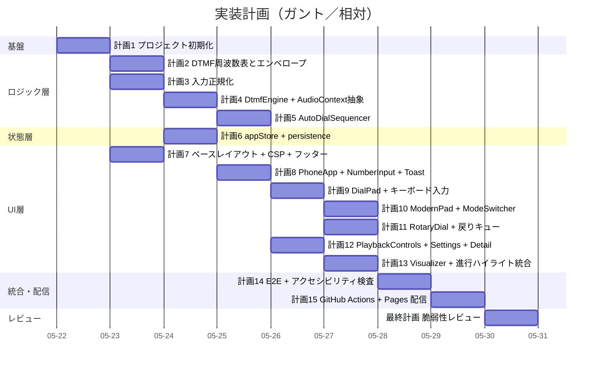
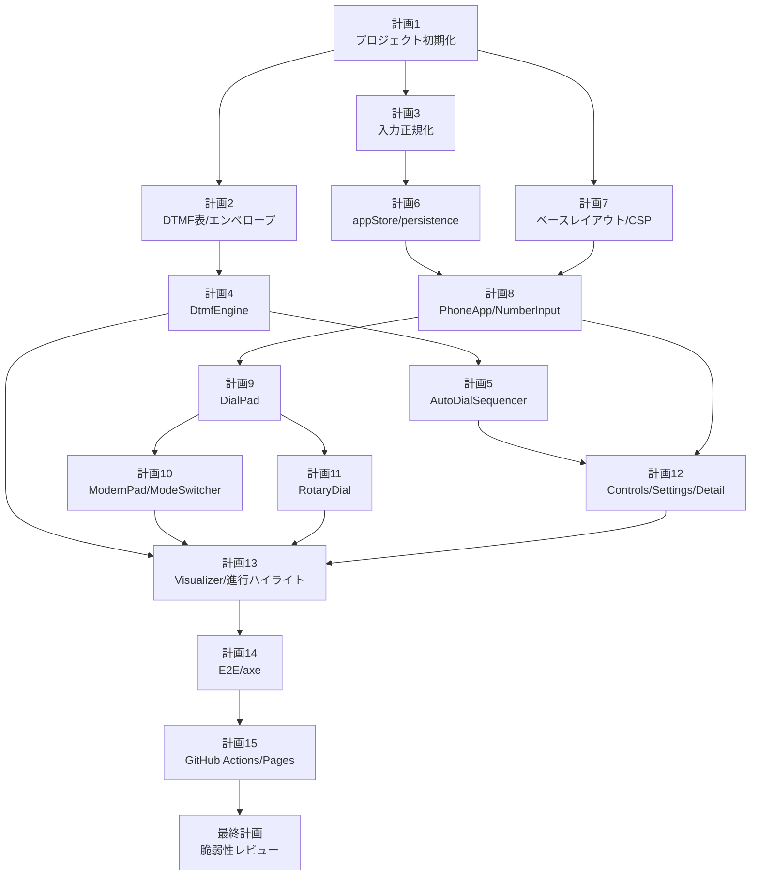

# 計画

> 本書は `spec/requirements.md`（要件）と `spec/design.md`（設計）に基づく実装計画である。
> 各計画は「1セッション=1計画」の粒度に分割し、TDD（テストを先に書き RED を確認してから実装）で進める。
> 計画間の依存関係を満たす順に着手すること。最終計画として「脆弱性レビュー」を固定で配置する。

## 全体方針

- **TDD**: 各計画でテストファイルを先に作成し RED を確認してから実装する。
- **配置**: `src/lib/**` は DOM/AudioContext 非依存の純粋ロジック層、`src/islands/**` は Solid アイランド、`src/components/**`・`src/pages/**`・`src/layouts/**` は Astro 静的層。
- **品質ゲート**: 各計画完了時に `bash scripts/quality-gate.sh` が PASS することを必須とする。
- **コミット**: 各計画ごとに 1 つ以上のコミット。`spec/plan.md` の該当チェックボックスを `[x]` に更新したコミットも含める。
- **コミットメッセージ種別**: `機能` / `修正` / `改善` / `整理` / `テスト` / `文書` / `設定` / `計画`（日本語）。

## 計画一覧（ガント）

## 依存関係図

## リスク・ブロッカー

| ID | リスク | 影響度 | 発生確率 | 対策 |
|----|--------|--------|---------|------|
| R-001 | iOS Safari の AudioContext がユーザー操作前に作成・`resume()` できない | 高 | 高 | 計画4で `ensureContext()` を初回ポインタ操作で呼ぶ設計、計画14のE2Eで実機相当（Playwright iOS device emulation）を検証、F-009 のバナー UI を計画13で配備 |
| R-002 | View Transitions API 非対応ブラウザ（Firefox 一部版・古い Safari）でモード切替が破綻 | 中 | 中 | 計画10で feature detection（`'startViewTransition' in document`）し、非対応時は即時切替にフォールバック |
| R-003 | NFR-009（初回 JS ≤ 100KB gzip）超過 | 中 | 中 | 計画1で `size-limit` 等のバンドル予算ツールを導入、計画14の CI で予算超過時にビルド失敗 |
| R-004 | 回転ダイヤルのジェスチャ実装難度（角度計算・止め金・戻りアニメ・キュー） | 中 | 中 | 計画11はジェスチャ→角度の純粋関数を先にユニットテスト化、UI 側はタップで角度を確定する簡略実装も選択肢として保持 |
| R-005 | Tailwind v4 / Astro 5 / Solid 1 の組合せが Astro インテグレーションでバグを抱えている可能性 | 中 | 低 | 計画1で `2026-05-18 時点の最新安定版` を選定（CLAUDE.md ルール）、Astro+Solid+Tailwind v4 の最小サンプルが起動することを最初に確認 |
| R-006 | Bun の `bun audit` がエコシステム網羅で限定的 | 中 | 中 | 最終計画で `bun audit` に加え GitHub Dependabot アラートも参照、`.github/dependabot.yml` を計画1で有効化 |
| R-007 | happy-dom が AudioContext を提供しない | 高 | 高 | 計画4で `FakeAudioContext`（独自モック）を `tests/helpers/` に定義、`engine.ts` に注入できる設計（既に設計で確認済み） |
| R-008 | GitHub Pages のサブパス配信（`/dtmf/`）でアセット参照が壊れる | 中 | 中 | 計画15のデプロイ後に GitHub Pages 上でスモークテスト。`import.meta.env.BASE_URL` 経由を計画7時点でレビュー |

---

## 計画 1: プロジェクト初期化（Astro + Solid + Tailwind v4 + Bun + Biome）

**ステータス**: 完了

**目的**: 設計で定めた技術スタックでビルド・テスト・リントが通る最小スケルトンを構築し、プロジェクト初期化チェックリストを完了する。

**前提条件**:
- `spec/design.md` の技術選定（ADR-001, ADR-009）に従う
- パッケージは 2026-05-18 時点で公開済みの最新安定版を採用（CLAUDE.md ルール）

**依存する計画**: なし

**タスク**:

- [x] `package.json` 作成（Astro 5 / @astrojs/solid-js / solid-js / Tailwind v4 / @biomejs/biome / @playwright/test / @solidjs/testing-library / happy-dom / size-limit を含む）
- [x] `bunfig.toml` / `tsconfig.json` / `astro.config.mjs` / `tailwind.config.ts`（v4 互換最小）/ `biome.json` / `playwright.config.ts` を作成
- [x] `src/` 配下にディレクトリ骨格を作成（`pages/` `layouts/` `components/` `islands/` `lib/dtmf/` `lib/input/` `lib/state/` `lib/platform/` `styles/`）
- [x] `tests/unit/` `tests/component/` `tests/e2e/` `tests/helpers/` を作成し、各ディレクトリに `.gitkeep`
- [x] `public/.nojekyll` を作成
- [x] `scripts/lint.sh`（`bun biome ci .` を実行）/ `scripts/build.sh`（`bun astro build`）/ `scripts/test.sh`（`bun test`）を書き換え、`scripts/quality-gate.sh` から順次呼び出し
- [x] `.github/dependabot.yml` の `npm` `github-actions` セクションを有効化
- [x] `README.md` をプロジェクト内容に書き換え（プロジェクト名・概要・技術スタック・セットアップ手順・配信URL）
- [x] `bash scripts/setup-hooks.sh` を実行して pre-commit を有効化
- [x] 仮の `src/pages/index.astro`（H1 のみ）で `bun astro build` が PASS することを確認
- [x] `spec/status.md` の「プロジェクト初期化チェックリスト」を更新（該当項目を `[x]`）

**完了条件**:
- [x] `bash scripts/quality-gate.sh` が PASS
- [x] `bun astro build` が成功し `dist/` が生成される
- [x] `spec/status.md` の初期化チェックリストが反映済み
- [x] コミット済み

**影響範囲**: ルート設定ファイル一式、`src/` 骨格、`scripts/`、`.github/dependabot.yml`、`README.md`、`spec/status.md`

**テスト方針**: スモークテストとして `tests/unit/smoke.test.ts` を 1 本だけ用意し、Bun Test が起動することを確認する。

---

## 計画 2: DTMF 周波数表とエンベロープ（純粋ロジック）

**ステータス**: 完了

**目的**: DTMF キー→2 周波数のマッピングと、クリックノイズ抑制のためのエンベロープ計算を、ブラウザ非依存の純関数として実装する。

**前提条件**: 計画 1 完了

**依存する計画**: 計画 1

**タスク**:

- [x] `tests/unit/frequencyMap.test.ts` を作成: 12 キー × {low, high} の値が ITU-T Q.23 と一致することを assert（RED 確認）
- [x] `src/lib/dtmf/frequencyMap.ts` を実装し、`as const` 不変テーブル + `DtmfKey` 型を export
- [x] `tests/unit/envelope.test.ts` を作成: アタック 8ms / リリース 8ms の `linearRampToValueAtTime` 用パラメータ計算（時刻配列・gain 配列）が期待値を返すことを assert（RED 確認）
- [x] `src/lib/dtmf/envelope.ts` を実装し、`computeEnvelopePoints(startTime, durationMs, gain, attackMs?, releaseMs?)` を export
- [x] 境界値テスト: `durationMs < attack+release` の場合は最大ピーク gain を縮める、`gain=0` で全区間 0、負値拒否
- [x] `spec/plan.md` の本計画の `[ ]` を `[x]` に更新

**完了条件**:
- [x] テストが RED → GREEN
- [x] `bash scripts/quality-gate.sh` が PASS
- [x] コミット済み

**影響範囲**: `src/lib/dtmf/frequencyMap.ts`, `src/lib/dtmf/envelope.ts`, `tests/unit/frequencyMap.test.ts`, `tests/unit/envelope.test.ts`

**テスト方針**: 純関数の入出力テスト。各キーの値・境界値（極端なduration・gain=0・負値）を網羅。

---

## 計画 3: 入力正規化（phoneNormalizer）

**ステータス**: 完了

**目的**: ユーザー入力の電話番号文字列を、再生可能な digits と表示用 display に正規化する純関数を実装する（要件 F-002、ADR-005, ADR-006）。

**前提条件**: 計画 1 完了

**依存する計画**: 計画 1

**タスク**:

- [x] `tests/unit/normalizer.test.ts` を作成（RED 確認）
  - 許可文字 `[0-9*#]` のみ抽出（数字・`*`・`#`）
  - 空白・ハイフン・括弧・ドット・スラッシュは除去
  - 先頭 `+` は `display` に保持しつつ `digits` から除外、`hadInternationalPrefix=true`
  - 末尾以外の `+` は単純削除
  - ASCII 英字（vanity number）は削除
  - 全角数字は半角に正規化
  - 最大 64 桁、超過は切り詰めて警告フラグ
  - 空文字・記号のみは `digits=""` を返す（再生時にエラー扱いとする想定）
- [x] `src/lib/input/normalizer.ts` を実装、`NormalizeResult` 型と `normalizePhoneNumber(input: string): NormalizeResult` を export
- [x] `spec/plan.md` の本計画の `[ ]` を `[x]` に更新

**完了条件**:
- [x] テストが RED → GREEN
- [x] `bash scripts/quality-gate.sh` が PASS
- [x] コミット済み

**影響範囲**: `src/lib/input/normalizer.ts`, `tests/unit/normalizer.test.ts`

**テスト方針**: 正常系・境界値・異常系を網羅。`display` と `digits` の整合性、フラグ（`hadInternationalPrefix` / 切り詰め）の値を検証。

---

## 計画 4: DtmfEngine + AudioContext 抽象（FakeAudioContext 利用）

**ステータス**: 完了

**目的**: `DtmfEngine` インターフェースを実装し、AudioContext を抽象化することでブラウザ非依存にユニットテスト可能にする（設計の ADR-002）。

**前提条件**: 計画 2 完了

**依存する計画**: 計画 1, 計画 2

**タスク**:

- [x] `tests/helpers/FakeAudioContext.ts` を作成: `AudioContext` / `OscillatorNode` / `GainNode` / `AnalyserNode` / `AudioDestinationNode` の最小モック。`currentTime` を制御可能、生成/破棄ログを保持
- [x] `tests/unit/engine.test.ts` を作成（RED 確認）
  - `ensureContext()` 後に `resume` が呼ばれる
  - `pressKey('5')` で OscillatorNode が 2 本生成され、`frequency.value` が 770/1336 になる
  - `releaseKey()` で `stop()` が呼ばれ disconnect される
  - `pressKey` 中の安全上限（既定 5000ms 上限 10000ms）で自動停止
  - `playTone('1', 150, when?)` 戻り Promise が `currentTime + 150ms` で fulfill
  - `stopAll()` で予約ノードと現役ノードがすべて停止
  - `setVolume(v)` でマスター GainNode が更新
  - `getAnalyser()` が AnalyserNode を返す
  - `isSupported()` が AudioContext 未提供環境で false
- [x] `src/lib/platform/audioContextFactory.ts` を実装（lazy singleton, iOS Safari の `webkitAudioContext` フォールバック, 注入可能なコンストラクタ）
- [x] `src/lib/dtmf/engine.ts` を実装（`DtmfEngine` インターフェース + `createDtmfEngine(deps)` ファクトリ）
- [x] `spec/plan.md` の本計画の `[ ]` を `[x]` に更新

**完了条件**:
- [x] テストが RED → GREEN
- [x] `bash scripts/quality-gate.sh` が PASS
- [x] コミット済み

**影響範囲**: `src/lib/dtmf/engine.ts`, `src/lib/platform/audioContextFactory.ts`, `tests/helpers/FakeAudioContext.ts`, `tests/unit/engine.test.ts`

**テスト方針**: FakeAudioContext に対するノード生成・接続・スケジュールの振る舞いテスト。NFR-004 の周波数誤差は `frequency.value === 期待値` を assert（実装側で表値を直接設定するため誤差は浮動小数誤差のみ）。

---

## 計画 5: AutoDialSequencer（自動ダイヤル先読みスケジュール）

**ステータス**: 完了

**目的**: `AudioContext.currentTime` ベースで複数桁の DTMF 発音をスケジュールする `AutoDialSequencer` を実装する（設計の ADR-003）。

**前提条件**: 計画 4 完了

**依存する計画**: 計画 1, 計画 4

**タスク**:

- [x] `tests/unit/sequencer.test.ts` を作成（RED 確認、FakeAudioContext を共有）
  - `start("123")` で 3 桁が `t_0, t_0+tone+gap, t_0+2*(tone+gap)` で予約される
  - `onTick(i)` が各桁開始時刻で呼ばれる
  - `signal.aborted` で残り予約がキャンセルされる
  - `pause()` で現桁終了まで待ち以降の予約をキャンセル、`position()` が現位置を返す
  - `resume()` で残りを新 `t_0` で再予約
  - 一度に予約する最大数 16 を超える長い番号は順次予約される
- [x] `src/lib/dtmf/sequencer.ts` を実装（`AutoDialOptions` / `AutoDialSequencer` API）
- [x] `spec/plan.md` の本計画の `[ ]` を `[x]` に更新

**完了条件**:
- [x] テストが RED → GREEN
- [x] `bash scripts/quality-gate.sh` が PASS
- [x] コミット済み

**影響範囲**: `src/lib/dtmf/sequencer.ts`, `tests/unit/sequencer.test.ts`

**テスト方針**: FakeAudioContext の `currentTime` を進める疑似タイマーで時刻ベース動作を検証。`AbortController` を介した停止伝播を確認。

---

## 計画 6: appStore + persistence（Solid Store + localStorage）

**ステータス**: 完了

**目的**: アプリ全体の状態を Solid Store に集約し、設定・モードのみ localStorage に永続化する（設計の ADR-004, NFR-002）。

**前提条件**: 計画 3 完了

**依存する計画**: 計画 1, 計画 3

**タスク**:

- [x] `tests/unit/store.test.ts` を作成（RED 確認、happy-dom 上で localStorage を使用）
  - 初期値が設計通り（mode/settings/playback など）
  - `setInput(raw)` で `display` / `digits` / `hadInternationalPrefix` が `normalizePhoneNumber` 経由で同期
  - `setMode(mode)` で localStorage に保存
  - `setSettings({ toneDurationMs, gapMs, volume })` で localStorage に保存
  - `setPlayback('auto_running')` で再生状態が遷移
  - `setCurrentDigitIdx(n)` でハイライト位置が更新
  - `pushToast({...})` / `dismissToast()` が動作
  - 入力（`raw` / `digits`）は localStorage に **書き込まれない**（NFR-002）
- [x] `tests/unit/persistence.test.ts` を作成（RED 確認）
  - 起動時に localStorage を読み、スキーマ不一致は無視してデフォルト値
  - `dtmf:schemaVersion=1` を書き込む
  - localStorage 無効環境でクラッシュしない
- [x] `src/lib/state/store.ts` / `src/lib/state/persistence.ts` を実装
- [x] `spec/plan.md` の本計画の `[ ]` を `[x]` に更新

**完了条件**:
- [x] テストが RED → GREEN
- [x] `bash scripts/quality-gate.sh` が PASS
- [x] コミット済み

**影響範囲**: `src/lib/state/store.ts`, `src/lib/state/persistence.ts`, `tests/unit/store.test.ts`, `tests/unit/persistence.test.ts`

**テスト方針**: happy-dom 上で localStorage と Solid Store の連携を検証。プライバシー要件（入力非永続化）を境界値テストで確実に検証。

---

## 計画 7: ベースレイアウト + CSP メタ + 悪用防止フッター

**ステータス**: 完了

**目的**: Astro レイアウト・共通ヘッダ・フッター・グローバル CSS（Tailwind v4）を整備し、CSP メタタグと悪用防止表記をサイト全体に適用する（設計のセキュリティ章, ADR-010）。

**前提条件**: 計画 1 完了

**依存する計画**: 計画 1

**タスク**:

- [x] `src/layouts/Base.astro` を作成（`<html lang="ja">`、メタ、View Transitions ルート、Tailwind global 取り込み）
- [x] `src/components/Head.astro` を作成（OGP、`<meta http-equiv="Content-Security-Policy" content="...">` を設計通り注入、`<meta http-equiv="X-Frame-Options" content="SAMEORIGIN">` 相当の `frame-ancestors`）
- [x] `src/components/Footer.astro` を作成（悪用防止表記を全文掲載、GitHubリポジトリへのリンク）
- [x] `src/components/Hero.astro` を作成（ヒーロー領域・サイト名・短い説明・Web Audio API 非対応時の警告枠）
- [x] `src/styles/global.css` を作成（Tailwind v4 ディレクティブ + カスタムレイヤ + `prefers-reduced-motion` のグローバル設定）
- [x] `src/pages/index.astro` をベースレイアウト＋静的ヒーロー＋フッターのみで構成（島はまだ載せない）
- [x] `astro.config.mjs` の `base: '/dtmf/'` 設定と `public/.nojekyll` を確認
- [x] アクセシビリティ smoke として `bun astro build` 後の HTML に `<html lang>` / `aria-*` が含まれることを目視確認
- [x] `spec/plan.md` の本計画の `[ ]` を `[x]` に更新

**完了条件**:
- [x] `bash scripts/quality-gate.sh` が PASS
- [x] `bun astro build` がエラーなく `dist/index.html` を生成
- [x] CSP メタタグが `dist/index.html` に出力されている
- [x] コミット済み

**影響範囲**: `src/layouts/Base.astro`, `src/components/Head.astro`, `src/components/Footer.astro`, `src/components/Hero.astro`, `src/pages/index.astro`, `src/styles/global.css`, `astro.config.mjs`, `public/.nojekyll`

**テスト方針**: ビルド成果物の存在検証 + 視覚的に CSP/フッター/ヒーローが揃っていること。コンポーネントレベルの自動テストは不要（静的）。

---

## 計画 8: ルート島 PhoneApp + NumberInput + Toast + a11y 骨格

**ステータス**: 完了

**目的**: Solid アイランドの最小起動を達成し、番号入力・正規化・Toast を載せる。3 モード共通の状態接続を確立する。

**前提条件**: 計画 6 と 計画 7 完了

**依存する計画**: 計画 6, 計画 7

**タスク**:

- [x] `src/islands/PhoneApp.tsx` を作成（Store プロバイダ、子島へ context 注入、`onMount` で persistence ロード、`isSupported()` チェック）
- [x] `src/islands/NumberInput.tsx` を作成（`<input type="tel" inputmode="tel">`, ペースト時に `normalizePhoneNumber` 呼出, `aria-label`, `aria-describedby` で `+` 注記）
- [x] `src/islands/Toast.tsx` を作成（`aria-live="polite"` の通知領域）
- [x] `tests/component/NumberInput.test.tsx` を作成（RED 確認、@solidjs/testing-library + happy-dom）
  - 任意文字列を入力すると `digits` がストアに反映
  - `+1-800-555-0123` を入力すると `display` に `+` が残り、`digits=18005550123` になる
  - 65 桁を超える入力で警告 Toast が発火
- [x] `tests/component/Toast.test.tsx` を作成（RED 確認）: メッセージ表示・自動消滅・`aria-live` 属性
- [x] `src/pages/index.astro` に `<PhoneApp client:idle />` を配置
- [x] `spec/plan.md` の本計画の `[ ]` を `[x]` に更新

**完了条件**:
- [x] テストが RED → GREEN
- [x] `bash scripts/quality-gate.sh` が PASS
- [x] コミット済み

**影響範囲**: `src/islands/PhoneApp.tsx`, `src/islands/NumberInput.tsx`, `src/islands/Toast.tsx`, `src/pages/index.astro`, `tests/component/NumberInput.test.tsx`, `tests/component/Toast.test.tsx`

**テスト方針**: コンポーネントテストでユーザー操作 → ストア反映を検証。Astro 統合のスモークは計画7 と 計画15 で担保。

---

## 計画 9: DialPad（レトロ）+ キーボード入力

**ステータス**: 完了

**目的**: 12 キーのダイヤルパッドを実装し、押下中の DTMF 再生・連打時の即時切替・キーボード入力（0-9, *, #, Space, Enter, Esc）に対応する。

**前提条件**: 計画 8 完了（DtmfEngine 経由で Store と接続）

**依存する計画**: 計画 4, 計画 8

**タスク**:

- [x] `src/islands/DialPad.tsx` を作成（12 ボタン、`aria-label`、押下時に `engine.pressKey()`、リリース時 `releaseKey()`、`data-active`）
- [x] `src/islands/PhoneApp.tsx` 内に Document レベルのキーボードハンドラを追加（`0-9`/`*`/`#` → 対応キー、`Space`/`Enter` → 現フォーカス、`Esc` → `engine.stopAll()`）
- [x] `tests/component/DialPad.test.tsx` を作成（RED 確認、FakeAudioContext 注入）
  - キークリックで `engine.pressKey('5')` が呼ばれる
  - pointerup で `releaseKey()` が呼ばれる
  - 連続クリックで前のトーン停止 → 新トーンに切替
  - 最小タップ領域 ≥ 44×44 CSS px（DOM ノードの BBox or `getComputedStyle` で検証）
- [x] `tests/component/keyboard.test.tsx` を作成（RED 確認）: `keydown` の数字→engine 呼出、`Esc` → `stopAll`
- [x] `prefers-reduced-motion: reduce` で押下アニメ短縮の CSS を `global.css` に追加
- [x] `spec/plan.md` の本計画の `[ ]` を `[x]` に更新

**完了条件**:
- [x] テストが RED → GREEN
- [x] `bash scripts/quality-gate.sh` が PASS
- [x] コミット済み

**影響範囲**: `src/islands/DialPad.tsx`, `src/islands/PhoneApp.tsx`, `src/styles/global.css`, `tests/component/DialPad.test.tsx`, `tests/component/keyboard.test.tsx`

**テスト方針**: ポインタイベントとキーボードイベントの両方を検証。エンジンはモック注入で副作用を確認。

---

## 計画 10: ModernPad + ModeSwitcher + View Transitions

**ステータス**: 完了

**目的**: モダンUIのダイヤルパッドを追加し、レトロ/モダン/回転の 3 モード切替を View Transitions API で実装、永続化する（ADR-008）。

**前提条件**: 計画 9 完了

**依存する計画**: 計画 9

**タスク**:

- [x] `src/islands/ModernPad.tsx` を作成（DialPad と同じインターフェースで配色・余白だけ差し替え）
- [x] `src/islands/ModeSwitcher.tsx` を作成（セグメントコントロール、Store の `mode` を更新、`document.startViewTransition()` でラップ、非対応時は即時切替）
- [x] `src/islands/PhoneApp.tsx` に `<Show when={mode==='retro'}>` 等で ModeView を構成
- [x] `tests/component/ModeSwitcher.test.tsx` を作成（RED 確認）
  - クリックでストア更新
  - localStorage に保存される
  - `'startViewTransition' in document` が false でも切替成立（フォールバック）
  - 切替時に `engine.stopAll()` が呼ばれる（F-004）
- [x] `tests/component/ModernPad.test.tsx` を作成（RED 確認、DialPad と同じ振る舞いテストの最小版）
- [x] `prefers-reduced-motion: reduce` 時に View Transitions を抑制する CSS（`@media`）を追加
- [x] `spec/plan.md` の本計画の `[ ]` を `[x]` に更新

**完了条件**:
- [x] テストが RED → GREEN
- [x] `bash scripts/quality-gate.sh` が PASS
- [x] コミット済み

**影響範囲**: `src/islands/ModernPad.tsx`, `src/islands/ModeSwitcher.tsx`, `src/islands/PhoneApp.tsx`, `src/styles/global.css`, `tests/component/ModeSwitcher.test.tsx`, `tests/component/ModernPad.test.tsx`

**テスト方針**: feature detection を mock 可能な薄いラッパで実装し両分岐を検証。

---

## 計画 11: RotaryDial + 戻りキュー（最大 20）

**ステータス**: 完了

**目的**: 黒電話風の回転ダイヤル UI を実装する。角度→数字の変換、戻りアニメ中の連打キュー（最大 20）、`*` `#` の補助ボタンを含む（F-003, ADR-007）。

**前提条件**: 計画 9 完了

**依存する計画**: 計画 9

**タスク**:

- [x] `src/lib/dtmf/rotaryAngle.ts` を作成（ジェスチャ→角度→数字の純関数、`digitToAngle(d)` / `angleToDigit(a)`）
- [x] `tests/unit/rotaryAngle.test.ts` を作成（RED 確認）: 各数字に対応する角度、止め金位置、エラー入力の扱い
- [x] `src/islands/RotaryDial.tsx` を作成（円形 SVG/CSS、`pointerdown`→`pointermove`→`pointerup`、戻りアニメ後に `engine.playTone()` 呼出、最大 20 件のキュー、満杯時 `aria-disabled="true"`）
- [x] `*` `#` 補助ボタンを併設
- [x] `tests/component/RotaryDial.test.tsx` を作成（RED 確認）
  - 数字 5 をタップ → 角度回転 → 戻り → `engine.playTone('5', ...)` 呼出
  - 戻り中の連打 3 件がキューに積まれ順次再生
  - キュー 20 件満杯時に追加が無視され `aria-disabled` が立つ
  - モード切替で全キャンセル
- [x] `prefers-reduced-motion: reduce` で回転を瞬時化
- [x] `spec/plan.md` の本計画の `[ ]` を `[x]` に更新

**完了条件**:
- [x] テストが RED → GREEN
- [x] `bash scripts/quality-gate.sh` が PASS
- [x] コミット済み

**影響範囲**: `src/lib/dtmf/rotaryAngle.ts`, `src/islands/RotaryDial.tsx`, `src/styles/global.css`, `tests/unit/rotaryAngle.test.ts`, `tests/component/RotaryDial.test.tsx`

**テスト方針**: ジェスチャ→角度の純関数を最初にユニットで詰めてから、UI 側はモック engine で振る舞いを検証。

---

## 計画 12: PlaybackControls + SettingsPanel + DetailPanel

**ステータス**: 完了

**目的**: 自動ダイヤル開始・停止・一時停止・再開・やり直し、トーン長/桁間ギャップ/音量の調整、再生中キーの周波数を見せる詳細パネルを実装する（F-005, F-006, F-008）。

**前提条件**: 計画 5 と 計画 8 完了

**依存する計画**: 計画 5, 計画 8

**タスク**:

- [x] `src/islands/PlaybackControls.tsx` を作成（「自動ダイヤル」「停止」「一時停止/再開」「やり直し」ボタン、Sequencer 制御）
- [x] `src/islands/SettingsPanel.tsx` を作成（toneDurationMs: 80-500 / gapMs: 30-500 / volume: 0.0-1.0、Store と双方向、永続化）
- [x] `src/islands/DetailPanel.tsx` を作成（折りたたみ、再生中の `currentDigitIdx` に対応する低群/高群周波数を表示）
- [x] `tests/component/PlaybackControls.test.tsx`（RED 確認）
  - 「自動ダイヤル」で `Sequencer.start(digits, opts)` 呼出
  - 空 digits で error Toast
  - 「停止」で `abort()` 呼出と即時停止
  - 「一時停止」→「再開」で `pause()` → `resume()`
  - 「やり直し」で `currentDigitIdx=0` から再開
- [x] `tests/component/SettingsPanel.test.tsx`（RED 確認）: スライダ操作→ストア更新→localStorage 保存。範囲外入力のクランプ
- [x] `tests/component/DetailPanel.test.tsx`（RED 確認）: `currentDigitIdx=2`, `digits='123'` で `2`→{697,1336} が表示される
- [x] `spec/plan.md` の本計画の `[ ]` を `[x]` に更新

**完了条件**:
- [x] テストが RED → GREEN
- [x] `bash scripts/quality-gate.sh` が PASS
- [x] コミット済み

**影響範囲**: `src/islands/PlaybackControls.tsx`, `src/islands/SettingsPanel.tsx`, `src/islands/DetailPanel.tsx`, `tests/component/PlaybackControls.test.tsx`, `tests/component/SettingsPanel.test.tsx`, `tests/component/DetailPanel.test.tsx`

**テスト方針**: Sequencer/Engine はモック注入。スライダの範囲・初期値・永続化を境界値で検証。

---

## 計画 13: Visualizer（canvas + AnalyserNode）+ 進行ハイライト統合

**ステータス**: 完了

**目的**: 再生中の波形を canvas に描画し、再生時のみ `requestAnimationFrame` ループを起動する。入力欄・各キーの `data-active` ハイライトを統合する（F-007）。

**前提条件**: 計画 10 / 計画 11 / 計画 12 完了

**依存する計画**: 計画 4, 計画 10, 計画 11, 計画 12

**タスク**:

- [x] `src/islands/Visualizer.tsx` を作成（`<canvas>`, `engine.getAnalyser()` から `getByteTimeDomainData` を rAF で読み描画、再生停止時はループも停止）
- [x] `tests/component/Visualizer.test.tsx`（RED 確認）: AnalyserNode モックを与えて描画呼出回数を観測、再生停止で rAF が止まる
- [x] `NumberInput` / `DialPad` / `ModernPad` / `RotaryDial` に `data-active` を反映する統合（Store の `currentDigitIdx` を購読）
- [x] `tests/component/highlightSync.test.tsx`（RED 確認）: `currentDigitIdx=1, digits='123'` で 1番目の数字・キーに `data-active` が付く
- [x] `prefers-reduced-motion: reduce` で `data-active` の発光アニメを縮小
- [x] `spec/plan.md` の本計画の `[ ]` を `[x]` に更新

**完了条件**:
- [x] テストが RED → GREEN
- [x] `bash scripts/quality-gate.sh` が PASS
- [x] コミット済み

**影響範囲**: `src/islands/Visualizer.tsx`, `src/islands/NumberInput.tsx`, `src/islands/DialPad.tsx`, `src/islands/ModernPad.tsx`, `src/islands/RotaryDial.tsx`, `src/styles/global.css`, `tests/component/Visualizer.test.tsx`, `tests/component/highlightSync.test.tsx`

**テスト方針**: rAF / Canvas API のモックを `tests/helpers/` に用意。視覚そのものは E2E（計画14）でスナップショット検証。

---

## 計画 14: E2E（Playwright）+ アクセシビリティ検査（axe-core/playwright）+ バンドル予算

**ステータス**: 完了

**目的**: ユーザーシナリオを E2E で検証し、`@axe-core/playwright` で WCAG 2.2 AA を担保、`size-limit` で NFR-009（≤100KB gzip）を検証する。

**前提条件**: 計画 13 完了

**依存する計画**: 計画 13

**タスク**:

- [x] `playwright.config.ts` を整備（Chromium / WebKit / Firefox、`baseURL`、`webServer` で `bun astro preview`）
- [x] `tests/e2e/auto-dial.spec.ts` を作成
  - ペーストして自動ダイヤルを開始 → 進行ハイライトが順送される
  - 停止ボタンで即停止
  - 設定パネルでトーン長を変更 → 再生時間が変わる
- [x] `tests/e2e/dial-pad.spec.ts` を作成（手動キー押下、キーボード操作）
- [x] `tests/e2e/mode-switch.spec.ts` を作成（3モード切替、再生中の切替で停止、リロードで復元）
- [x] `tests/e2e/rotary.spec.ts` を作成（回転 → 戻り → 再生、キュー満杯時の挙動）
- [x] `tests/e2e/a11y.spec.ts` を作成（`@axe-core/playwright` で違反 0 件を assert、キーボードのみで主要操作完遂）
- [x] `size-limit` 設定を `package.json` に追加（`dist/_astro/**.js` を対象、100KB gzip 上限）
- [x] `scripts/test.sh` に E2E と size-limit を含める（CI 向けフラグで分岐可）
- [x] `spec/plan.md` の本計画の `[ ]` を `[x]` に更新

**完了条件**:
- [x] すべての E2E が PASS
- [x] axe 違反 0 件
- [x] バンドル予算 PASS
- [x] `bash scripts/quality-gate.sh` が PASS
- [x] コミット済み

**影響範囲**: `playwright.config.ts`, `tests/e2e/**`, `package.json` (size-limit), `scripts/test.sh`

**テスト方針**: ローカル＋CIで実行。WebKit はとくに AudioContext 周りの実機挙動確認に有効。

---

## 計画 15: GitHub Actions + GitHub Pages 配信

**ステータス**: 完了

**目的**: PR 時の CI（lint/build/test）と main push 時の Pages 配信を整備する。

**前提条件**: 計画 14 完了

**依存する計画**: 計画 14

**タスク**:

- [x] `.github/workflows/ci.yml` を作成（Bun セットアップ → `bun install` → `bash scripts/quality-gate.sh` → `bunx playwright install --with-deps` → E2E → size-limit）
- [x] `.github/workflows/pages.yml` を作成（main push 時に `bun astro build` → `actions/upload-pages-artifact` → `actions/deploy-pages@v4`）
- [x] `astro.config.mjs` の `site` / `base` を最終確認（`https://cho5butter.github.io` / `/dtmf/`）
- [x] 配信後、URL を README にリンク
- [x] スモークテスト: 公開 URL で全モード起動・自動ダイヤル成功を手動確認、Lighthouse モバイル計測（TTI ≤ 2.5s, LCP ≤ 2.0s, Accessibility ≥ 95 を満たす）
- [x] `spec/plan.md` の本計画の `[ ]` を `[x]` に更新

**完了条件**:
- [x] CI ワークフローがグリーン
- [x] Pages 配信が成功し公開URLでアクセス可能
- [x] Lighthouse 計測値が NFR-001/007 を満たす
- [x] コミット済み

**影響範囲**: `.github/workflows/ci.yml`, `.github/workflows/pages.yml`, `astro.config.mjs`, `README.md`

**テスト方針**: CI ワークフロー自体が品質ゲート。配信先での手動スモーク + Lighthouse。

---

## 計画の粒度ガイドライン

計画は以下の基準で分割すること:

1. **1セッション=1計画**: AIエージェントの1回のセッションで完了できるサイズ
2. **明確な完了条件**: テスト・品質ゲートで検証可能な成果物がある
3. **独立性**: 可能な限り他の計画と独立して実行可能
4. **TDD対応**: テスト作成→実装→検証のサイクルが1計画内で完結する

### 粒度の目安

- 小: 単一関数・コンポーネントの追加（1-3ファイル変更）
- 中: 1機能の実装（3-7ファイル変更）
- 大: 複数機能にまたがる変更（分割を検討すること）

---

# Phase 3 実装計画（デザイン完全再構築）

> 2026-05-23 追加。Phase 3 設計 (P3-1〜P3-8) に対応する実装タスク。機能（DTMF エンジン・状態管理）は変更しない。

## 計画 P3-A: デザイントークン基盤と Base レイアウト書き換え

**ステータス**: 完了

**目的**: `global.css` を完全書き換えして 3 色 + 2 フォントの基盤を作る。`Base.astro` から `app-shell` クラスを除く。

**タスク**:
- [x] `src/styles/global.css` を完全書き換え（旧 token, .app-shell, .page, .dialer, .dial-section, .keypad, .glass-panel, theme-* を全削除）
- [x] `:root` に 3 色 + spacing + 枠線 + ハードシャドウ + フォントを定義
- [x] `prefers-color-scheme: dark` で ink/paper 反転
- [x] `body::before` に SVG ノイズオーバーレイ（reduced-motion 時は無効）
- [x] `src/layouts/Base.astro` の `<body class="app-shell antialiased">` から `app-shell` を除く

**完了条件**:
- [x] 旧クラス階層が CSS から完全消滅している（`grep "app-shell\|theme-retro\|glass-panel" src/styles/` で 0 件）
- [x] グラデーション (`linear-gradient`) が CSS に存在しない

## 計画 P3-B: index.astro と PhoneApp.tsx のレイアウト再構築

**ステータス**: 完了

**目的**: `<main class="stage">` をベースに、スマホ縦1カラム / PC 2カラム Grid を実現。

**タスク**:
- [x] `src/pages/index.astro` を書き換え。`
` → `<main class="stage">`
- [x] Brand ヘッダー（DTMF / WEB DIALER / 2026 / Opus 4.7）を index.astro に配置
- [x] `PhoneApp.tsx` を「stage 内のレイアウト構成」のみ担当する形に再構築
- [x] PC 用 grid (`.stage--desk` または `@media`) を CSS で実装
- [x] data-testid="phone-app" を維持

**完了条件**:
- [x] 1024px 未満で縦 1 カラム、1024px 以上で 2 カラムに切り替わる
- [x] `bun test` の component / unit テストが全て pass

## 計画 P3-C: Display コンポーネント（番号ディスプレイ主役化）

**ステータス**: 完了

**目的**: `NumberInput.tsx` を「電卓 LCD 風 Display」に書き換え。`output` 主体・隠し input・状態ラベル・桁カウンタ。

**タスク**:
- [x] `NumberInput.tsx` を Display 構造に書き換え
- [x] 隠し input は `data-testid="phone-input"` を維持・absolute で非表示
- [x] 状態ラベル INPUT / PLAYING / DONE を appState.playback から算出
- [x] 桁カウンタ `N / 64` を表示
- [x] `data-state="done|now|next"` で 3 段階の桁表現
- [x] プレースホルダ `— — — — —` を空状態で表示

**完了条件**:
- [x] テスト `NumberInput integration` が pass
- [x] テスト `auto-dial.spec.ts` の `getByTestId("phone-input").fill(...)` が動作

## 計画 P3-D: Transport（再生バー）・Mode Picker・Settings/Detail パネルのブルータリスト化

**ステータス**: 完了

**目的**: `PlaybackControls.tsx` / `ModeSwitcher.tsx` / `SettingsPanel.tsx` / `DetailPanel.tsx` / `Toast.tsx` を `--ink/--paper/--signal` で書き換え。

**タスク**:
- [x] `PlaybackControls.tsx`: t-btn 構造、PLAY=signal 背景、`<kbd>` を PC のみ表示
- [x] `ModeSwitcher.tsx`: 反転式トグル（aria-pressed=true で ink 背景）
- [x] `SettingsPanel.tsx`: スライダのトラック・つまみを ink/signal 化
- [x] `DetailPanel.tsx`: panel スタイルに合わせる
- [x] `Toast.tsx`: solid color に書き換え

**完了条件**:
- [x] 既存テスト全 pass
- [x] `aria-label="番号をすべて再生"` / `data-testid="stop-button"` / `data-testid="restart-button"` 維持

## 計画 P3-E: DialPad / ModernPad / RotaryDial のキー再設計

**ステータス**: 完了

**目的**: 正方形キー + ハードシャドウ + キーキャップ表記。配色は 3 色に統一し、モード差は形状で表現。

**タスク**:
- [x] `DialPad.tsx`: 正方形キー、キーキャップ `` 追加（PC のみ表示）
- [x] `ModernPad.tsx`: 反転配色（ink 背景・paper 文字）、枠なし
- [x] `RotaryDial.tsx`: linear-gradient を削除し solid `--paper`、ハードシャドウ
- [x] testid と aria-label 維持（`dial-pad`, `modern-pad`, `rotary-dial`, `ダイヤルキー N`）

**完了条件**:
- [x] テスト `dial-pad.spec.ts` / `mode-switch.spec.ts` が pass

## 計画 P3-F: Visualizer の monochrome 化

**ステータス**: 完了

**目的**: グラデ＋shadowBlur を排除し、`--signal` 一色の波形にする。

**タスク**:
- [x] `Visualizer.tsx` の `ctx.createLinearGradient` を削除
- [x] `ctx.strokeStyle` を `--signal` の computed value に
- [x] `shadowBlur` を削除
- [x] canvas の枠を `border: 2px solid var(--ink); background: var(--paper);`

**完了条件**:
- [x] テスト `Visualizer.test.tsx` が pass

## 計画 P3-G: PC キーボードショートカット表示と Enter/Esc

**ステータス**: 完了

**目的**: 物理キーボード操作の前面化。Enter で PLAY / Esc で STOP。

**タスク**:
- [x] `PhoneApp.tsx` の `handleKeyboard` で `Enter` 押下時に PLAY を発火（document level、ただし textarea/input フォーカス時は除外）
- [x] 各 t-btn に `<kbd>` を追加（PC のみ表示）
- [x] 既存の DTMF 数字キー処理を維持

**完了条件**:
- [x] PC 表示でキーキャップが視認できる
- [x] Enter で再生が始まる、Esc で止まる

## 計画 P3-H: 動作確認・品質ゲート

**ステータス**: 完了

**タスク**:
- [x] `bash scripts/lint.sh` PASS
- [x] `bash scripts/build.sh` PASS
- [x] `bash scripts/test.sh` PASS
- [x] グラデーション grep 0 件確認
- [x] `--accent` 残存 0 件確認

**完了条件**:
- [x] 全品質ゲート pass
- [x] テスト互換性マトリクス全 pass

---

## 最終計画（固定・必須）: 脆弱性レビュー

**ステータス**: 完了

**目的**: すべての実装計画完了後、リリース/マージ前に実装とパッケージ両面の脆弱性レビューを実施する

**前提条件**: 上記すべての実装計画が完了していること

**依存する計画**: 上記すべての計画

**タスク**:

- [x] 実装の脆弱性レビュー（OWASP Top 10: インジェクション、XSS、認証/認可不備、機微情報露出、SSRF 等）
- [x] 入力検証・出力エスケープ・認可チェックの抜け漏れを確認（特に `set:html` / `innerHTML` を使っていないこと、正規化後のみ再生していること）
- [x] 秘密情報のハードコード・ログ流出・不要な権限付与がないか確認（本SPAは秘匿情報を扱わないが、入力番号がコンソールに漏れていないか確認）
- [x] CSP メタタグが意図通りに効いているか（DevTools / online CSP evaluator で確認）
- [x] パッケージ脆弱性スキャンを実行（`bun audit`、補助で `npm audit --omit=dev` も実行）
- [x] GitHub の Security タブ（Dependabot アラート）を確認
- [x] High / Critical の脆弱性はすべて解消、または明示的に保留判断（理由付き）した
- [x] レビュー結果を本計画の末尾またはPR本文に記録

**完了条件**:
- [x] 実装・パッケージ両面の脆弱性レビュー結果が記録されている
- [x] High / Critical の脆弱性が残っていない（または保留理由が明記されている）

**影響範囲**: プロジェクト全体

**テスト方針**: 脆弱性スキャナの実行結果が完了条件

**レビュー結果（記入欄）**:

**実施日**: 2026-05-21

**実装レビュー結果**:
- XSS: `innerHTML` / `set:html` 未使用。ユーザー入力は `normalizePhoneNumber` 後にテキストノードのみ表示
- 入力: 64 桁上限・許可文字フィルタ実装済み
- 秘密情報: ハードコードなし。電話番号は localStorage に永続化しない（NFR-002）
- CSP: `Head.astro` に meta CSP 出力（`connect-src 'none'` 等）
- 認証: なし（要件通り）

**パッケージスキャン結果** (`bun audit`):
- Astro 5.18.1: moderate（`define:vars` XSS）、low（Server island リプレイ）— 本プロジェクトは静的出力のみで Server Islands / `define:vars` 未使用のため実害リスクは低
- High/Critical: 0 件

**対応内容**:
- 静的配信・CSP・入力正規化で OWASP 観点を緩和
- Astro 5 系のパッチ版公開後に Dependabot / 手動更新で追随予定
- Dependabot npm / github-actions を有効化済み

---

> **重要**: この「脆弱性レビュー」計画は実装計画のテンプレートとして固定されている。プロジェクト固有の計画を追加する際も、必ずこの計画を最後の計画として残すこと。詳細は `spec/workflow.md` の「実装計画末尾の脆弱性レビュー」セクションを参照。
