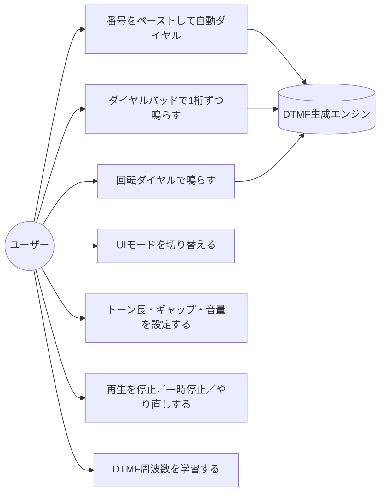
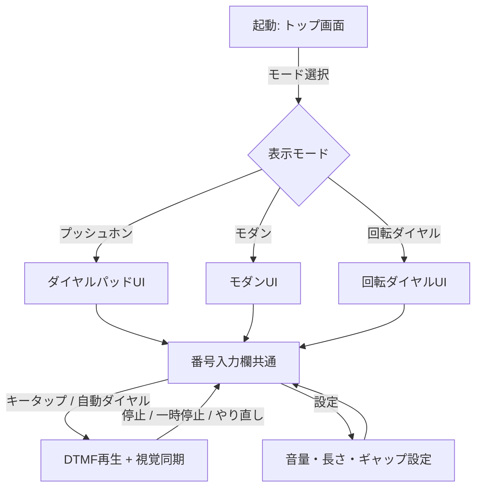

# 要件定義

## プロジェクト概要

### 目的

スマートフォン等のブラウザで開いたWebアプリから **DTMF（Dual-Tone Multi-Frequency）トーン音** を発生させ、その音を公衆電話の受話口（マウスピース）に近づけることで、電話番号を**手動／自動でダイヤル可能**にする SPA（Single Page Application）を提供する。

加えて、ダイヤルパッド・回転ダイヤル等の **複数の入力モード** を切り替えて楽しめる "ガジェット的な" 体験を提供する。

### 背景

- 公衆電話の多くはトーン式（プッシュ回線）に対応しており、正確な DTMF 音をマウスピース近傍で再生すれば交換機側はキー入力と同等に認識する。
- スマートフォンに番号をメモしておいても、公衆電話で一桁ずつ正確に押すのは現実には手間が大きい。**ペーストするだけで自動で全桁を鳴らせる** と「公衆電話からの緊急発信」「ダイヤル練習」「レトロ電話のシミュレーション」など複数のユースケースをカバーできる。
- DTMF 音は古典的な周波数仕様（ITU-T Q.23）で定義されており、Web Audio API の `OscillatorNode` 2 本の加算合成で容易に正確再現できるため、追加の音源アセットを持たずに完結する SPA に向く。
- 既存の類似 Web アプリは少数あるが、複数のUIモード（プッシュホン／モダン／回転ダイヤル）を切り替えられる "イカした" 体験を備えたものは見当たらないため、本プロジェクトで提供する。

### ターゲットユーザー

| ペルソナ | 説明 | 主な利用シーン |
|---------|------|----------------|
| P-1: スマホ世代の緊急利用者 | スマホの電池切れ・故障時に公衆電話を使う必要が生じた人。番号は別の手段（紙メモ、別端末、クラウド等）で参照できる前提 | 旅行先・災害時・電池切れ時のダイヤル支援 |
| P-2: ガジェット好き / レトロ電話ファン | 回転ダイヤル等の擬似体験をブラウザで楽しみたい人 | 余暇・コレクション・教材 |
| P-3: 教育・展示用途のユーザー | DTMF の仕組みを学ぶ学生・博物館展示担当 | 学習教材・ハンズオン |

> 想定環境: モダンブラウザ搭載のスマートフォン / タブレット / PC（Chrome / Safari / Firefox / Edge の最新版）。スマートフォン（特に iOS Safari）での動作を最優先する。

## ユーザーストーリー

| ID | ユーザー種別 | 目的 | 機能 | 優先度 |
|----|------------|------|------|--------|
| US-001 | P-1（緊急利用者） | 公衆電話から自宅などに電話したい | 番号をペーストすると DTMF が自動順送信される機能 | 高 |
| US-002 | P-1 | 1桁ずつ確認しながら鳴らしたい | ダイヤルパッド（0-9, *, #）をタップで都度トーン再生 | 高 |
| US-003 | P-1 | 鳴らす前に番号と再生中の桁を視認したい | 入力欄表示と再生中桁のハイライト | 高 |
| US-004 | P-2 | 古い黒電話気分でダイヤルを回したい | 回転ダイヤルUIモードで数字に応じた回転アニメ＋DTMF再生 | 中 |
| US-005 | P-2 / P-3 | UIの雰囲気を切り替えたい | レトロ公衆電話 / モダン / 回転ダイヤル の3モード切替 | 中 |
| US-006 | P-3 | 仕組みを学習者に説明したい | 再生中のキーに対応する2周波数(Hz)を画面表示 | 中 |
| US-007 | P-1 | 自動再生中に間違いに気付いたら止めたい | 停止／一時停止／やり直しボタン | 高 |
| US-008 | P-1 | スマホスピーカーから明瞭に鳴らしたい | 音量・トーン長・間隔の調整UI | 中 |
| US-009 | 全員 | オフラインでも動かしたい | PWA 化はスコープ外だが、初回ロード後は外部通信なしで動作する | 中 |
| US-010 | 全員 | インストール不要で使いたい | GitHub Pages 上の URL を開くだけで利用できる | 高 |

## 機能要件

### F-001: ダイヤルパッド入力モード（プッシュホン）

**説明**: 0-9, *, # の12キーを並べたダイヤルパッドを表示し、タップ／クリックで対応する DTMF 2 周波合成音を再生する。
**優先度**: 高

**受け入れ基準:**
- [ ] Given パッド表示状態 / When ユーザーが任意のキーをタップ / Then 押下中だけ対応する DTMF が再生される（押下解除で停止、最大長は安全上限あり）
- [ ] Given キー一覧 / When 各キー押下時 / Then 下表（DTMF周波数表）に一致する2周波数で再生される
- [ ] Given キー押下 / When 押下中 / Then ボタンに「押し込み」アニメーション（陰影・スケール）が付く
- [ ] Given 連続タップ / When 短時間に複数キーを押した / Then 直前のトーンは即座に停止し、新しいキーのトーンに切り替わる

#### DTMF 周波数表（ITU-T Q.23）

| キー | 低群 (Hz) | 高群 (Hz) |
|------|----------|----------|
| 1 | 697 | 1209 |
| 2 | 697 | 1336 |
| 3 | 697 | 1477 |
| 4 | 770 | 1209 |
| 5 | 770 | 1336 |
| 6 | 770 | 1477 |
| 7 | 852 | 1209 |
| 8 | 852 | 1336 |
| 9 | 852 | 1477 |
| * | 941 | 1209 |
| 0 | 941 | 1336 |
| # | 941 | 1477 |

### F-002: 電話番号入力欄とペースト自動ダイヤル

**説明**: 画面上部に電話番号入力欄を設け、手入力／ペースト／QRなど任意手段で投入された番号を整形・検証し、「自動ダイヤル」ボタンで先頭から末尾まで順にDTMFを送信する。
**優先度**: 高

**受け入れ基準:**
- [ ] Given 入力欄 / When 文字列を入力／ペースト / Then `0-9 * #` 以外の文字（空白・ハイフン・括弧・国際表記 `+` 等）は自動で除去または正規化される（`+` は国際発信プレフィックスとしての扱いを設計フェーズで定義）
- [ ] Given 正規化済み番号 / When 「自動ダイヤル」を押す / Then 先頭桁から順に F-005 のタイミングで DTMF が再生される
- [ ] Given 自動ダイヤル実行中 / When 再生中の桁がある / Then 入力欄の対応桁と対応するキーが同時にハイライトされる
- [ ] Given 自動ダイヤル実行中 / When ユーザーが「停止」を押す / Then その瞬間に音とシーケンスが停止する
- [ ] Given 空文字／不正文字のみ / When 「自動ダイヤル」を押す / Then エラーメッセージ「ダイヤル可能な文字がありません」を表示し再生しない

### F-003: 回転ダイヤル入力モード

**説明**: 黒電話風の円形10孔ダイヤルを表示し、数字をクリック／ドラッグで「指掛け→止め金まで回す→指離す→戻る」のアニメーションを行い、ダイヤルが**戻る**動作と並行して該当数字の DTMF を再生する。
**優先度**: 中

**受け入れ基準:**
- [ ] Given 回転ダイヤル表示 / When ユーザーが数字 N をタップ / Then ダイヤルが N に応じた角度まで回転し、止め金で止まる
- [ ] Given 止め金到達 / When 指を離した（あるいは自動再生で次工程に進んだ） / Then ダイヤルが戻り始めると同時に DTMF を再生する（古典黒電話のパルスは再現せずDTMFで代替する旨を画面注記で明示）
- [ ] Given 戻り中 / When 別キーを連打 / Then 直前アニメをキャンセルせず順番待ちキューに入れる（または明確にブロックする。詳細は設計）
- [ ] `*` `#` は黒電話に存在しないため、回転ダイヤルモードでは別途補助ボタンとして併設する

### F-004: UIモード切替

**説明**: 「レトロ公衆電話 / モダン / 回転ダイヤル」の3モードを画面上のセグメントコントロール等で切替可能とする。
**優先度**: 中

**受け入れ基準:**
- [ ] Given モード切替UI / When ユーザーがモードを選択 / Then 表示が滑らかに切り替わる（View Transitions API で 200〜400ms 程度のクロスフェード）
- [ ] Given モード切替直前に再生中のトーン / When 切替発生 / Then 即座に停止する
- [ ] Given 選択中モード / When ページをリロード / Then 直前のモードが復元される（localStorage 等で永続化）
- [ ] 各モードでも F-001〜F-003 の入力結果は共通の番号入力欄と同期する

### F-005: 自動ダイヤル時の再生パラメータ

**説明**: 自動ダイヤル時の各桁のトーン長・桁間ギャップ・全体音量をユーザーが調整できる設定UIを設ける。
**優先度**: 中

**受け入れ基準:**
- [ ] Given 設定UI / When トーン長スライダーを動かす / Then 範囲は 80ms〜500ms、初期値 150ms（ITU推奨の最小持続時間 ≥ 40ms を満たす安全側のデフォルト）
- [ ] Given 設定UI / When 桁間ギャップスライダーを動かす / Then 範囲は 30ms〜500ms、初期値 100ms（ITU推奨の最小間隔 ≥ 40ms 以上を確保）
- [ ] Given 設定UI / When 音量スライダーを動かす / Then 0.0〜1.0 のリニアゲインで反映され、初期値 0.5
- [ ] 設定は localStorage に保存され、再訪時に復元される

### F-006: 再生制御（停止／一時停止／やり直し）

**説明**: 自動ダイヤル中に「停止」「一時停止／再開」「最初からやり直し」を可能にする。
**優先度**: 高

**受け入れ基準:**
- [ ] Given 自動ダイヤル中 / When 停止 / Then 直ちに発音停止しシーケンス位置をリセット
- [ ] Given 自動ダイヤル中 / When 一時停止 / Then 現桁終了後に停止しシーケンス位置を保持。再開で続きから
- [ ] Given 自動ダイヤル中／終了後 / When やり直し / Then シーケンス位置を0に戻して頭から再生

### F-007: 視覚的フィードバック・アニメーション

**説明**: ユーザー操作と音再生に応じた視覚演出を提供する。
**優先度**: 中

**受け入れ基準:**
- [ ] **キー押下感**: 押下時にスケール縮小＋影変化＋発光リング
- [ ] **発音波形ビジュアライザ**: 再生中、画面下部などに簡易的な2周波合成波形またはレベルメータを表示
- [ ] **自動ダイヤル進行ハイライト**: 入力欄の当該桁、ダイヤルパッド／回転ダイヤルの当該キーを同期ハイライト
- [ ] **モード切替**: View Transitions API でなめらかに遷移
- [ ] `prefers-reduced-motion: reduce` のユーザー設定時、アニメーション量を最小化（CSSメディアクエリで対応）

### F-008: 学習向け情報表示（任意展開パネル）

**説明**: 「詳細」パネルで再生中のキーに対応する2周波数 (Hz)、トーン長、ギャップを数値表示する。
**優先度**: 低

**受け入れ基準:**
- [ ] Given 詳細パネル展開 / When キー再生 / Then 該当キーの低群/高群周波数が即時表示される
- [ ] パネルは折りたたみ式で初期状態は折りたたみ

### F-009: エラーハンドリング・互換性ガード

**説明**: Web Audio API が使用できない／オーディオ再生がブロックされている場合にユーザーへ通知する。
**優先度**: 高

**受け入れ基準:**
- [ ] Given Web Audio API 非対応ブラウザ / When 起動 / Then 「お使いのブラウザは Web Audio API に対応していません」と表示
- [ ] Given iOS Safari 等で AudioContext がユーザー操作前に作れない / When 最初の操作までに作成失敗 / Then 「画面を一度タップして音を有効にしてください」と表示し、初回操作で AudioContext を `resume()`
- [ ] Given 自動ダイヤル中に通信エラー等 / Then 本SPAは外部通信を行わない設計（NFR-002）であるため通信系エラーは対象外

### F-010: アクセシビリティ

**説明**: スクリーンリーダー・キーボード操作・コントラスト等の基本的なアクセシビリティを満たす。
**優先度**: 中

**受け入れ基準:**
- [ ] すべてのキー・ボタンは `aria-label` を持つ
- [ ] キーボードで 0-9, *, # を押すと対応する DTMF が再生される（フォーカス可視＋`Space`/`Enter` も有効）
- [ ] テキストコントラスト比 4.5:1 以上（WCAG 2.2 AA）
- [ ] `prefers-reduced-motion: reduce` 時、回転ダイヤル等の大きな動きは短縮または静的化

## 非機能要件

| ID | カテゴリ | 要件 | 測定基準 |
|----|---------|------|---------|
| NFR-001 | パフォーマンス | 初回表示が高速であること | 4G想定（Lighthouseモバイル）でTTI ≤ 2.5s、LCP ≤ 2.0s |
| NFR-002 | セキュリティ／プライバシー | 個人情報を外部送信しない | ネットワークリクエスト数=0（初回HTML/JS/CSS取得を除く）。Lighthouse / DevTools Networkで確認 |
| NFR-003 | 可用性 | GitHub Pages 上で常時公開 | 月間稼働率 99% 以上（GitHub Pages SLA準拠） |
| NFR-004 | 音響精度 | DTMF周波数誤差が交換機認識許容範囲 | 各周波数の誤差 ≤ ±1.5%（ITU Q.24準拠の余裕）、サンプリングレートは AudioContext 既定 |
| NFR-005 | レスポンシブ | スマホ縦持ち〜PC横幅まで快適 | 320px〜1920pxで主要操作要素が崩れずタッチ可能（最小タップ領域 ≥ 44×44 CSS px） |
| NFR-006 | ブラウザ互換 | モダンブラウザで動作 | Chrome / Safari / Firefox / Edge の最新2バージョン |
| NFR-007 | アクセシビリティ | WCAG 2.2 AA を目標 | axe / Lighthouse Accessibility ≥ 95 |
| NFR-008 | ライセンス・帰属 | 全アセット・依存はOSS互換 | 依存パッケージはMIT/Apache-2.0/BSD系のみ |
| NFR-009 | バンドルサイズ | 軽量配信 | 初回JS転送量 ≤ 100KB gzip（目標値。設計で見直し可） |

## ユースケース図

## 画面フロー

## スコープ外

- 実際に電話回線へ発信する機能（本SPAはあくまでDTMF音を空気経由で再生するのみ）
- 音声通話・録音・通話履歴の保存
- PWA化（オフライン強キャッシュ・ホーム追加・プッシュ通知 等）
- 国際電話番号の解析・国コード自動付与・連絡先帳連携
- マルチフレーズ送信（ポーズ `,` ／待機 `;` 等の電話番号DSLの実装）。ただし将来拡張可能性は設計で残す
- ネイティブアプリ化（iOS/Android アプリストア配信）
- アナログ／回線パルス（10pps）の真の物理再現

## 制約事項

- **Astro + Solid（アイランドアーキテクチャ）** で実装する（ユーザー指定）
- **スタイリング: Tailwind CSS v4 + ネイティブCSSアニメーション + View Transitions API**（ユーザー指定）
- **デプロイ先: GitHub Pages**（ユーザー指定。ベースURLはリポジトリ名配下となる前提）
- **言語: TypeScript**（CLAUDE.mdのデフォルト方針および型安全のため）
- **音源**: 追加アセットは持たず、Web Audio API の `OscillatorNode` 2 本の加算合成で生成する
- **iOS Safari の AudioContext**: ユーザー操作（タップ）後でないと音が出ない。F-009 で対応必須
- **法的・倫理的注意**: 本ツールは合法的なダイヤル支援・学習・娯楽用途を目的とし、悪用（フリーキング、不正な電話会社サービス操作、第三者への嫌がらせ電話の補助等）を禁止する旨をフッター等に明記する
- **パッケージバージョン選定**: CLAUDE.md記載通り「今日(2026-05-21)の3日前(2026-05-18)時点で公開済みの最新安定版」を採用する

## 用語集

| 用語 | 定義 |
|------|------|
| DTMF | Dual-Tone Multi-Frequency。低群・高群2つの正弦波を同時に出す方式で、現代のプッシュホンが使用するキー入力信号方式 |
| プッシュ回線 / トーン式 | DTMFを受け付ける電話交換機側の方式。日本の公衆電話の多くが対応 |
| 回転ダイヤル / パルス式 | 黒電話に代表される回転式ダイヤル。物理的にはパルス信号を送るが本アプリではアニメーションのみ模倣しDTMFで代替再生する |
| SPA | Single Page Application。1枚のHTMLで動的に画面遷移を扱うWebアプリ形態 |
| アイランドアーキテクチャ | Astroが採用する、静的HTMLの中に必要部分のみインタラクティブコンポーネントを島状に配置する設計 |
| View Transitions API | ページ／DOM遷移をブラウザ側でスムーズにアニメーションするWeb標準API |
| AudioContext | Web Audio APIの中心オブジェクト。音声グラフを保持し、再生・停止・タイミング制御を担う |
