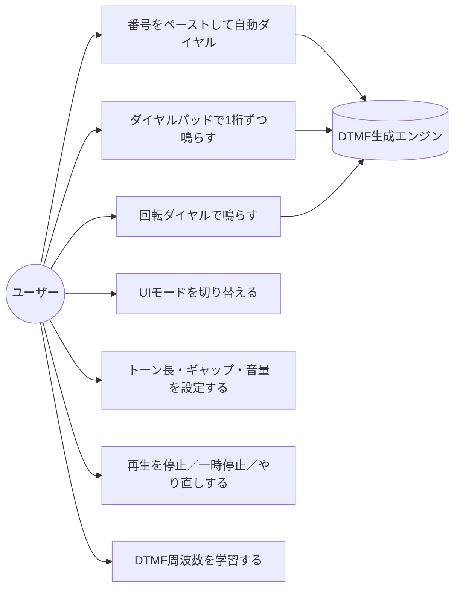
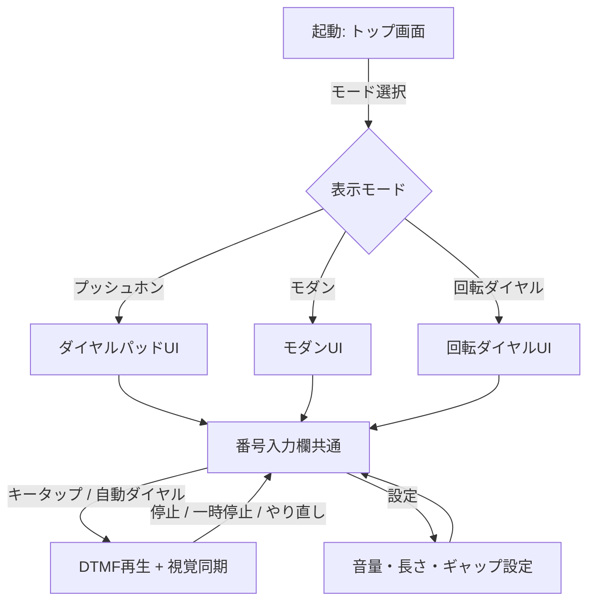

# 要件定義

## プロジェクト概要

### 目的

スマートフォン等のブラウザで開いたWebアプリから **DTMF（Dual-Tone Multi-Frequency）トーン音** を発生させ、その音を公衆電話の受話口（マウスピース）に近づけることで、電話番号を**手動／自動でダイヤル可能**にする SPA（Single Page Application）を提供する。

加えて、ダイヤルパッド・回転ダイヤル等の **複数の入力モード** を切り替えて楽しめる "ガジェット的な" 体験を提供する。

### 背景

- 公衆電話の多くはトーン式（プッシュ回線）に対応しており、正確な DTMF 音をマウスピース近傍で再生すれば交換機側はキー入力と同等に認識する。
- スマートフォンに番号をメモしておいても、公衆電話で一桁ずつ正確に押すのは現実には手間が大きい。**ペーストするだけで自動で全桁を鳴らせる** と「公衆電話からの緊急発信」「ダイヤル練習」「レトロ電話のシミュレーション」など複数のユースケースをカバーできる。
- DTMF 音は古典的な周波数仕様（ITU-T Q.23）で定義されており、Web Audio API の `OscillatorNode` 2 本の加算合成で容易に正確再現できるため、追加の音源アセットを持たずに完結する SPA に向く。
- 既存の類似 Web アプリは少数あるが、複数のUIモード（プッシュホン／モダン／回転ダイヤル）を切り替えられる "イカした" 体験を備えたものは見当たらないため、本プロジェクトで提供する。

### ターゲットユーザー

| ペルソナ | 説明 | 主な利用シーン |
|---------|------|----------------|
| P-1: スマホ世代の緊急利用者 | スマホの電池切れ・故障時に公衆電話を使う必要が生じた人。番号は別の手段（紙メモ、別端末、クラウド等）で参照できる前提 | 旅行先・災害時・電池切れ時のダイヤル支援 |
| P-2: ガジェット好き / レトロ電話ファン | 回転ダイヤル等の擬似体験をブラウザで楽しみたい人 | 余暇・コレクション・教材 |
| P-3: 教育・展示用途のユーザー | DTMF の仕組みを学ぶ学生・博物館展示担当 | 学習教材・ハンズオン |

> 想定環境: モダンブラウザ搭載のスマートフォン / タブレット / PC（Chrome / Safari / Firefox / Edge の最新版）。スマートフォン（特に iOS Safari）での動作を最優先する。

## ユーザーストーリー

| ID | ユーザー種別 | 目的 | 機能 | 優先度 |
|----|------------|------|------|--------|
| US-001 | P-1（緊急利用者） | 公衆電話から自宅などに電話したい | 番号をペーストすると DTMF が自動順送信される機能 | 高 |
| US-002 | P-1 | 1桁ずつ確認しながら鳴らしたい | ダイヤルパッド（0-9, *, #）をタップで都度トーン再生 | 高 |
| US-003 | P-1 | 鳴らす前に番号と再生中の桁を視認したい | 入力欄表示と再生中桁のハイライト | 高 |
| US-004 | P-2 | 古い黒電話気分でダイヤルを回したい | 回転ダイヤルUIモードで数字に応じた回転アニメ＋DTMF再生 | 中 |
| US-005 | P-2 / P-3 | UIの雰囲気を切り替えたい | レトロ公衆電話 / モダン / 回転ダイヤル の3モード切替 | 中 |
| US-006 | P-3 | 仕組みを学習者に説明したい | 再生中のキーに対応する2周波数(Hz)を画面表示 | 中 |
| US-007 | P-1 | 自動再生中に間違いに気付いたら止めたい | 停止／一時停止／やり直しボタン | 高 |
| US-008 | P-1 | スマホスピーカーから明瞭に鳴らしたい | 音量・トーン長・間隔の調整UI | 中 |
| US-009 | 全員 | オフラインでも動かしたい | PWA 化はスコープ外だが、初回ロード後は外部通信なしで動作する | 中 |
| US-010 | 全員 | インストール不要で使いたい | GitHub Pages 上の URL を開くだけで利用できる | 高 |
| US-011 | 全員 | "ちゃんと動く" 公衆電話ツールを使いたい | 標準のキー配列・確実な発音・即時の入力反映 | 高 |
| US-012 | 全員 | 視覚的に気持ちよく、デザインに統一感がある体験を得たい | 全モードで一貫したミニマル（システム / Bauhaus 風）UI とマイクロインタラクション | 高 |

## 機能要件

### F-001: ダイヤルパッド入力モード（プッシュホン）

**説明**: 0-9, *, # の12キーを並べたダイヤルパッドを表示し、タップ／クリックで対応する DTMF 2 周波合成音を再生する。
**優先度**: 高

**受け入れ基準:**
- [ ] Given パッド表示状態 / When ユーザーが任意のキーをタップ / Then 押下中だけ対応する DTMF が再生される（押下解除で停止、最大長は安全上限あり）
- [ ] Given キー一覧 / When 各キー押下時 / Then 下表（DTMF周波数表）に一致する2周波数で再生される
- [ ] Given キー押下 / When 押下中 / Then ボタンに「押し込み」アニメーション（陰影・スケール）が付く
- [ ] Given 連続タップ / When 短時間に複数キーを押した / Then 直前のトーンは即座に停止し、新しいキーのトーンに切り替わる

#### DTMF 周波数表（ITU-T Q.23）

| キー | 低群 (Hz) | 高群 (Hz) |
|------|----------|----------|
| 1 | 697 | 1209 |
| 2 | 697 | 1336 |
| 3 | 697 | 1477 |
| 4 | 770 | 1209 |
| 5 | 770 | 1336 |
| 6 | 770 | 1477 |
| 7 | 852 | 1209 |
| 8 | 852 | 1336 |
| 9 | 852 | 1477 |
| * | 941 | 1209 |
| 0 | 941 | 1336 |
| # | 941 | 1477 |

### F-002: 電話番号入力欄とペースト自動ダイヤル

**説明**: 画面上部に電話番号入力欄を設け、手入力／ペースト／QRなど任意手段で投入された番号を整形・検証し、「自動ダイヤル」ボタンで先頭から末尾まで順にDTMFを送信する。
**優先度**: 高

**受け入れ基準:**
- [ ] Given 入力欄 / When 文字列を入力／ペースト / Then `0-9 * #` 以外の文字（空白・ハイフン・括弧・国際表記 `+` 等）は自動で除去または正規化される（`+` は国際発信プレフィックスとしての扱いを設計フェーズで定義）
- [ ] Given 正規化済み番号 / When 「自動ダイヤル」を押す / Then 先頭桁から順に F-005 のタイミングで DTMF が再生される
- [ ] Given 自動ダイヤル実行中 / When 再生中の桁がある / Then 入力欄の対応桁と対応するキーが同時にハイライトされる
- [ ] Given 自動ダイヤル実行中 / When ユーザーが「停止」を押す / Then その瞬間に音とシーケンスが停止する
- [ ] Given 空文字／不正文字のみ / When 「自動ダイヤル」を押す / Then エラーメッセージ「ダイヤル可能な文字がありません」を表示し再生しない

### F-003: 回転ダイヤル入力モード

**説明**: 黒電話風の円形10孔ダイヤルを表示し、数字をクリック／ドラッグで「指掛け→止め金まで回す→指離す→戻る」のアニメーションを行い、ダイヤルが**戻る**動作と並行して該当数字の DTMF を再生する。
**優先度**: 中

**受け入れ基準（実機相当のジオメトリと挙動）:**

> 典拠: NTT 600 / 601 形（および WE 500 等の同系黒電話）の物理仕様。

- [ ] **数字配置**: 10 個の指穴は **30° 刻み**で並び、合計 **270° の円弧**を占める。残る **90° は穴のない隙間**（指止め用）。配置は実機どおり「1」が **2 時方向（時計の約 60°）**、続いて反時計回りに `2, 3, 4, 5, 6, 7, 8, 9, 0` が並び（`3` が **12 時方向（0°）**、`9` が **6 時方向（180°）**）、「0」は **5 時方向（約 150°）**。等間隔分布（旧 36° 刻み・全周一周）にはしない
- [ ] **指止め（フィンガーストッパー）**: ディスク外周の **4 時方向（約 120°）**、すなわち「0」と「1」の間の 90° 隙間の中に固定の突起として描画される。隙間内では止め金は「0」寄り（「0」から 30°・「1」から 60°）に置かれる。色は `--signal` でアフォーダンスを示す
- [ ] **回転方向**: ユーザーが数字 N をタップ / Then ディスクが**時計回り**に回転し、N の指穴が止め金の位置（120°）に到達した時点で停止する。回転量 = `N × 30° + 30°`（1 が最小 60°、0 が最大 330°）。実機の指掛け感に揃える
- [ ] **戻りの挙動**: 指を離す（あるいは自動進行）と、ディスクが**反時計回り**に元位置まで戻る。戻りは実機のガバナ調速器に倣い **ほぼ等速（linear）**、戻り時間は数字の回転量に比例（10pps の物理モデルに合わせ約 100ms/桁、最大約 1.0秒）
- [ ] **戻り中のクリック音**: 戻り動作中、`prefers-reduced-motion` でない場合に、数字 N に応じて **N 回のパルス音（短いクリック / ガラガラ）** を約 100ms 間隔で再生する。`0` は 10 パルス。これは旧式パルス回線を模した装飾音であり、最終的な DTMF とは別レイヤで再生される
- [ ] **DTMF 再生タイミング**: 古典黒電話はパルス式のため本来 DTMF は鳴らないが、本アプリの目的（公衆電話ダイヤル支援）から、**戻り完了直後** に該当数字の DTMF を 1 音だけ送出する。クリック音と DTMF が二重に聞こえる旨を `<small>` 注記で表示
- [ ] **指挿入インジケータ**: 選択した数字の指穴を `--signal` で塗り、回転中・戻り中も同期して移動する（指がそこに入っている表現）
- [ ] **連打時**: 戻り中に別キーを押すと、現アニメをキャンセルせず順番待ちキューに入れる（最大 20 件）
- [ ] **補助キー**: `*` `#` は黒電話に存在しないため、回転ダイヤルモードでは別途補助ボタンとして併設する

### F-004: UIモード切替

**説明**: 「レトロ公衆電話 / モダン / 回転ダイヤル」の3モードを画面上のセグメントコントロール等で切替可能とする。
**優先度**: 中

**受け入れ基準:**
- [ ] Given モード切替UI / When ユーザーがモードを選択 / Then 表示が滑らかに切り替わる（View Transitions API で 200〜400ms 程度のクロスフェード）
- [ ] Given モード切替直前に再生中のトーン / When 切替発生 / Then 即座に停止する
- [ ] Given 選択中モード / When ページをリロード / Then 直前のモードが復元される（localStorage 等で永続化）
- [ ] 各モードでも F-001〜F-003 の入力結果は共通の番号入力欄と同期する

### F-005: 自動ダイヤル時の再生パラメータ

**説明**: 自動ダイヤル時の各桁のトーン長・桁間ギャップ・全体音量をユーザーが調整できる設定UIを設ける。
**優先度**: 中

**受け入れ基準:**
- [ ] Given 設定UI / When トーン長スライダーを動かす / Then 範囲は 80ms〜500ms、初期値 150ms（ITU推奨の最小持続時間 ≥ 40ms を満たす安全側のデフォルト）
- [ ] Given 設定UI / When 桁間ギャップスライダーを動かす / Then 範囲は 30ms〜500ms、初期値 100ms（ITU推奨の最小間隔 ≥ 40ms 以上を確保）
- [ ] Given 設定UI / When 音量スライダーを動かす / Then 0.0〜1.0 のリニアゲインで反映され、初期値 0.5
- [ ] 設定は localStorage に保存され、再訪時に復元される

### F-006: 再生制御（停止／一時停止／やり直し）

**説明**: 自動ダイヤル中に「停止」「一時停止／再開」「最初からやり直し」を可能にする。
**優先度**: 高

**受け入れ基準:**
- [ ] Given 自動ダイヤル中 / When 停止 / Then 直ちに発音停止しシーケンス位置をリセット
- [ ] Given 自動ダイヤル中 / When 一時停止 / Then 現桁終了後に停止しシーケンス位置を保持。再開で続きから
- [ ] Given 自動ダイヤル中／終了後 / When やり直し / Then シーケンス位置を0に戻して頭から再生

### F-007: 視覚的フィードバック・アニメーション

**説明**: ユーザー操作と音再生に応じた視覚演出を提供する。
**優先度**: 中

**受け入れ基準:**
- [ ] **キー押下感**: 押下時にスケール縮小＋影変化＋発光リング
- [ ] **発音波形ビジュアライザ**: 再生中、画面下部などに簡易的な2周波合成波形またはレベルメータを表示
- [ ] **自動ダイヤル進行ハイライト**: 入力欄の当該桁、ダイヤルパッド／回転ダイヤルの当該キーを同期ハイライト
- [ ] **モード切替**: View Transitions API でなめらかに遷移
- [ ] `prefers-reduced-motion: reduce` のユーザー設定時、アニメーション量を最小化（CSSメディアクエリで対応）

### F-008: 学習向け情報表示（任意展開パネル）

**説明**: 「詳細」パネルで再生中のキーに対応する2周波数 (Hz)、トーン長、ギャップを数値表示する。
**優先度**: 低

**受け入れ基準:**
- [ ] Given 詳細パネル展開 / When キー再生 / Then 該当キーの低群/高群周波数が即時表示される
- [ ] パネルは折りたたみ式で初期状態は折りたたみ

### F-009: エラーハンドリング・互換性ガード

**説明**: Web Audio API が使用できない／オーディオ再生がブロックされている場合にユーザーへ通知する。
**優先度**: 高

**受け入れ基準:**
- [ ] Given Web Audio API 非対応ブラウザ / When 起動 / Then 「お使いのブラウザは Web Audio API に対応していません」と表示
- [ ] Given iOS Safari 等で AudioContext がユーザー操作前に作れない / When 最初の操作までに作成失敗 / Then 「画面を一度タップして音を有効にしてください」と表示し、初回操作で AudioContext を `resume()`
- [ ] Given 自動ダイヤル中に通信エラー等 / Then 本SPAは外部通信を行わない設計（NFR-002）であるため通信系エラーは対象外

### F-010: アクセシビリティ

**説明**: スクリーンリーダー・キーボード操作・コントラスト等の基本的なアクセシビリティを満たす。
**優先度**: 中

**受け入れ基準:**
- [ ] すべてのキー・ボタンは `aria-label` を持つ
- [ ] キーボードで 0-9, *, # を押すと対応する DTMF が再生される（フォーカス可視＋`Space`/`Enter` も有効）
- [ ] テキストコントラスト比 4.5:1 以上（WCAG 2.2 AA）
- [ ] `prefers-reduced-motion: reduce` 時、回転ダイヤル等の大きな動きは短縮または静的化

### F-011: ミニマル統一デザイン（システム / Bauhaus 風）

**説明**: v1 実装の「3 モード × 3 配色」状態を解消し、全体を単一のデザイン言語（システム / Bauhaus 風: 幾何学プリミティブ・限定パレット・グロテスク系サンセリフ・装飾を排した機能的構成）で統一する。3 モードの差別化はカラースキームではなく**形状（円・矩形・グリッド配列）と動き**で表現する。
**優先度**: 高
**対応ユーザーストーリー**: US-005, US-012

**受け入れ基準:**
- [ ] Given 起動時 / When 表示 / Then 背景はオフホワイト（#F5F5F4 前後）または純黒、テキストは純黒/純白の **2 値ベース** ＋ **アクセント色 1 色のみ**（推奨: 赤 `#E63946` 系か黄 `#FFD23F` 系のいずれか 1 種、設計フェーズで確定）
- [ ] 全モードでカードの入れ子をやめ、`Hero / App / Footer` を **単一の縦グリッド** に統合する（カード in カード禁止）
- [ ] レトロ / モダン / 回転 の 3 モードは **同一配色** とし、差異は以下に限定する
  - レトロ: 矩形グリッド配列（4 段 × 3 列）の機械式ボタン質感
  - モダン: 矩形グリッド配列の薄いボタン質感（境界線のみ）
  - 回転: 円形配置 ＋ 円盤回転アニメーション（数字プレートは固定、内側ディスクが回る）
- [ ] 角丸は `0` または `2px` のみ使用（`rounded-2xl` 等の過大な角丸禁止）
- [ ] `shadow-*` 系装飾シャドウは原則禁止。ホバー/プレス時の状態表現は **アウトライン or 色反転** で行う
- [ ] 余白は 8 の倍数のグリッド（4/8/16/24/32/48/64）に統一
- [ ] フォーカスリングはアクセント色の 2px outline で統一（モード別の色変更禁止）
- [ ] 設定/詳細パネルは `
` のままだが、ネイティブマーカーを CSS で除去し、`+`/`−` 等のミニマル記号で開閉表現
- [ ] フッターのリンクは `underline` を廃止し、ホバー時のみ下線表示

### F-012: タイポグラフィシステム

**説明**: 統一されたタイポグラフィスケールと書体選定により情報階層を明確化する。
**優先度**: 高
**対応ユーザーストーリー**: US-012

**受け入れ基準:**
- [ ] サンセリフ: ローカルフォント優先で `Inter` / `Helvetica Neue` / `Arial` のグロテスク系を使用（追加 Web フォント DL なし、NFR-001/002 と両立）
- [ ] モノスペース: 電話番号表示に `ui-monospace` 系（JetBrains Mono / SF Mono / Menlo / Consolas）を使用し、桁を等幅で表示
- [ ] タイポスケール: `12 / 14 / 16 / 20 / 28 / 40` の 6 段階に統一
- [ ] 電話番号入力欄および進行ハイライト表示は **大型モノスペース（28〜40px）** で番号を強調表示
- [ ] 重要数値（周波数表示・トーン長/ギャップ ms 値）もモノスペース統一
- [ ] 行間は本文 `1.5`、見出し `1.2` で固定

### F-013: マイクロインタラクション再設計

**説明**: 押下感・発音同期・モード遷移を、ミニマルかつ気持ち良いマイクロインタラクションで表現する。
**優先度**: 中
**対応ユーザーストーリー**: US-004, US-012

**受け入れ基準:**
- [ ] キー押下: スケール縮小に加え、**アクセント色の outline リング** が押下中に発光（CSS animation）
- [ ] 発音中: キー周囲に **同心円リップル**（CSS `@keyframes`、120〜200ms）を 1 回放出
- [ ] 自動ダイヤル進行中: 入力欄の対象桁をアクセント色で塗り、進行と同期して 1 桁ずつ左から塗り進める（残り桁はグレー）
- [ ] モード切替: **View Transitions API（`document.startViewTransition`）** を実装し、各モードの主要要素に `view-transition-name` を付与してクロスフェード（250ms 程度）
- [ ] 回転ダイヤル: 数字プレートは固定、内側ディスクのみ回転する 2 レイヤ構造に変更
- [ ] `prefers-reduced-motion: reduce` 時はすべての動きを `transform: none` ＋ `transition: none` で静的化（既存ルール継続）

### バグ修正要件（v1 監査による）

> v1 実装の `claude/ui-ux-redesign-audit-bZT6s` ブランチでの監査（2026-05-23）で確認された致命的バグを v2 で必ず修正する。

| ID | バグ概要 | 関連要件 | 優先度 |
|----|---------|---------|--------|
| B1 | DTMF_KEYS の Object.keys 順序により、ダイヤルパッドが `0,1,2,3,...,9,*,#` の誤った配列で表示される。標準は `1,2,3 / 4,5,6 / 7,8,9 / *,0,#` | F-001, F-011 | 高 |
| B2 | `PhoneApp.tsx` の `onMount` の戻り値クリーンアップは Solid.js では機能せず、`keydown` リスナが解除されない | F-010 | 高 |
| B3 | DialPad/ModernPad のキー押下時、`setInput()` が呼ばれず番号入力欄に反映されない | F-004 | 高 |
| B4 | RotaryDial の数字押下時も `setInput()` が呼ばれず番号入力欄に反映されない | F-004 | 高 |
| B5 | ポインタ押下（マウス/タッチ）時に `appState.playback` が `key_held` にならず、波形ビジュアライザが動作しない | F-007 | 中 |
| B6 | `lib/platform/viewTransition.ts` が `update()` を実行するだけのスタブで、`document.startViewTransition` を呼んでいない | F-007, F-013 | 中 |
| B7 | `engine.pressKey` が `ensureContext()` を await せず、iOS Safari の suspended context のまま `scheduleTone` を実行し無音になる | F-009 | 高 |
| B8 | `sequencer.pause()` は setTimeout のみキャンセルし、既に WebAudio スケジューラに積まれた oscillator は停止しないため、pause 後も最大 16 桁分のトーンが鳴り続ける | F-006 | 高 |

**受け入れ基準:**
- [ ] B1: `DTMF_KEYS` をリテラル配列で順序固定し、`1,2,3,4,5,6,7,8,9,*,0,#` の 12 要素として DialPad/ModernPad が出力する
- [ ] B2: `PhoneApp.tsx` のクリーンアップを `onCleanup` で行う
- [ ] B3: DialPad/ModernPad の press ハンドラから `setInput(appState.raw + key)` 相当を呼び、入力欄と同期する（最大桁数 64 はそのまま）
- [ ] B4: RotaryDial の dialDigit で同様に入力欄に追記する
- [ ] B5: ポインタ press 時にも `setPlayback("key_held")` を立て、release で `idle` に戻す
- [ ] B6: `runViewTransition` で `document.startViewTransition` が利用可能なら呼び、なければ即時更新にフォールバックする
- [ ] B7: `pressKey` を async 化または `ensureContext().then(...)` で context が running になってから schedule する
- [ ] B8: sequencer の pause/stop で `engine.stopAll()` に加え、未来時刻にスケジュール済みの oscillator をすべて停止する内部マップを持つ

## 非機能要件

| ID | カテゴリ | 要件 | 測定基準 |
|----|---------|------|---------|
| NFR-001 | パフォーマンス | 初回表示が高速であること | 4G想定（Lighthouseモバイル）でTTI ≤ 2.5s、LCP ≤ 2.0s |
| NFR-002 | セキュリティ／プライバシー | 個人情報を外部送信しない | ネットワークリクエスト数=0（初回HTML/JS/CSS取得を除く）。Lighthouse / DevTools Networkで確認 |
| NFR-003 | 可用性 | GitHub Pages 上で常時公開 | 月間稼働率 99% 以上（GitHub Pages SLA準拠） |
| NFR-004 | 音響精度 | DTMF周波数誤差が交換機認識許容範囲 | 各周波数の誤差 ≤ ±1.5%（ITU Q.24準拠の余裕）、サンプリングレートは AudioContext 既定 |
| NFR-005 | レスポンシブ | スマホ縦持ち〜PC横幅まで快適 | 320px〜1920pxで主要操作要素が崩れずタッチ可能（最小タップ領域 ≥ 44×44 CSS px） |
| NFR-006 | ブラウザ互換 | モダンブラウザで動作 | Chrome / Safari / Firefox / Edge の最新2バージョン |
| NFR-007 | アクセシビリティ | WCAG 2.2 AA を目標 | axe / Lighthouse Accessibility ≥ 95 |
| NFR-008 | ライセンス・帰属 | 全アセット・依存はOSS互換 | 依存パッケージはMIT/Apache-2.0/BSD系のみ |
| NFR-009 | バンドルサイズ | 軽量配信 | 初回JS転送量 ≤ 100KB gzip（目標値。設計で見直し可） |
| NFR-010 | デザイン一貫性 | 全モードで単一のデザイントークン | カラー/間隔/角丸/書体スケールが `tailwind.config.ts` または CSS custom properties に集約され、モード別の重複定義がないこと |
| NFR-011 | UI 回帰防止 | 主要 UI フローを E2E で担保 | キーパッド配列・キー押下→入力欄反映・モード切替・自動ダイヤルの 4 シナリオを Playwright で検証可能 |

## ユースケース図

## 画面フロー

## スコープ外

- 実際に電話回線へ発信する機能（本SPAはあくまでDTMF音を空気経由で再生するのみ）
- 音声通話・録音・通話履歴の保存
- PWA化（オフライン強キャッシュ・ホーム追加・プッシュ通知 等）
- 国際電話番号の解析・国コード自動付与・連絡先帳連携
- マルチフレーズ送信（ポーズ `,` ／待機 `;` 等の電話番号DSLの実装）。ただし将来拡張可能性は設計で残す
- ネイティブアプリ化（iOS/Android アプリストア配信）
- アナログ／回線パルス（10pps）の真の物理再現

## 制約事項

- **Astro + Solid（アイランドアーキテクチャ）** で実装する（ユーザー指定）
- **スタイリング: Tailwind CSS v4 + ネイティブCSSアニメーション + View Transitions API**（ユーザー指定）
- **デプロイ先: GitHub Pages**（ユーザー指定。ベースURLはリポジトリ名配下となる前提）
- **言語: TypeScript**（CLAUDE.mdのデフォルト方針および型安全のため）
- **音源**: 追加アセットは持たず、Web Audio API の `OscillatorNode` 2 本の加算合成で生成する
- **iOS Safari の AudioContext**: ユーザー操作（タップ）後でないと音が出ない。F-009 で対応必須
- **法的・倫理的注意**: 本ツールは合法的なダイヤル支援・学習・娯楽用途を目的とし、悪用（フリーキング、不正な電話会社サービス操作、第三者への嫌がらせ電話の補助等）を禁止する旨をフッター等に明記する
- **パッケージバージョン選定**: CLAUDE.md記載通り「今日(2026-05-21)の3日前(2026-05-18)時点で公開済みの最新安定版」を採用する

## 用語集

| 用語 | 定義 |
|------|------|
| DTMF | Dual-Tone Multi-Frequency。低群・高群2つの正弦波を同時に出す方式で、現代のプッシュホンが使用するキー入力信号方式 |
| プッシュ回線 / トーン式 | DTMFを受け付ける電話交換機側の方式。日本の公衆電話の多くが対応 |
| 回転ダイヤル / パルス式 | 黒電話に代表される回転式ダイヤル。物理的にはパルス信号を送るが本アプリではアニメーションのみ模倣しDTMFで代替再生する |
| SPA | Single Page Application。1枚のHTMLで動的に画面遷移を扱うWebアプリ形態 |
| アイランドアーキテクチャ | Astroが採用する、静的HTMLの中に必要部分のみインタラクティブコンポーネントを島状に配置する設計 |
| View Transitions API | ページ／DOM遷移をブラウザ側でスムーズにアニメーションするWeb標準API |
| AudioContext | Web Audio APIの中心オブジェクト。音声グラフを保持し、再生・停止・タイミング制御を担う |

---

# 追加要件（Phase 3: デザイン完全再構築）

> 2026-05-23: ユーザー指示「レイアウトはすべて削除し、完全再構築」「PC・スマホに適したレイアウト」「AIっぽくないデザイン」を受けた追加要件。
> Phase 2 までの実装（モード切替・ためて解放 UX・DTMF エンジン）の**機能**はそのまま維持しつつ、**ビジュアル / レイアウト層を全廃して再構築**する。

## 背景・課題

Phase 2 で「ミニマル統一デザイン（F-011〜F-013）」を導入したが、以下の課題が残存している:

1. **AI 生成物に典型的な見た目**: ダークグラデ背景・カード in カード（`.app-shell > .dialer > .dial-section > .keypad`）・丸ボタン中心・うっすら影 — 量産的でアイデンティティが弱い。
2. **PC レイアウトの未最適化**: `max-width: 28rem` でスマホ縦持ち向けにしか最適化されておらず、PC でも狭い 1 カラムのまま中央寄せされる。横幅を活かしたレイアウトが存在しない。
3. **情報密度のメリハリ不足**: モード切替・キーパッド・入力欄・再生バー・設定・詳細パネルが**すべて同じ視覚的ウェイト**で縦に積まれ、主役（番号入力 → 再生）が際立たない。
4. **タイポグラフィの主役不在**: 番号表示が `var(--key-size)` ベースのキーと同程度のスケールで、「番号を鳴らす道具」というドメインのアイコン性が弱い。

## 機能要件（Phase 3 追加）

### F-014: レイアウト完全再構築（PC / スマホ別最適化）

**説明**: Phase 2 までの全 CSS レイアウト（`.app-shell` / `.page` / `.dialer` / `.dial-section` 等の入れ子と中央寄せ）を破棄し、**PC とスマホで完全に別のレイアウト**を CSS Grid で構成する。`src/styles/global.css` の `@layer components` 以下のレイアウト関連ルールはすべて書き換える。
**優先度**: 高
**対応ユーザーストーリー**: US-010, US-011, US-012, NFR-005

**受け入れ基準:**
- [ ] スマホ（< 768px）レイアウト
  - [ ] 縦 1 カラム。上から「ヘッダー（極小）→ 番号ディスプレイ（大）→ ダイヤル本体 → 再生バー → 折りたたみ設定」の順で固定
  - [ ] **番号ディスプレイ**が画面幅いっぱい（左右パディング 16〜24px）かつ高さ最低 96px。タイポは `clamp(2rem, 9vw, 3.5rem)` の大型モノスペース
  - [ ] ダイヤル本体（キーパッド or 回転）はビューポート短辺の 70〜85% を占める。**ジャンプ無しで親指リーチ可能**な下半分配置
  - [ ] **再生バー**は画面下部に sticky 配置（`position: sticky; bottom: 0`）。`safe-area-inset-bottom` を尊重
- [ ] PC（≥ 1024px）レイアウト
  - [ ] **2 カラム CSS Grid**: 左カラム「番号ディスプレイ + 再生バー + 設定」(40〜45%) / 右カラム「ダイヤル本体 + モード切替」(55〜60%)
  - [ ] 最大幅 `1200px` で中央寄せ。両カラムは縦 align-items: start
  - [ ] ダイヤル本体のキーサイズは固定 `72px〜88px` で**スマホより大きい**こと（マウスポインタ前提でも視認できる存在感）
- [ ] タブレット（768〜1023px）はスマホ縦レイアウトを最大幅 640px で中央寄せ（中間レイアウトは作らない、シンプルさ優先）
- [ ] 既存の `.app-shell / .page / .dialer / .dial-section / .page-header` のクラス階層を**廃止**し、`<main>` 直下に新規 grid を組む
- [ ] モード切替・設定・詳細パネル等の補助要素は**主役（入力欄・キー・再生ボタン）より明確に視覚的ウェイトを落とす**

### F-015: ビジュアルアイデンティティ「Brutalist × Physical Hardware」

**説明**: 「おまかせ提案」として、デザイン方向性を **ブルータリスト × 物理ハードウェア**（実機のテンキー・テープレコーダ・古い計算機を思わせる、厚みのあるボタン・モノスペース・粗い質感）に確定する。AI 生成物にありがちな**滑らかなグラデ / うっすら影 / 過大な角丸 / ガラスエフェクト**を**完全排除**する。
**優先度**: 高
**対応ユーザーストーリー**: US-012

**受け入れ基準:**
- [ ] **カラーパレット**（CSS custom properties に集約、3 色のみ）
  - [ ] `--ink: #0A0A0A`（ほぼ黒、文字・枠線）
  - [ ] `--paper: #F2EFE6`（クリーム色、背景）
  - [ ] `--signal: #FF3B30`（信号赤、アクセント / 再生中ハイライト）
  - [ ] グレースケール中間色 `--ink-50: #6B6B68`（ヒント・補助テキスト用、上記 3 色からの派生のみ許可）
  - [ ] グラデーション禁止。`linear-gradient` / `radial-gradient` を CSS から完全削除
- [ ] **タイポグラフィ**
  - [ ] サンセリフ: `Helvetica Neue, Inter, Arial, sans-serif`（ローカル優先、外部 DL 禁止）
  - [ ] モノスペース: `JetBrains Mono, SFMono-Regular, Menlo, Consolas, ui-monospace, monospace`
  - [ ] 番号ディスプレイ・周波数・ms 値はモノスペース等幅
  - [ ] ヘッダーロゴ部は **超大型サンセリフ**（PC: 48px / スマホ: 32px）で `letter-spacing: -0.04em`
- [ ] **ボーダー・角丸・影**
  - [ ] 角丸は `0` のみ。`border-radius: 0` がデフォルト（回転ダイヤルの円盤は例外として円形維持）
  - [ ] 装飾シャドウ（`box-shadow: 0 X X rgb(0 0 0 / Y)`）は禁止。代わりに**ハードシャドウ**（`box-shadow: 4px 4px 0 var(--ink)` 等のオフセットのみ、ブラー = 0）を主要 CTA とディスプレイ枠に使用
  - [ ] すべての枠線は `2px solid var(--ink)`（細い `1px` 罫線は禁止）
- [ ] **テクスチャ**
  - [ ] 紙の繊維風 SVG ノイズ（`<feTurbulence>`）を背景にうっすらオーバーレイ（opacity 0.04〜0.06）して "デジタル臭" を抑える
- [ ] **ダーク / ライト**
  - [ ] デフォルトはライト（`--paper` 背景）。`prefers-color-scheme: dark` 時は `--ink` と `--paper` を入れ替え、`--signal` は維持
- [ ] **削除対象**
  - [ ] `var(--accent)` の青（`#60a5fa`）、`accent-bg` の半透明青、`.glass-panel` の `rgb(255 255 255 / 0.02)` 全廃
  - [ ] `theme-retro` / `theme-modern` / `theme-rotary` のテーマクラス由来配色を全廃（モード差は配色ではなく**形状**で表現）

### F-016: 番号ディスプレイの主役化（"電卓 LCD" 化）

**説明**: 番号入力欄を「フォームの 1 input」ではなく、**画面の主役となる大型ディスプレイ**として再設計する。実機の電卓・FAX・テープデッキの数字窓のような存在感を持たせる。
**優先度**: 高
**対応ユーザーストーリー**: US-003, US-011, US-012

**受け入れ基準:**
- [ ] 番号表示エリアは**カードや input としてではなく、`<output>` 主体の大型ブロック**として実装
- [ ] 高さ: スマホで最低 96px、PC で最低 140px
- [ ] 番号は**右揃え**で、未入力時はプレースホルダ `— — — — —` をモノスペースで左から表示（電卓的なゼロパディング感）
- [ ] 自動ダイヤル進行中、**現在桁を `--signal` 赤で塗り**、再生済み桁はインク色、未再生桁は `--ink-50` グレーで 3 段階表現
- [ ] ディスプレイの上に「INPUT」「PLAYING」「DONE」等の状態ラベルをモノスペース小文字 11px で表示（実機の LED 表記風）
- [ ] 入力編集は**フォーカス時のみ枠が `--signal` に変わる隠し input** で受け、見た目は常にディスプレイのまま
- [ ] 桁数カウンタ「`3 / 64`」をディスプレイ右上に小さく表示

### F-017: PC キーボード操作の前面化

**説明**: PC レイアウトでは物理キーボード操作が主となる前提を UI で示し、各キーに**キーボードショートカット表示**を併記する。
**優先度**: 中
**対応ユーザーストーリー**: US-002, US-010

**受け入れ基準:**
- [ ] PC（≥ 1024px）時、各ダイヤルキー右下に**小さなキーキャップ表記**（例: キー `1` のラベル下に `1` を小さくモノスペースで併記）
- [ ] 再生ボタンに `Enter` / 停止ボタンに `Esc` のショートカットを表示し、Enter / Esc キーで実際に発火させる
- [ ] スマホレイアウトではキーキャップ表記を**非表示**（CSS `@media` で切替、DOM には残す）
- [ ] フォーカスリングは `outline: 2px solid var(--signal); outline-offset: 2px` で統一

### F-018: アクセシビリティ・後方互換性の維持

**説明**: F-014〜F-017 を実装した上で、Phase 2 までの a11y 要件と E2E テストを破壊しない。
**優先度**: 高
**対応ユーザーストーリー**: US-010, US-011

**受け入れ基準:**
- [ ] `data-testid` 属性（`phone-app` / `mode-switcher` / `dial-pad` / `phone-input` / `digit-preview` / `playback-controls` / `stop-button` / `restart-button` / `settings-panel` / `volume` / `tone-duration` / `gap-ms` / `low-freq` / `high-freq` / `visualizer`）は**すべて維持**する
- [ ] `aria-label` / `aria-pressed` / `aria-live` の既存属性を維持
- [ ] WCAG 2.2 AA（コントラスト 4.5:1 以上）を `--ink` / `--paper` / `--signal` の組合せで満たす
- [ ] `prefers-reduced-motion: reduce` 時はアニメーションを停止（既存ルール継続）
- [ ] 最小タップ領域 44×44 CSS px を維持
- [ ] Playwright E2E（`tests/` 配下）を**改修なしでパス**することを目指す（テストが期待する DOM 構造は維持）

## 非機能要件（Phase 3 追加）

| ID | カテゴリ | 要件 | 測定基準 |
|----|---------|------|---------|
| NFR-012 | デザインアイデンティティ | AI 生成物に典型的な装飾を排除 | グラデ / 過大角丸 / ガラスエフェクト / 装飾シャドウのレビュー指摘ゼロ |
| NFR-013 | レスポンシブ品質 | PC / スマホで体験が明確に差別化 | 320px / 768px / 1024px / 1440px の 4 ブレークポイントで Playwright スクリーンショット差分を確認 |
| NFR-014 | デザイントークン集約 | 配色・タイポ・スペースを単一の真実源に | `src/styles/global.css` の `:root` に CSS custom properties として集約、Tailwind 経由の生のカラー指定禁止 |

## スコープ外（Phase 3 追加）

- DTMF エンジン（`src/lib/dtmf/`）の挙動変更
- 状態管理（`src/lib/state/`）の API 変更
- 新規ユーザー入力モードの追加（既存の retro / modern / rotary の 3 モードを維持）
- ダークモードのトグル UI 提供（OS 設定追従のみ、明示的なトグルは作らない）
- PWA 化・オフライン強キャッシュ

## 追加要件（Phase 3 補正 / 2026-05-23）

> 2026-05-23: ユーザー報告「スマホから Input に数字を入力すると同じ数字が二回入力される」「Clear ボタンも付けてほしい」を受けた追加要件。実装はバグ修正＋小機能追加の範囲。

### F-019: 入力クリアボタン

**説明**: 番号ディスプレイ近傍に「Clear」ボタンを追加し、ワンタップで入力欄を空にできるようにする。再生中（`auto_running` / `auto_paused` / `key_held`）は誤操作防止のため非活性。
**優先度**: 中
**対応ユーザーストーリー**: US-003

**受け入れ基準:**
- [x] 番号ディスプレイ（`.display__screen`）の **右側**にインラインで配置（モバイル・PC とも視認可能・1 行レイアウト）
- [x] 押下で `setInput("")` 相当を実行し、`raw` / `display` / `digits` / `hadInternationalPrefix` がすべて初期化される
- [x] `appState.display.length === 0` の場合は disabled（押せない）
- [x] `appState.playback !== "idle"` の場合も disabled
- [x] `aria-label="入力をクリア"`、`data-testid="clear-button"` を付与
- [x] 体裁は他の物理ボタン（`.rotary__aux-btn` / `.t-btn`）と統一: `var(--hair)` 細枠 + `var(--shadow-hard)` ハードシャドウ + mono 11px。hover/active で `var(--signal)` 反転＋シャドウ消し。タップ領域は最小 44×56（高さは `.display__screen` に追従）

### バグ修正要件（Phase 3 補正）

| ID | バグ概要 | 関連要件 | 優先度 |
|----|---------|---------|--------|
| B-09 | スマホ仮想キーボードで `<input type="tel">` に数字を入力すると、`PhoneApp.tsx` の document-level `handleKeyboard` が DTMF キーとして `recordDialKey()` を実行し、さらに仮想キーボードが `preventDefault` を無視して文字を挿入するため、`raw` に同じ数字が二重に追加される | F-002, F-017 | 高 |
| B-10 | `engine.setVolume(v)` は内部で `v * v`（知覚音量補正）を行うが、呼び出し側（`PhoneApp.tsx` onMount、`SettingsPanel.tsx` onInput）が **既に二乗した値** を渡しているため、最終的な `masterGain.gain.value` が `v⁴` になる。デフォルト UI 音量 50% の場合、実 gain は 6.25% となり、特に iOS の Web Audio 出力では事実上無音に近く「音が鳴らない」と知覚される | F-005 | 高 |
| B-11 | スマホ（特に iOS）で本体スピーカーから音が流れない。原因は 2 点。(1) iOS Safari は既定で Web Audio を「着信音（ambient）」チャンネル扱いとし、本体側面のサイレント（マナー）スイッチがオンだと無音になる（`navigator.audioSession.type` 未設定）。(2) `appState.audio.contextSuspended` が初期値 `false` 固定で onMount 時に AudioContext の suspended 状態を観測していないため、「音を有効にしてください」バナーが永遠に表示されず、ユーザーがアクティベーション導線にたどり着けない | F-005, US-008 | 高 |

**受け入れ基準:**
- [x] B-09: `handleKeyboard` 内で `inFormField`（フォーカスが `<input>` / `<textarea>` 上）かつキーが DTMF キーの場合は、document-level の `recordDialKey` / `playDigitSequence` を実行せず、ネイティブ input イベントに委譲する。Enter / Escape はこれまで通り処理する
- [x] B-09: モバイル仮想キーボードからの数字入力で、最終的な `appState.raw` が入力された桁数と一致すること（unit test で `handleKeyboard` 経由のシミュレーションを追加）
- [x] B-09: PC 物理キーボードでの数字キー押下時の挙動（入力欄外で押下 → 番号欄に追記、`onKeyUp` で音再生）は維持される
- [x] B-10: `engine.setVolume` の呼び出し側は **線形の UI 音量値（0〜1）をそのまま** 渡すこと。エンジン内部で `v²` 補正を行うため、二乗するのはエンジンのみ
- [x] B-10: UI 音量 50% で `masterGain.gain.value === 0.25`（`v² = 0.25`）となる（unit test で検証）
- [x] B-10: SettingsPanel のスライダー操作で値を変更したとき、`engine.setVolume` には常に線形値（0〜1）が渡されることを保証する（呼び出し契約テスト）
- [x] B-11: AudioContext 生成時およびユーザージェスチャ（`ensureContext`）の度に `navigator.audioSession.type = "playback"` を設定する。非対応ブラウザでは no-op として安全に無視する
- [x] B-11: iOS のサイレントスイッチがオンでも本体スピーカーから DTMF 音が鳴る（実機確認は PR レビュー時）
- [x] B-11: onMount で AudioContext の状態が `suspended` の場合に「音を有効にしてください」バナーを表示し、ユーザー操作（バナーのボタン／キー押下／ダイヤルタップ／自動再生）で resume に成功したらバナーを非表示にする
- [x] B-11: `engine` に `getContextState()` を追加し、AudioContext の状態（`suspended` / `running` / `null`）を返す（unit test で検証）

## 追加要件（Phase 4: 初回アクセス時の音声警告 / 2026-06-03）

> 2026-06-03: ユーザー指示「初回アクセス時に音が鳴る旨の警告ポップアップを出してほしい」を受けた追加要件。
> 本アプリは DTMF 音を鳴らすことが目的であり、公共の場・サイレント想定の環境で不意に音が出る事故を防ぐため、初回訪問時に「音が鳴る」旨を明示的に告知する。
> ユーザー確認により、**形式=モーダルダイアログ / 表示頻度=初回アクセス時のみ（localStorage 記憶） / 既存の「音を有効にしてください」バナーとは独立（本ポップアップは警告告知のみで、音の有効化は担わない）** と決定。

### F-020: 初回アクセス時の音声警告モーダル

**説明**: ユーザーが初めてアプリを開いたとき、「このアプリは音（DTMF トーン）を鳴らします」という旨を伝える警告モーダルダイアログを画面中央に表示する。ユーザーが明示的に閉じる（「OK」等）まで操作をブロックする。一度閉じたら localStorage に記憶し、以降の訪問では表示しない。音の有効化（AudioContext の resume）は本モーダルの責務外とし、既存の「音を有効にしてください」バナー（B-11）に委ねる。
**優先度**: 中
**対応ユーザーストーリー**: US-008, US-011

**受け入れ基準:**
- [x] Given 初回アクセス（localStorage に確認済みフラグなし） / When ページ表示 / Then 画面中央に警告モーダルが表示され、背景がオーバーレイで覆われる
- [x] Given 警告モーダル表示中 / When ユーザーが「OK」ボタンを押す / Then モーダルが閉じ、localStorage に確認済みフラグが保存される
- [x] Given 確認済みフラグが localStorage にある（2 回目以降の訪問） / When ページ表示 / Then モーダルは表示されない
- [x] モーダルには「音が鳴る」旨が明確に記述される（例: 「このアプリはボタン操作で音（電話のダイヤル音）が鳴ります。音量にご注意ください。」）
- [x] モーダルは F-015 のビジュアルアイデンティティ（ブルータリスト: `2px solid var(--ink)` 枠 + ハードシャドウ + 角丸 0 + 3 色パレット）に準拠する
- [x] アクセシビリティ: `role="dialog"` / `aria-modal="true"` / `aria-labelledby` を付与し、表示時に「OK」ボタンへフォーカスを移す。`Escape` キーまたは「OK」で閉じられる
- [x] フォーカストラップ: モーダル表示中は背後の要素を操作できない（オーバーレイで `pointer-events` をブロック、または Tab 移動をモーダル内に閉じ込める）
- [x] `data-testid="sound-warning-modal"` / 確認ボタンに `data-testid="sound-warning-ok"` を付与
- [x] `prefers-reduced-motion: reduce` 時はモーダルの出現アニメーションを無効化する
- [x] localStorage が利用不可（プライベートモード等で例外）の場合でもクラッシュせず、モーダルを表示して閉じられる（記憶できないだけでフォールバック動作する）

#### 非機能・実装メモ

- localStorage キーは既存の永続化キー命名規則（`src/lib/state/` の persist 実装）に合わせる
- SSR/アイランド（`client:only`）構成のため、`localStorage` アクセスはクライアント側マウント後に限定する
- 既存の `audio-banner`（音の有効化バナー）と同時表示されうるが、責務が異なるため共存を許容する（重なって見づらくならないよう設計フェーズで配置を検討）

